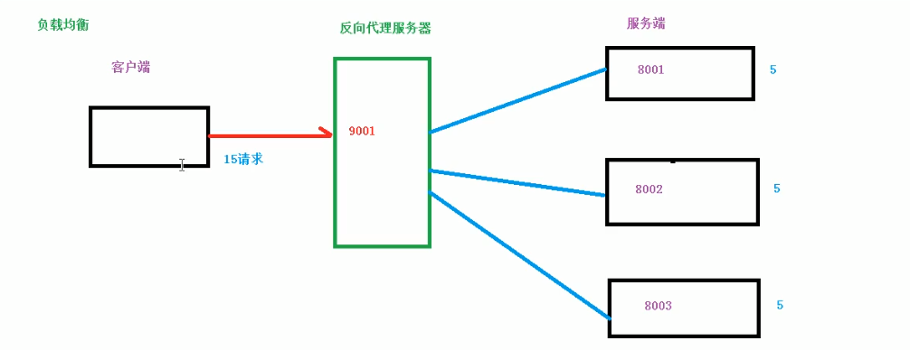
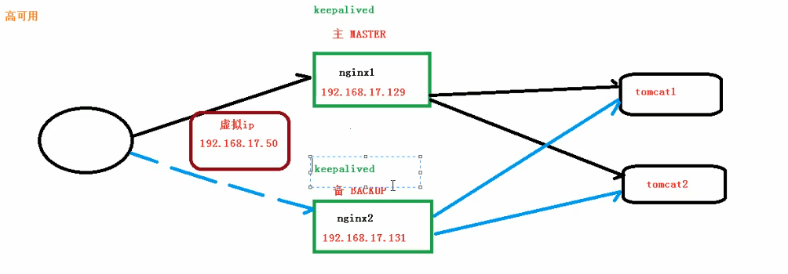

## 开启 nginx

### 安装

-   arch:`yay -S nginx`
-   CentOS
    -   [下载](http://nginx.org/en/download.html)
    -   依赖:`make zlib zlib-devel gcc-c++ libtool openssl openssl-devel pcre`
    -   位置:nginx 安装完成后目录`/usr/local/nginx `或`/usr/share/nginx`
    -   开启
        -   `systemctl start nginx.service`:pacman 直接安装的可以用
        -   执行 xxx/sbin 下 ./nginx 指令
    -   问题
        -   端口 :如果有防火墙,配置指定的是 80 端口 `firewall-cmd --add-port=80/tcp --permanent`:开放 80 端口，重启墙
    -   nginx 常用命令 `需要有管理员权限`
        -   进入 nginx/sbin 目录(上面位置)|rach 直接在全局了任何位置都可以
        -   开启 `./nginx`
        -   停止 `./nginx -s stop`
        -   安全退出 `./nginx -s quit`
        -   重新加载 `./nginx -s reload`:配置文件修改时使用
        -   一般通过 `systemctl` 操作
    -   nginx 配置文件
        -   `/usr/local/nginx/conf/nginx.conf`
        -   或 `/etc/nginx/nginx.conf`
-   nginx源   
    ```shell
    # 安装 yum-utils，此插件可让我们自主选择 yum 源
    yum install yum-utils -y

    # 添加
    vim /etc/yum.repos.d/nginx.repo
    [nginx-stable]
    name=nginx stable repo
    baseurl=http://nginx.org/packages/centos/$releasever/$basearch/
    gpgcheck=0
    enabled=1
    module_hotfixes=true

    [nginx-mainline]
    name=nginx mainline repo
    baseurl=http://nginx.org/packages/mainline/centos/$releasever/$basearch/
    gpgcheck=0
    enabled=0
    module_hotfixes=true

    # 切换 yum 源为 Nginx 稳定版本的 yum 源
    yum-config-manager --enable nginx-stable

    # 查看yum上的Nginx版本
    yum info nginx

    # 安装
    yum install nginx -y 

    # 启动服务，关闭防火墙或开发80端口，与服务器还需要去安全组开放80端口
    xx.xx.xx.xx:80 
    ```

-   tomcat 安装
    -   [下载](https://tomcat.apache.org/download-70.cgi)
    -   解压进入`bin`
    -   运行:`./startup.sh` :如果有防火墙 `firewall-cmd --add-port=8080/tcp --permanent`:开放 8080 端口
    -   成功:`Tomcat started.`,再通过 `http://192.168.1.xxx:8080/` 测试是否开启成功
    -   日志:`../logs/catalina.out`

```shell
# 配置文件解析
# 第一部分全局配置
# 作用:从文件开始到events直接的部分，主要处理一些影响nginx服务器整体运行的配置指令
worker_processes  1; # nginx处理并发的数量

#error_log  logs/error.log;
#error_log  logs/error.log  notice;
#error_log  logs/error.log  info;

#pid        logs/nginx.pid;

# 第二部事件配置
# 作用:里面的指令主要音响nginx服务器与用用户的网络链接
events {
    worker_connections  1024; # 最大链接数目
}

# 第三部分http配置
# 包括http全局块、server块
http {
    include       mime.types;
    default_type  application/octet-stream;

    #log_format  main  '$remote_addr - $remote_user [$time_local] "$request" '
    #                  '$status $body_bytes_sent "$http_referer" '
    #                  '"$http_user_agent" "$http_x_forwarded_for"';

    #access_log  logs/access.log  main;

    sendfile        on;
    #tcp_nopush     on;

    #keepalive_timeout  0;
    keepalive_timeout  65;

    #gzip  on;
    # 负载均衡配置 一
    # 测试:http://192.168.1.104/vod/index.html 刷新会按顺序获取包含服务的相应页面
    upstream myserver { # 配置分发负载的服务器列表
    	server 192.168.1.104:8000;
    	server 192.168.1.104:8080;
    }

    # 配置虚拟主机相关信息(重要)
    server {
        listen       80; # 防火墙要开通80端口
        server_name  192.168.1.104;

        #charset koi8-r;

        #access_log  logs/host.access.log  main;


        location / { # 访问路径符合该正则时做的事情
            root   html;
            proxy_pass http://myserver; # 上面定义的名称
            index  index.html index.htm;
        }

        #error_page  404              /404.html;

        # redirect server error pages to the static page /50x.html
        #
        error_page   500 502 503 504  /50x.html;
        location = /50x.html {
            root   html;
        }

        # proxy the PHP scripts to Apache listening on 127.0.0.1:80
        #
        #location ~ \.php$ {
        #    proxy_pass   http://127.0.0.1;
        #}

        # pass the PHP scripts to FastCGI server listening on 127.0.0.1:9000
        #
        #location ~ \.php$ {
        #    root           html;
        #    fastcgi_pass   127.0.0.1:9000;
        #    fastcgi_index  index.php;
        #    fastcgi_param  SCRIPT_FILENAME  /scripts$fastcgi_script_name;
        #    include        fastcgi_params;
        #}

        # deny access to .htaccess files, if Apache's document root
        # concurs with nginx's one
        #
        #location ~ /\.ht {
        #    deny  all;
        #}
    }
    # 反向代理案例
    # 反向代理转发,访问http://192.168.1.104:9001 时候 根据条件代理到 http://127.0.0.1:8080 和 .....:8000服务器
    server {
        listen       9001;
        server_name  192.168.1.104;
        # = 严格匹配
        # ~ uri包含正则，区分大小写
        # ~* uri包含正则，不区分大小写
        # ~~
        location ~ /edu/ {
            root   html;
	    proxy_pass http://127.0.0.1:8080; #80r800 这个服务下面需要有edu这个文件夹
            index  index.html index.htm;
        }
        location ~ /vod/ {
            root   html;
	    proxy_pass http://127.0.0.1:8000; #8000 这个服务下面需要有vod这个文件夹
            index  index.html index.htm;
	}
    }
    # 动静分离
    server {
        listen       9002;
        server_name  192.168.1.104;
        location /www/ { # 范围路径有www的时候
            root  /data/; # root /data/ 设置为静态资源服务器
            index  index.html index.htm;
        }
        location /image/ {
            root  /data/;
            autoindex on; # 列出当前文件夹的文件列表
        }
    }

    # another virtual host using mix of IP-, name-, and port-based configuration
    #
    #server {
    #    listen       8000;
    #    listen       somename:8080;
    #    server_name  somename  alias  another.alias;

    #    location / {
    #        root   html;
    #        index  index.html index.htm;
    #    }
    #}


    # HTTPS server
    #
    #server {
    #    listen       443 ssl;
    #    server_name  localhost;

    #    ssl_certificate      cert.pem;
    #    ssl_certificate_key  cert.key;

    #    ssl_session_cache    shared:SSL:1m;
    #    ssl_session_timeout  5m;

    #    ssl_ciphers  HIGH:!aNULL:!MD5;
    #    ssl_prefer_server_ciphers  on;

    #    location / {
    #        root   html;
    #        index  index.html index.htm;
    #    }
    #}

}

```


---
### 基本概念

-   nginx 是一个`高性能`的`HTTP`和`反向代理服务器`,`占用内存少`、`并发能力强`
-   `热部署`:持续运行，在不关闭服务情况下升级软件版本
-   nginx -s reload 重新加载配置文件
-   nginx -t 查看配置文件错误位置

## 代理
> 你们各种用户全部来访问我(nginx),我把你们的请求转给其他各个服务
### 正向代理(客户端配置)

-   在`客户端`配置`代理服务器`，通过`代理服务器`进行互联网访问
-   如:电脑不能访问谷歌，配置 vpn，通过 vpn 代理访问
    

### 反向代理(服务端配置)

-   客户端不需要任何配置，将请求发送到反向代理服务器,由反向代理服务器去选择目标服务获取数据返回(tomcat)
    
-   案例(实现图 6 操作)
    -   window 修改 host (无所谓)
    -   访问 nginx 服务
    -   nginx 配置 `proxy_pass http://127.0.0.1:8080;`,让 window 用户访问到服务器上 8080 这个服务


## 轮询
> 如果有三台服务器，先不管负载均衡的权重，第一请求转服务器1，第二请求转服务器2，第三请求转服务器3，第四转1，论这给
## 负载(压力)均衡
-   资源大的服务器多接点，小的少接点
-   场景:传统`发送服务器请求`->`处理数据`->`可能要操作SQL`->`返回结果`
-   问题:信息数量、访问、数据、业务复杂度等增长造成请求`日益缓慢`，`并发量大`还容易造成服务器崩溃
-   解决方案
    -   提高服务器配置(不好)
    -   负载均衡:增加`服务器数量`，将`请求分发`到各个服务器上，将原先请求`集中到单个服务器`的情况改为`分发到多个服务器`,从而将`负载`分发到不同的服务器
    -   实现:请求不是直接发送到服务器,而是发送到反向代理服务器,在分发到各个不同的服务器
        
-   配置两步

```shell
`http块下`
upstream myserver { # 配置分发负载的服务器列表,三种种分配方式，位置不能变，真实环境一种就可以了
    ip_hash;
    server 192.168.1.104:8000 weight=5;
    server 192.168.1.104:8080 weight=10;
    fail;
}
`localhost下`
proxy_pass http://myserver; # 上面定义的名称
```

-   分配策略
    -   默认轮训(按顺序)
    -   权重(weight)
        -   默认 1 权重越高，分配的客户端越多
    -   ip_hash
        -   每个请求按 ip 的 hash 分配，每个用固定访问一个服务器
    -   fair
        -   按照请求的响应时间分配，响应块的服务器优先分配

## 动静分离

-   概念:动态请求与静态请求通(静态资源)过不同的服务器来解析,加快解析速度，降低单个服务器的压力
-   通过 location 指定不同后缀名实现不同转发
-   expires 设置缓存过期时间，减少与服务器的交流，缓存后不会去服务器获取，只会返回 304，服务器通过对比文件最后更新时间是否发生变化，判断是否要重新下载
    
    

## location 里的属性
```shell
location /img/ {
    alias /var/www/image/;
}
#若按照上述配置的话，则访问/img/目录里面的文件时，ningx会自动去/var/www/image/目录找文件
```

```shell
location /img/ {
    root /var/www/image;
    index index.html index.htm;

}
# 若按照这种配置的话，则访问/img/目录下的文件时，nginx会去/var/www/image/img/目录下找文件。
# 按顺序先找index.html 如果没有再找 index.htm
```
## nginx 配置高可以集群

-   为了 nginx 挂了,程序还能正常执行
-   准备
    -   两个配置好 nginx 的服务器
    -   都安装 keepalived (`/etc/keepalived/`) 配置主从服务器
    -   keepalived 配置文件可以配置虚拟 ip、检测脚本路径、检测脚本中测试是否切换
    -   启动两个`nginx`和`keepalived`
        -   systemctl start keepalived.service
    -   ifconfig 会多次虚拟 ip

```shell
# /etc/keepalived/keepalived.conf

vrrp_script chk_nginx { #chk_nginx自定义
    script "/etc/keepalived/nginx_check.sh" ## 检测 nginx 状态的脚本路径
    interval 2 # 检测时间间隔
    weight -20 # 如果条件成立，权重-20
}
vrrp_instance VI_1 { # 配置虚拟ip
    state MASTER # 备份服务器将MASTER 改为 BACKUP
    interface eth0 # 在使用的网卡 常用ip的那个
    virtual_router_id 51 # 主、备用服务器的这个id必须相同
    priority 100  # 主、备用服务器的优先级，主大、备小
    advert_int 1 # 心跳包
    authentication {
        auth_type PASS
        auth_pass 1111
    }
    track_script {
                chk_nginx ## 执行 Nginx 监控的服务
    }
    virtual_ipaddress {
        192.168.200.16  # 虚拟ip地址
        192.168.200.17
        192.168.200.18
    }
}
```
shell检测脚本
```shell
#!/bin/bash

A=`ps -C nginx --no-header |wc -l`
# 判断nginx是否挂掉，如果挂掉了，尝试重启
if [ $A -eq 0 ];then
    /usr/local/nginx/sbin/nginx
    # 等待一小会再次检查nginx，如果没有启动成功，则停止keepalived，使其启动备用机
    sleep 3
    if [ `ps -C nginx --no-header |wc -l` -eq 0 ];then
        killall keepalived
    fi
fi

```


### 原理


### 内网穿透工具
    - natapp


---
[掘金](https://juejin.cn/post/6844903701459501070#heading-6)
[菜鸟](https://www.runoob.com/w3cnote/nginx-setup-intro.html)