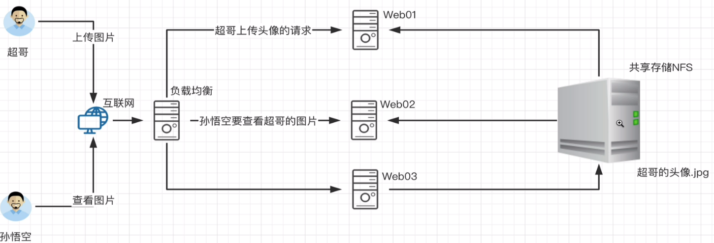

### 防火墙

#### 安装防火墙服务 firewalld

firewall-cmd

```shell
# 查看防火墙状态
firewall-cmd --state

# 重启防火墙(重启完设置才生效)
firewall-cmd --reload

# ftp
firewall-cmd –zone=public –add-port=21/tcp –permanent 开启21号端口
firewall-cmd –zone=public –add-port=30000-40000/tcp –permanent 开启30000到40000的端口
firewall-cmd –add-service=ftp –permanent 永久开发ftp服务
```
-   `firewall-cmd --zone=public --add-service=ftp --permanent`:防火墙开起 ftp 服务
    -   `--zone=public`:设置区域，默认就是public ，下面所以指令都能加
-   `firewall-cmd --list-all`:开放的端口，以及其他信息
    -   `--list-ports`:开放的端口
    -   `--list-service`:查看防火墙已开通的服务
-   `firewall-cmd --add-port=8001/tcp --permanent`:新增开放端口（permanent 表示设置为持久）
    -   `--add-port=8080-8083/tcp`:添加多个端口
    -   `--remove-port=81/tcp`:删除端口
    -   `--query-port=81/tcp`:查询端口是否开放
-    设置完重启防火墙生效


通过 systemctl
```shell
# 开启防火墙
systemctl start firewalld.service | service firewalld start

# 重启防火墙
systemctl restart firewalld.service | service firewalld restart

# 防火墙开机启动
systemctl enable firewalld.service
# 关闭防火墙
systemctl stop firewalld.service
# 查看现有的规则
iptables -nL
```

华为云开放端口使可以在页面访问
1、安全组 Sys-WebServer 添加 端口
2、防火墙开放端口或关闭防火墙
服务器解析第三方域名
服务器设置域名解析，添加第三方域名，第三方将域名dns配置设置服务器提供的dns

#### iptables
> 软件防火墙 iptables，防火墙命令行工具，客户端代理，将用户配置的安全策略，执行到 `netfilter` 中
> 真正实现过滤的是 `netfilter` ,处于内核空间
> iptables+netfilter 实现软件防火墙
> centos7下 才有`firewalld + nftables`代替了`iptables+netfilter`

- 默认防火墙规则

```shell
iptables -L
```


### FTP

>   文件传输协议，搭建好之后可以通过客户端上传现在服务器的文件

FTP协议，直接以明文传输，安全不太好

#### 终端ftp
window自带
```shell
# 登入
> ftp
ftp> open ip
回车 依次输入用户名密码

# help 查看支持的命令列表
ftp> help     ?

# LITERAL PASV 切换被动模式
```

#### 客户端

---

#### 服务端 vsftpd 搭建 ftp 环境

>   vsftpd 基于 FTP 协议，解决了ftp一些传输安全问题 

1.   关闭防火墙 关闭 selinux
     1.   vim /etc/selinux/config ；SELINUX=enforcing  -> SELINUX=disabled
     2.   终端 setenforce 1||0 临时开启关闭,  0 管理好像有问题

1.   VSFTP链接类型
     1.   控制链接 （持续连接）-> TCP21 -> 用户收发FTP命令
     2.   数据链接 （按需链接）-> TCP20 -> 用于上传下载数据

2.   主动模式（Prot）：客户端生成随机端口给服务器

     1.   服务端打开好21端口，让客户端随时来连
     2.   如果登录成功，客户端会生成一个随机端口，Prot模式主动将这端口给服务器，用于接收服务器通过`20端口`发出的数据 

3.   被动模式（Pasv）：服务端主动生成数据交互端口给客户端

     1.   服务端打开好21端口，让客户端随时来连
     2.   如果登录成功，客户端向服务端**发送PASV指令**，服务器开发随机端口(需要指定范围)，并把端口告诉客户端
          1.    随机端口 与 主动模式的 20端口地位是一样的，（注意防火墙开发端口）
     3.   客户端生成临时端口，与服务器随机端口来与 服务器传输数据
     4.   云服务器上你可以连接到服务器上某个端口，但是服务器连接不到你（云服务器最好用被动模式）

4.   数据传输模式

     1.   **Binary模式：**不对数据进行处理，适用于`可执行文件`、`压缩文件`，`图片`等
     2.   **ASCII：**进行文本传输时，自动适应模板操作系统的结束符，回车符等
     3.   切换方式 ftp 命令提示符输入 ascii 或 bin 转换

5.   安装
     -   安装 `vsftpd`
     -   `systemctl enable vsftpd` 开机自启服务
     -   `systemctl start vsftpd` 启动服务
     -   `netstat -antp` 查看21端口是否开启
     -   
     
6.   登录颜色方式
     1.   匿名账户登录

          1.   名称 `ftp` 或 `anonymous`
     
          2.   无密码，直接回车
     
          3.   默认目录：`/var/ftp`
     
          4.   默认权限： 可下载不可上传 ( 上传权限由两部分组成 )
               1.   主配置文件部分 `anon_upload_enable=YES`
     
               2.   文件系统部分 
                    1.   `/var/ftp` 除了所有者之外，组 和 其他人是否有写入权限，一般添加子目录 `chmod 添加权限 777`
     
                    2.   本地用户，一般把他的跟文件夹所有者，变成他
     
               3.   不用创建大量用户，但是所有人都能用，都设置完在重启
     
          5.   相关配置一般 `anon` 开头
     
          ```shell
          # 匿名用户 常用配置 /etc/vsftpd.conf
          # 账户:anonymous或ftp 密码随意
          anonymous_enable=YES #是否允许匿名访问
          anon_root=/usr/local/ftpdir #配置匿名用户根目录(如果无法直接设置777，许在ftpdir创建777权限文件夹，供匿名用户使用)
          anon_umask=022 #匿名用户上传的文件，其他人能否操作这些文件，的权限掩码 
          anon_upload_enable=YES #是否允许匿名用户上传写入
          anon_mkdir_write_enable=YES
          anon_other_write_enable=YES
          
          # root 目录下创建 .message 文件
          dirmessage_enable=YES # 登录就会显示 .message 的内容 
          
          no_anon_password=YES #匿名用户不用密码登录
          ftp_username=ftpuser #匿名登录后的使用者
          anon_world_readable_only=YES　　　　　 　# 开启匿名用户下载权限
          ```
     
          
     
     2.   本地用户登录
     
          1.   账号密码 : `本地账户的用户名与密码`
          2.   工作目录：登录用户家目录  `drwx------`
          3.   创建访问，不用登录系统的用户(本地 linux 用户)
               1.   `useradd -s /sbin/ nologin zhangsan`
          4.   相关配置一般`local`开头，所有用户local配置的是一样的
     
          ```shell
          # 本地用户 /etc/vsftpd.conf
          local_enable=YES #是否允许本地用户`如root`登录
          local_root=/home/ftpuser #设置本地用户登录后默认路径，否则默认在自己的家目录
          local_umask=022 #设置本地用户上传文件的权限
          
          listen=YES
          listen_ipv6=YES # 注释掉
          local_max_rate=0 # 限制最大传输速率
          write_enable=YES #是否允许写入，否则不能上传文件
          ftpd_banner=Welcome to blah FTP service. # ftp链接成功提示
          
          # 配置文件 chroot_list
          chroot_local_user=YES # 本地用户不能切换到上级
          chroot_list_enable=YES #是否启用限制用户名单
          chroot_list_file=/etc/vsftpd/chroot_list # 如果开启就要指定路径，里面的用户不限制去上级
          allow_writeable_chroot=YES #如果文件不能上传 550 Permis....，可以加上这儿
          allow_writeable_chroot=YES & setenforce 0 # 这个设为yes 并且 关闭eslinux，才能正常使用 chroot
          
          # 配置文件 user_list
          userlist_enable=YES & userlist_deny=YES # 禁止/etc/vsftpd/user_list 文件中的用户登录
          userlist_enable=YES & userlist_deny=NO # 允许 /etc/vsftpd/user_list 文件中的用户登录
          
          # 配置文件 ftpusers 权限高，里面所有用户都不允许登录，root默认在里面（（manjaro 没有））
          
          # 被动模式
          pasv_enable=YES # 启用被动模式，默认YES
          pasv_min_prot=40000
          pasv_max_prot=50000  # 指定被动模式端口范围
          
          # 主动模式
          prot_enable=YES|NO # 是否取消主动模式 默认YES
          ```
          5.  新建一个用户
          ```shell
          # 配置一个用户
          useradd -s /sbin/nologin ftpuser
          passwd ftpuser

          # 权限目录 默认 家目录
          mkdir /var/ftp/ftpupload
          chown -R ftpuser:ftpuser /var/ftp/ftpupload

          # 备份配置文件
          cp /etc/vsftpd.conf /etc/vsftpd.conf.back

          pasv_address=114.115.121.129
          pasv_enable=YES
          pasv_min_port=30000
          pasv_max_port=50000

          # 主机安全组配置30000-50000 和 21 端口的几率

          
          ```
     
          
     
     3.   虚拟用户登录
     
          1.    创建虚拟用户代替本地用户
          2.   使用`本地用户`作为`虚拟用户`的`映射用户`，为虚拟用户提供`工作目录`和`权限控制`
          3.   能够设置严格权限，为每个虚拟用户生成单独配置文件
     
          ```shell
          # 虚拟用户
          # 1、/etc/vsftpd/ 建立FTP的虚拟用户数据库文件 vsftpd.user 随意
          user1
          pwd1
          user2
          pwd2     # 奇数行账号，偶数行密码
          
          # 加密生成数据库文件
          db_load -T -t hash -f vsftpd.user vsftpd.db
          
          # 设置 vsftpd.db 文件权限 保证安全
          chmod 600 vsftpd.db
          
          # 创建虚拟映射用户 virturl，并指定用户家目录
          useradd -d /var/ftproot -s /sbin/nologin virturl
          
          # /var/ftproot 添加其他人权限
          chmod o+r /var/ftproot
          
          # 建立支持虚拟用户的PAM任务文件 /etc/pam.d/vsftpd ，添加虚拟用户支持
          cp -a /etc/pam.d/vsftpd /etc/pam.d/vsftpd.pam
          
          # 编辑 .pam （清空原来内容，添加下面两行）
          auth       required    pam_userdb.so db=/etc/vsftpd/vsftpd
          account    required    pam_userdb.so db=/etc/vsftpd/vsftpd
          
          # vsftpd.conf 文件添加支持
          # 修改
          pam_service_name=vsftpd.pam
          # 添加
          guest_enable=YES # 开启虚拟用户
          guest_username=virturl # 指定虚拟用户的映射用户
          user_config_dir=/etc/vsftpd/dir # 虚拟用户的配置目录，需要创建 /etc/vsftpd/dir 
          
          # 关闭匿名用户的一些配置,除非都要用的，否则私有的要提到 dir 下 单独配置
          
          # /etc/vsftpd/dir/user1
          anon_upload_enable=YES # 允许 user1 上传文件
          
          # /etc/vsftpd/dir/user2
          anon_mkdir_write_enable=YES # 允许创建目录
          
          # /etc/vsftpd/dir/user3
          # chown virturl:virturl /var/ftpuser1/  改变所有者与所属组
          write_enable=YES # 写权限，vsftpd.conf 有的这边就不要设置了
          anon_upload_enable=YES
          anon_mkdir_write_enable=YES 
          anon_other_write_enable=YES # 删除/重命名的权限
          anon_world_readable_only=YES # 文件的其他人必须有读的权限才允许下载
          local_root=/var/ftpuser1  # 指定自己独有的家目录，不是 anon 就是 local开头
          
          
          ```
     
     4.   **配置文件中不能出现多余空格**


### DNS

 域名 指向一个 IP 

DNS 就是域名和IP互相解析的一个服务

 #### 域名的组成和分类

>   常见完整格式 `www.atguigu.com.`

1.   `.`：跟域，可以省略不写 ，所有 `com` `cn`等 顶级域，都是建立在跟域上的
     1.   全球共13台根域名服务器。名字分别为“A”至“M”，10台在美国，另外各有一台设置于英国、瑞典和日本。
          1.   分为1台主根，12台辅根，辅根数据也必须从主根同步
     2.   所有根服务器均由美国政府授权的互联网域名与号码分配机构ICANN统一管理
     3.   国内设置`镜像根域.`使国内用户进行域名解析时效率更快，不要每次都跑国外去
          1.   `镜像根`的数据只能来源于根域服务器，从根域服务器同步，不能其他方式更新
2.   `com`：顶级域， ICANN组织指定和管理
     1.   国家地区域名：**cn 中国**、**hk 香港**、**sg 新加坡** 等
     2.   通用顶级域名：**com ( 商业机构 )**、**org ( 非盈利组织 )**、**edu ( 教育机构 )** 等
     3.   新通用顶级域名：red   top
3.   `atguigu`：二级域（ 注册与 )，个人或组织申请注册
4.    `www`：三级域 （ 子域 ），服务器网站代表
5.    `其他`：
     1.   `s1.www.xxxx.xx` s1代码某台主机
     2.   `com.cn` 属于二级域名，是 cn 顶级域的子域

#### DNS域名解析过程

1.   客户端访问 `www.atguigu.com`  
     1.   浏览器自动补齐`:80`
2.   客户端首先查询自己的 hosts 文件，查看该文件内是否有 `www.atguigu.com` 的记录
     1.   有 直接返回IP地址给浏览器 
3.   客户端继续在本机内查询DNS的解析缓存
     1.   有 直接返回给浏览器
4.   客户端查看网卡上设置的DNS服务器地址，访问DNS服务器，查询结果，
     1.   若解析库有解析记录，返回给客户浏览器
5.   客户机设置的DNS服务器，解析库找不到，去该服务器缓存查找
     1.   有 直接返回
6.   DNS服务器 向根域发起`迭代查询`
     1.   DNS 找到根域， 拿到`com` 顶级域 的 IP地址
     2.   DNS 根据 `com`顶级域的IP 找到顶级域，获取二级域`atguigu`的ip地址
     3.    DNS 根据 `atguigu`二级域的地址找到二级域，获取 三级域`www`的 IP，这个就是我们需要的IP地址
7.   拿到真正的IP地址后，**返回给客户端**，并把这次这个新记录**保存**到自己DNS解析库和缓存中，下次就不要再`迭代查询`了


### nc

-   安装 `nmap-ncat`或`nmap-netcat`

### openssh(远程连接工具)

> 使其他设备可以通过 `xshell，mobaxterm 等工具远程连接`

-   安装 openssh
-   `system status ssh`:查看是否开启
-   `lsof -i:22`:检测是否可以使用,默认 22 端口

-   mobaxterm 链接 图形界面
    -   首先目标linux系统需要支持`X11-forwarding`
    -   arch系列
        -   yay -S xorg-xauth
        -   touch ~/.Xauthority && chmod 600 ~/.Xauthority
        -   sudo vim /etc/ssh/sshd_config 将 AddressFamily any 改为 AddressFamily inet
        -   sudo systemctl reload sshd.service && sudo systemctl restart sshd.service

### lsof

### wget

### htop
-   通过上下左右控制，不能HJKL
-   `F2`:显示界面设置，`空格`切换显示模式，`Available meters`回车，添加指定属性,delete删除
-   `F3`:搜索
-   `F4`:过滤(隐藏不匹配的进程)
-   `F5`:进程树

### docker
> 容器镜像服务，Docker理解成一个专门分装应用程序与执行环境的轻型虚拟机,作用镜像制作

[镜像官网](https://hub.docker.com)
[其他镜像](https://quay.io)

  -   yay安装 ，通过systemctl开启服务
  -   权限:
    -   创建docker组，将相关用户归属组添加docker
    -   sudo gpasswd -a username docker
  -   刷新:newgrp docker
    -   id username 查看是否添加成功
  -   镜像
  -   阿里云 -> 控制台 -> 产品与服务 -> 搜索容器镜像服务-> 加速配置
    -   将他的配置json内容复制到/etc/docker/daemon.json中
  -   常用命令
    -   `docker info`:查看docker基础信息
    -   `docker search xxx`:查找镜像
    -   `docker pull xxxname`:下载镜像
    -   `docker images`:查看下载镜像的信息
    -   `docker rmi IMAGE_ID|Tag`通过id或tag删除
    -   `docker save -o centos.tar centos:7`:保存将名称:centos,tag：7的镜像输出中centos.tar文件中

#### 常用基础环境服务
-   `httpd`:Apache
-   `busybox`：轻量嵌入式系统
-   `centos`:系统镜像

#### lazydocker
> docker gui管理插件

### samba
> 是一款linux系统应用微软文件资料的工具
> 微软指定了`SMB协议`，用于`局域网`文件共享，

特点：
1、linux与Windows之间进行文件和打印机共享
2、适用于linux与linux，和linux与window
3、NFS个适合linux与linux的文件共享，所有samba一般用在 linux与window使用

安装
```shell
# yum 安装配置文件一般在 /etc 下
yum install samba -y
cd /etc/samba


# global 全局配置
[global]
    # 定义一个工作组
	workgroup = SAMBA  
    # 安全验证方式 user代表账号密码
	security = user

	passdb backend = tdbsam

	printing = cups
	printcap name = cups
	load printers = yes
	cups options = raw

# 下面的都是独立局部配置，如:home下面的配置，只对homes文件夹生效 
[homes]
	comment = Home Directories
	valid users = %S, %D%w%S
	browseable = No
	read only = No
	inherit acls = Yes


```
案例
1、建立共享文件夹
```shell
[testshare]
# 描述
	comment = All Printers
# 共享路径
	path = /var/tmp
# 是否公开
    public = no
# 是否可以写入
    writable = yes
# 是否允许匿名用户登录
    guest ok = yes

```

2、使用pdbedit 创建samba服务专用的密码信息
3、使用pdbedit管理samba用户,这个用户必须是linux用户
```shell
# 创建用户
pdbedit -a -u user-name

```
4、重启smb服务，并检查samba端口(445)是否存活
5、检测防火墙
iptables -L

6、使用客户端链接

```shell
# window
运行输入
//sam服务器地址

# macos
smb://sma服务器地址


```
### NFS
> 稳定的网络文件共享系统，与云服务器的共享
> 软件共享存储，大公司有可能需要购买硬件设备分担压力,成本高
> 统一存储网站静态数据


> NFS 和 RPC
1、NFS通过port传输数据，端口是随机的,主动再RPC进行注册（重启NFS，查看端口是否变化）
2、所以需要通过`RPC`服务进行端口注册，实现告知用户NFS端口是什么
3、所以RPC(远程过程调用)，NFS两个服务一起启动
4、过程：NFS（客户端）发送请求(端口111)到RPC，从而得到一个端口，再拿端口去访问远程NFS服务端

> 环境搭建
1、安装 rpcbind
2、安装 nfs-utils

> 环境配置
1、NFS是c/s模式，client,server 准备台机器
2、NFSServer创建共享文件夹，并给与权限 
3、修改NFSServer配置文件
```shell
# /etc/exports
# 配置文件规则
# NFS服务端共享目录 NFS客户端地址(参数...) NFS客户端地址2(参数...)
/root/nfsshare *(ro)  #所有人可读
/root/nfsshare 主机名(rw) 主机名2(rw)  允许这两个主机可读写
/root/nfsshare IP(insecure,rw,root_squash) 允许这个IP可读写
/root/nfsshare 192.168.178.0/24(rw) 允许整个178网段访问（24 子网掩码24位，255.255.255.0）

# 权限参数
insecure 允许客户端从大于1024的端口发请求(参数1必须加)
ro  只读
rw  读写
root_squash 如果客户端以root访问服务端nfs时，会把该用户映射位匿名用户，UID GID会变成nfsnobody的信息
no_root_squash 和上面相反不安全
all_squash 无论是root还是非root，全部匿名，很安全
sync 数据同步写入到磁盘和内存，保证数据安全，但效率低
async 数据线写入到内存，再持久化到磁盘效率高

```
4、启动NFS服务的文件共享目录
```shell
# NFS基于RPC111端口，保证RPC以及启动,111 端口启动
systemctl start rpcbind
netstat -tunlp|grep 111

# 写好NFS配置文件与挂载目录
chmod -Rf 777 path  强制递归给与权限
chown -r nfsnobody:nfsnobody path
# 启动NFS
systemctl start nfs-server.service （centos8专的版本）

# 检测本地共享情况
showmount -e 127.0.0.1

# 检测共享参数
/var/lib/nfs/etab
```

5、本地挂载测试
mount -t nfs 114.115.212.xxx:/root/nfsshare /mnt
umount /mnt 取消挂载 

6、客户端挂载
```shell
# 确保安装了nfs-utils和rpcbind
# 开启rpcbind
# 检测服务端共享是否可用，如果通了就能进行挂载操作
# 云服务器安全组需要开发111端口
showmount -e 服务端IP 

# mount -t -nfs xxxxx

```


### postfix + dovecot 收发邮件

 每个企业的邮箱都有 客户端 和  

### VNC 远程linux图形界面

服务端
```shell
yum install tigervnc-server

# 设置分辨率
vncserver -geometry 1920x1080

# 启动服务
vncserver
    输入至少六位密码
    验证前面数的密码
    第三个选n
    等待服务开启....

vncserver -list  查看端口与进程, 完成后去客户端

防火墙开放这个端口或关闭防火墙
```

进入官网下载客户端 下载`vnc viewer`桌面程序
    https://downloads.realvnc.com/download/file/viewer.files/VNC-Viewer-6.22.515-Windows-64bit.exe

新建链接
输入 ip与端口
名称随意 root

### 备份
`FreeFileSync`: [数据备份软件](https://freefilesync.com/)
1. 手动备份
    -   选择连个文件夹，比较可以看到差异文件，选择同步方式进行同步
    -   设置一次后，可以保存为批处理作业，变成开启执行，后手动点击直接同步

2. 监视备份 `RealTimeSync`
    -   可以添加很多个监视文件夹，设置空闲事件，每隔这么多秒，就去查看监视的文件夹是否有变化
    -   如果有变化就会执行下面命令行(命令可以把 前面的批处理作业拖进来)

3. 通过 window 的任务计划程序定时执行`批处理作业`，linux可以用cron