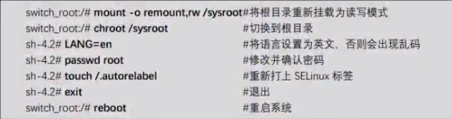

## 基础简介

-   安装[国内阿里云镜像](http://mirrors.aliyun.com/centos/)
-   安装[国内阿里云镜像](http://mirrors.aliyun.com/ubuntu-releases/20.10/)
-   安装[国内搜狐镜像](http://mirrors.sohu.com/)
    -   比较老版本可能不提供下载，需找较新的版本
    -   选择软件，默认最小安装，初学者建议选择带 GUI 的服务器
-   虚拟机
    -   快照：保持当前状态，后期玩坏了随时可回到这里
    -   克隆：完全克隆与连接克隆，链接克隆相当于创建一个子系统，只要父系统没事，子系统就能随便搞
    -   重建：安装系统的目录下有一个 vmdk 文件，如果保持好，其他系统安装的时候选择现有磁盘，再选择这个 vmdk 文件，那么系统就能还原
-   Linux 发行版(Ubuntu、CentOs;同一个内核在市场上有三百多个发行版),在 Linux 内核上安装软件上

    -   红帽(RedHat)系列
        -   红帽企业版 收费
        -   CentOs 相当于免费红帽企业版系统，后期也被红帽公司收购了
    -   debian 系列
        -   Ubuntu(在 Debian 上二次开发的系统，图形界面效果好)

-   GNU 计划：崇尚代码开源
-   Shell：指用户界面，包括图形界面（GUI）和字符界面（CLI），Linux 以字符界面为主，所以字符界面称为是`Shell`

    -   通过字符界面操作的指令叫做 shell 指令（cat /etc/shells）查看 Shell 目录
    -   Linux 默认使用的是目录中的 `/bin/bash`(通过 echo $SHELL 可以查看)
    -   进入图形界面： `ctrl+alt+f1`
    -   进入字符界面： `ctrl+alt+f2~6` ,打开五个字符 Shell(`虚拟终端 tty`)
    -   通过远程连的终端： 伪终端`pts`
    -   `tty`指令查看当前终端设备文件

    -   echo 查看$变量值
    -   shell 通常有`自带`一些命令称为`内部命令`如 cd、pwd,但是大多数都是`外部命令`,通过 `stype cd` 查看
    -   外部命令 (`which ls`通过 which 查看指定命令位置)
        -   每个外部命令都对应一个可执行文件，存在系统中
        -   普通命令:/bin、/usr/bin、/usr/local/bin
        -   管理员命令:/sbin、/usr/sbin、/usr/local/sbin

-   终端：通常把一套键盘鼠标显示屏这样的输入输出设备叫做`终端`
    -   笔记本这样的叫做`物理终端`，一个设备只有一个
    -   通过各种软件打开的字符界面叫`虚拟终端`可以很多个
    -   tty ： 查看当前使用终端的名称
-   远程工具
    -   Xshell：通过远程 Linux 的 ip，连接到远程
        -   必须能 ping 通的才行
        -   win10 默认不让其他人 ping 的，要去防火墙入站规则中设置
        -   拥有账户
    -   XMANAGER
-   命令提示符：[lzoxun@bogon ~]$ --> `[用户名@计算机名 所在目录]`
    -   ~ ：指用户家目录，每个用户都不一样
    -   $ ：普通用户
    -   \# ：root 用户

## 指令

-   格式 ： 命令 + [选项] + [参数]
-   参数 ： 命令要`处理的对象`
-   选项 ： `调节`命令的具体功能，带 - 前缀
-   tab 补全目录| ；多个命令用分号隔离

### 基本操作命令

-   `pwd` ：查看当前所在路径
    -   `-P`: 对于软连接文件 显示真实所在的路径 并非快捷方式的路径
-   `su <user-name>` ： 切换用户
-   `passwd <user-name>` ：更改用户密码（需要交互）
    -   `echo '123' | passwd --stdin <user-name>`：直接设置
-   `ln`: ln -s 源文件 快捷方式文件
-   `alias`: 创建别名(`/home/xxx/.bashrc`)
    -   `alias`:查看系统中存在的别名
    -   `alias xxx ='cat /etc/passwd'` : xxx 的作用就是查看 passwd
    -   `unalias xxx`:撤销指定别名
-   `history`：
    -   `-d num`:删除指定历史指令
    -   `!num`:执行指定历史指令
    -   `-c`:清除缓存的历史命令
-   `man` :查看帮助（help xxx 这里的 xxx 只能是内部指令）
-   `clear|Ctrl+l`:清除屏幕
-   标准输入输出
    -   `Stdin`:标准输入，文件面描述符号 0,鼠标键盘
    -   `Stdout`:标准输出，文件面描述符号 1，显示器
    -   `Stderr`:错误输出，文件面描述符号 2，显示器
    -   重定向
        -   输入重定向 > 或 >>,将输出到屏幕的内容转到指定文件中
            -   cat 1.txt 2.txt > 3.txt :合并文件 1 与文件 2
        -   错误信息从定向 2> ;将错误信息从定向到指定文件
            -   cmd xxxxxx 2> filepath
            -   cmd xxxxxx 2> /dev/null :将错误信息不存储不打印
        -   &> 错误和正确的全部从定向
        -   输出重定向 < 或 << ,将键盘的输入重定向到指定文件，详单与查看文件内容如：cat
            -   `cat > /etc/passwd`
            -   `cat >> xxx`:进入一个输入模式，无限输入，输入 xxx 后生成文件，结束此状态

### 文件操作

-   `cd` ：进入
    -   `cd -` ：进入之前所在目录
-   `ls`：查看目录的文件
    -   -l ：查看详细信息
    -   -a ： 查看所以文件包括隐藏文件
    -   -d ： 查看目录`自己的`信息
    -   -h ： 以 k、M 格式显示文件大小
    -   -R ：当前目录为根节点，列出所有子节点
    -   -i:查看文件唯一编号 inode
    -   --help ：单词一般都有两个杠
-   `touch <file-name>`：创建空文件
-   `mkdir <name1> <name2>`：创建空文件夹
    -   `-p a/b/c` ：创建多级目录
-   `rmdir <name1>`： 删除空目录
-   `rm <file-name>`： 删除文件
    -   `-f`：直接删除
    -   `-r`：删除目录
    -   `-rf`：强制删除目录下所有文件与文件夹
-   `cp <old-file> <new-file> `： 复制文件(new-file 有-复制，无-改名)
    -   `-r` ：复制目标可以是目录
    -   `-p` ：保留复制目标文件属性
-   `rsync <old-file> <new-file> `
    -   `-r`:递归复制子目录
    -   `-v`:查看复制的文件
    -   `-u`：只复制修改过的文件
-   `mv <old-file> <new-file> `： 剪切（剪切目录不要 -r）
    -   安装 mmv
    -   mmv '_._._._' '#1.#2'
    -   mmv 'file\*.rar' 'text#1.zip'
    -   #1 代表第一个*号匹配的内容，#2 代表第二个*号代表的内容
-   `dd if=/dev/zero of=/tmp/test bs=1M count=60`:构造一个 60 个 1M 大小的文件，从/dev/zero 文件放到/tmp/
-   文件属性设置

    -   文件或者目录设置扩展属性后 root 也要按照规则操作
    -   `chattr [-RV] +或- i或a 文件`
        -   `-R`:递归修改文件夹子目录文件
        -   `+-`:添加或删除
        -   `i`:只读属性，添加后 root 也无法修改
        -   `a`:只能往文件中增加内容，不允许删除
    -   `lsattr 文件`:查看属性

-   文件查找

    -   `locate <file name>`:返回文件所在路径,根据索引数据库查找，一段时间后数据库自动更新
    -   `find`: find <查找起始路径> <选项> <查找条件> <处理动作>

        -   `起始路径`:
        -   `选项`:

            -   `-name` :按文件名查找
            -   `-empty` :空文件或文件夹
            -   `-type 文件类型` :查找指定类型的文件(f、d、l、b、c) f 代替 - 普通文件
            -   `-not`:取反
            -   `-ls`:显示匹配文件的
            -   `-size`:
            -   `-i`:忽略大小写
            -   权限相关
                -   `-user root`:查找所有者是 root 的文件
                -   `-group`
                -   `-uid`
                -   `-gid`
                -   `-nouser`:没有所有者的文件(用户被删除)
                -   `-nogroup`:没有所属组的文件
                -   `-perm 755`:按权限查找
                    -   模糊查询
                        -   `perm /620` :查找出所有者拥有 r 或 w 权限，或者所属组有 w 权限的文件，`0代表不理会`
                        -   `perm -220`:并且
                    -   特殊权限查找(SUID 4、SGID 2、Sbit 1)
                        -   `perm /7000`:最高位是特殊权限，umask 查看

        -   `查找条件`:文件名称是什么、文件大小、文件类型、从属关系、权限等（通配符）
        -   `处理动作`:对找到的文件 进行指令操作
            -   find 找到的是文本信息内容可以直接 | 加指令操作
            -   -exec ls xxx {} \; 找到结果当做文件处理，但是指令后面需要加 {} \;结尾,| {} 代表找到的文件 \结束
            -   | xargs ls xxx 通过管道使用，功能与-exec 类似
                -   | xargs -i cp {} /root 加-i 可以用{}的功能
                -   echo "a b c"|xargs mkdir 直接新建a、b、c目录
                -   xargs单独使用
                    -   xargs (默认跟echo命令),将用户输入作为标准输出,用在后面跟的命令上
        -   根据时间戳查找
            -   天 : `-atime`(访问时间) 、`-mtime`(更改内容时间)、`-ctime`(改动时间)
                -   find /etc -atime +7 (七天内没有被访问过的文件)
                -   find /etc -atime -7 (七天内被访问过的文件)
            -   分 : `-amin`(访问时间) 、`-mmin`(更改内容时间)、`-cmin`(改动时间)
                -   find /etc -amin -7 (七分钟内被访问过的文件)

### 文件内容操作

-   `cat`：查看文本文件内容
    -   `-n`：显示行号
-   `more`：查看文本文件内容，分页功能满屏幕自动暂停，底部自动退出
-   `less`：查看文本文件内容，分页功能满屏幕自动暂停，手动按 Q 退出
-   `head -3 和 tail -3`：查看文件前 n 行或最后 n 行，指定行数

    -   `-f`：监听文件数据变化

-   `wc -l`：查看文件行数
-   `echo 'abc'`：输出内容，查看变量内容

    -   `> a.txt`: 内容重定向到指定文件

-   `sed`:[sed -i "s#https#http#g" `grep http -rl VERO`] 将 VERO 下所有子目录所有文件里的 http 替换成 https
    -   `-i`:直接修改文件
-   `grep "key" <file-path>`:从指定文件中查找关键字（支持正则不支持通配符）
    -   `"^key$"`：正则直接操作关键字
    -   `-n`：行号
    -   `-v`：查找关键字规则不匹配的
    -   `-i`：不区分大小写
    -   `-w`：独立单词
    -   `-r`：递归查询子目录文件内容
    -   `-o`:只显示匹配到的
    -   `-l`:只输出匹配内容的文件名
-   `diff <file-name> <file-name2>`:比较两个文件，列出不同的内容

    -   对比规则
        -   `a`:增加
        -   `d`:删除
        -   `c`:改变
        -   `<`:前面文件 1
        -   `>`:后面文件 2
    -   `12a13;>abcd`:文件 2 比文件 1 新增加了一行内容，文件 2 多出 abcd

-   `stat`:查看文件元数据（文件自生的属性权限时间）
    -   `modify time`:文件内容改变的时候（通过这个可以指定有人改了文件内容）
    -   `change time`:文件元数据改变的时候

### 常用模块

-   时间操作
    -   `date`: 系统时间
        -   `+"%F %T"`:2020-09-10 10:00:00
    -   `hwclock`:硬件 BIOS 时间
    -   `cat`:日历
    -   `sudo timedatectl set-local-rtc 1`:同步系统时间

### 基本系统运用指令

-   `ifconfig` ：查看 ip （ens33 格式、lo、virbr0 虚拟网卡）等网卡
    -   `watch -n 1 ifconfig` 实时查看网络状态，RX:接收，TX:发送 => (KB = 数值/1000)
-   `reboot|init 6` ：重启
-   `poweroff|init 0` ：关机
-   `shutdown`
    -   -h now ：立即关机
    -   -h +15 ：一段时间后关机
    -   -r now ：立即重启
    -   -r +15 "给其他在线用户发送信息" ：一段时间后重启
    -   -c ：取消之前 shutdown 的操作

### 字符

-   通配符(一般文件路径操作是通配符,文件内容操作用正则)
    -   `*`：匹配任意数量任意字符 -> 正则 `.*`
    -   `?`：匹配单个任意字符 -> 正则 `.`
    -   `[]`： 匹配指定范围内任意单个字符 如：[0-9]其中之一，[!12]不能是 1 2
-   `{}`：可展开如：mkdir /home/{a,b,c} 创建三个文件
-   `|`:管道（将管道左边的执行结果作为管道右边命令的输入）
    -   将很多命令链接起来执行

## 系统管理

### 用户、组

-   用户(`/etc/passwd`)

    -   基础信息

        -   `id UserName`:查看用户 ID，组 ID 信息
        -   `useradd UserName`:添加用户
            -   `-u 1110`:指定 UID
            -   `-d /HomeDir`:指定家目录
            -   `-g GroupName`:指定基本组不用默认的
            -   `-G GroupName`:直接添加附加组，基本组不影响
            -   `-e 2020-02-02`:用户有效期到 2020-02-02
            -   `-M`:不创建家目录(一般配合`-s /sbin/nologin`使用)
            -   `-m`:创建家目录
            -   `-s`:设置用户默认 shell
        -   `usermod UserName`:编辑用户属性（与 useradd 的参数基本一致）
            -   `-m -d /HomeDir`:指定新的家目录(-m 删除旧的)
            -   `-l newUserName`:更改用户名字
            -   `-G GroupName`:把该用户原来所以的附加组替换成这一个附加组
            -   `-a -G GroupName`:添加一个新的附加组
        -   `su UserName`:切换用户
            -   `su - UserName`:完全切换到新用户，环境工作路径等
            -   `su -`:切换到管理员 root
                -   su 配置文件`/etc/pam.d/su`
                -   取消注释 `auth required pam_wheel.so use_uid`行
                    -   只有`wheel`组的用户才能切换 root
        -   `sudo`:临时获取管理员权限 ,配置文件`/etc/sudoers`

            -   `lisi ALL=ALL`:用户`lisi`使用`sudo命令`可以执行`root的所有`操作
            -   `lisi2 ALL=/usr/sbin/useradd,/usr/sbin/usermod`:`lisi2`使用`sudo`只能执行这`指定的`命令
            -   `echo "1" | sudo -S /usr/local/nginx/sbin/nginx`:sudo 直接输入密码，通过 -S

        -   `userdel UserName`:删除用户
            -   `-r`:同时删除家目录

    -   用户类型

        -   超级管理员用户:拥有最高权限的 root(0)
        -   普通用户：创建的用户(1000 - 60000)
        -   系统用户：不能登录的，系统自己创建用来运行某些程序的用户（程序都必须以某个用户的身份来运行）(1 - 999)

    -   配置文件属性
        -   属性:`lzoxun:x:1001:1001:lzoxun:/home/lzoxun:/bin/bash`
        -   解析:`用户名:密码占位符:UID(用户ID):GID(基本组ID):描述 :家目录 :默认shell`
    -   用户密码(`/etc/shadow`)影子文件
        -   `passwd UserName`:设置密码
            -   `-d`:清除密码
            -   `-l`:锁定用户（在 shadow 密码前添加两个!!）
            -   `-u`:解除锁定
            -   `--stdin`:改变标准输入的地方(减少交互)
                -   `echo '123'|passwd --stdin UserName`
        -   加密
            -   密码是通过 sha 加密的
            -   `echo '123'|md5sum`:md5 加密
            -   `echo '123'|sha1sum`:sha 加密 ...

-   组(`/etc/group`)
    -   基础信息
        -   创建用户时自动创建一个与用户同名的基本组
        -   Linux 用户必须有一个组,默认归属的`基本组(一个)`,
        -   Linux 用户后期可以动态加入其他组，叫做`附加组(多个)`,
        -   `groupadd GroupName`:创建组
            -   `-g xxx`:指定组 id
        -   `groupdel GroupName`:删除组（不能是用户的基本组）
        -   `gpasswd -a UserName GroupName`:给用户添加附加组,从而`得到新组所拥有的权限`
        -   `gpasswd -d UserName GroupName`:从组里删除用户
    -   配置文件属性
        -   属性:`root:x:1001:lzoxun`
        -   解析:`组名:密码占位符:GID(组ID):哪些用户以root组作为附属组`

### 文件的权限与归属

-   权限（以下限制对 root 无效）

    -   文件
        -   read(r):文件读取
        -   write(w):文件写入
        -   execute(x):文件执行(脚本文件并且有执行的权限就能运行了)
    -   目录
        -   read(r):显示子目录,文件列表
        -   write(w):目录中新建、删除、子文件或目录(目录写权限可以删除目录内的所有文件)
        -   execute(x):使用 cd 命令进入,或退出目录
    -   基础操作
        -   `chmod 777 path`:设置权限
            -   数字操作
                -   r(4)、w(2)、x(1)
            -   字母操作
                -   `chmod [ugoa][+-=][rwx] path`
                -   u(所有者)、g(所属组)、o(其他用户)、a(全部)
                -   +(添加)、-(减少)、=(直接设置新的权限)
                -   `chmod o=r-x path`:指定其他用户只有读和执行权限
                -   `chmod a+w path`:所有用户添加可写权限`a可省略`
    
-   归属

    -   `chown`:更改文件或目录的所有者、所属组
        -   `chown root:admin FilePath`:更改所有者与所属组
        -   `chown root FilePath`:更改所有者
        -   `chown :admin FilePath`:更改所属组

-   高级权限
    -   访问控制列表`facl`
        -   前面的权限针对，所有者、所属组、其他人三类进行限制
        -   优先级高于用户的基本权限
        -   `facl`可以针对某一个用户进行权限设置
            -   `setfacl -m u:UserName:rwx FilePath`:设置用户`UserName`对`FilePath`的 facl 控制权限为`rwx`
            -   `setfacl -x u:UserName FilePath`:取消用户`UserName`对`FilePath`的 facl 控制权限
            -   `setfacl -b FilePath`:取消所有人`FilePath`的 facl 控制权限
            -   `getfacl FilePath`: 查看`FilePath`facl 详细信息，以及相关用户
                -   `mask 权限`:某个文件所有用户 facl 权限最大值，文件设置 facl 后，原先组权限位置含义将替换成这个，组的权限在 facl 的 group 中有
-   特殊权限

    -   SET 位权限（针对可执行文件或目录）

        -   SUID（对所有者设置 SET 位权限）,权限值`0755` 0 位置 +4
            -   `-rws------`:使执行该文件的`所有用户`自动具有该文件`所有者`的权限（所有者是 root,那么这些用户就有 root 权限）
            -   如果给 cat 程序添加 SET 权限，那么执行 cat 时所有用户都有管理员权限，都能参看任意文件了
            -   ` chmod u+s xxx`:本来有执行权限加 SET 位->显示小 s,否则显示大 S，`s只是占了位置不影响原来是否有x`
        -   SGID（对所属组内用户设置 SET 位权限）,权限值`0755` 0 位置 +2
            -   给一个`目录设置了SGID`,那么以后`这个目录`下`创建`了`文件`或`目录`，他们的`所属组`都是`SGID目录的所属组`，不是`所有者`的基本组
            -   作用是`目录设置了SGID`所属组的用户，创建的文件可以互相更改，适合协同办公
            -   ` chmod g+s xxx`

    -   粘滞位权限(Sticky Bit) SBIT ,权限值`0755` 0 位置 +1
        -   把对一个东西权限范围限制在直接的身上
        -   如对一个目录有写的权限，本来是可以删除目录下所有文件的，限制成只能删除你自己的文件
        -   ` chmod o+t xxx`
        -   777 权限的文件夹比较需要

-   其他
    -   umask（掩码）
        -   直接只有命令输入当前用户的 umask 值
        -   普通目录权限`最大值777`，普通文件不能执行的`最大权限666`
        -   如果当前用户`umask`为`022`,那么创建文件夹默认权限是`777去掉022=755`，文件默认`666去掉022=644`
        -   `umask xxx`:临时修改 umask 值，就是修改默认文件的权限, (永久修改需要在启动文件执行该命令)

### 其他特殊权限 （暂时跳过 课程 1 66~75 ）

## 文件

> ls -l 查看文件详情

### 文件详情

-   `第一组 权限`：[类型][rwx rwx rwx]
    -   第一位代表类型
        -   `-`：普通文件
        -   `d`：文件夹
        -   `l`：软链接，快捷方式
        -   `c`：字符设备
        -   `b`：块设备
    -   第一组[rwx]读写执行
        -   `所有者`对文件的操作权限
    -   第二组[rwx]读写执行
        -   `所属组`对文件的操作权限（文件未设置 facl 权限的话，否则代表 mask 的值）
        -   其他用户的附加组是该文件的所属组，那么那个用户的权限就是第二个[rwx]
        -   或这个所属组的所有成员(`/etc/group`中最后那个位置)，权限都是第二个[rwx]
    -   第三组[rwx]读写执行
        -   `其他用户`对文件的操作权限
        -   其他用户指的是所有者与所属组成员`之外`的用户
    -   `.` (默认是. 当用 facl 对该文件进行设置时会变成 `+`)、
-   `第二组`：被硬链接的次数
-   `第三组`：文件所有者(创建文件的用户)
-   `第四组`：文件所属组(创建文件用户的基本组)
-   `第五组`：文件大小
-   `第六组`：创建或最后一次修改时间
-   `第七组`：文件名（.当前目录、.. 上级目录）

### 目录信息

> 一切皆文件 、绝对路径、相对路径

-   `/`：跟目录(所以文件的起点)
-   `/boot`：存系统启动相关文件，Kernel 内核的位置，通常独立划分区
-   `/etc`：存各种配置文件，类似 window 注册表
-   `/dev`：存硬盘、光驱、鼠标等硬件设备
-   `/bin`：存最常用的基本命令，`任何用户`都有权限访问
-   `/sbin`：存最基本管理命令，`管理员`才有权限访问
-   `/usr`：默认软件安装路径
-   `/home`：普通用户家目录
-   `/root`：root 户家目录
-   `/mnt`：`临时`挂载存储设备
-   `/media`：系统自动挂载可移动存储设备
-   `/var`：存放`经常变化`的文件
-   `/proc`：存放进程文件,伪文件系统（存的是内存里的数据）
-   `/run`：存放临时文件，重启消失
-   `/lib、/lib64` ： 链接库

-   `srv`
-   `tmp`
-   `sys`
-   `/opt`:第三方应用程序

## vi 与 vim

-   vi 老版本编辑器，功能不齐全
-   vim
    -   工作模式
        -   `命令模式`（移动光标、字符串查找、删除、复制、粘贴等操作）
            -   默认命令模式
        -   `插入模式`（修改文件内容）
            -   命令模式下 a(after)、i、o(添加行插入) 进入
            -   `Esc` 退出到命令模式
        -   `行末模式`（保存、退出、文件内容查找与替换）
            -   命令模式下按 “:” 进入
            -   `Esc` 退出到命令模式
        -   `可视模式`（可进行选择）
            -   `v`:按字符选
            -   `V`:按行选
    -   命令模式常用操作
        -   移动光标
            -   `G`:移到最后
            -   `gg`:移到第一行
            -   `行号 G | 行号 gg`:跳到指定行
            -   `Home | ^ | 0 `:回到行首
            -   `End | $`:回到行尾
            -   `n 上下左右`:向指定方向移动 n 位
        -   上下翻页
            -   `Ctrl+B | Page Up`
            -   `Ctrl+F | Page Down`
        -   复制、粘贴、删除
            -   `x|Del`:删除单个字符
            -   `d`:删除
                -   `dd`:<字符功能>一整行
                -   `#dd`:<字符功能>从光标从光标出开始的#行字符
                -   `d^`:<字符功能>从光标之前到行首的字符
                -   `d$`:<字符功能>从光标之处到行尾的字符
            -   `y`:复制
            -   `p`:粘贴
        -   查找
            -   `/查找的内容`：回车查找，按 `n下N上` 查找其他
            -   `?查找的内容`：从下往上查找
        -   撤销
            -   `u`:撤销
    -   末行模式常用操作
        -   `:wq | :x `:保存并退出
        -   `:q`:未修改退出
        -   `:q!`:放弃修改并强制退出
        -   `:w path`:另存为
        -   替换
            -   `:[范围] s/替换的内容/新内容[/g][/c]`:[]可有可无
            -   `:% s/word/newword/gc`
            -   `:1,10 s/word/newword/gc`
    -   常用设置
        -   `:set nu |:set nu` 设置行号

## 磁盘管理与文件管理系统

### 磁盘分区与格式化

-   存储设备

    -   硬盘接口 IDE(I)、SCSI(S)(服务器常用)、SATA(A)、NVMe(V)等
    -   分区：早期硬盘只能有四个主分区，后面越来越多，四个不够，就可以拿一个变成扩展分区,扩展分区里可以创建很多的逻辑分区（如果需要的分区不超过四个就没必要使用逻辑分区）
    -   Linux 中每个磁盘，以及磁盘中的每个分区都是用`文件表示`的
    -   USB 接口移动设备读书 sd 开头，光驱光盘默认都是/dev/cdrom
    -   硬盘:第一块硬盘 sda、第二块 sdb、第三块 sdc....
        -   普通分区 sda1、sda2、sda3、sda4 或 sdb1、sdb2..
        -   逻辑分区 从 5 开始，sda5
        -   `fdisk`:分区指令
            -   `fdisk -l /dev/sda`:查看 sda 硬盘详细信息
            -   `fdisk /dev/sdb`:分区硬盘 2
                -   主分区
                    -   p 主分区，e 扩展分区
                    -   选择分区号
                    -   起始扇区（可以默认）
                    -   结束扇区（可以 +10G）
                    -   输入 p 查看，n 继续创建新分区
                -   扩展分区
                    -   p 主分区，e 扩展分区
                    -   选择分区号
                    -   起始扇区（可以默认）
                    -   结束扇区(不填直接到结尾)
                -   如果有了扩展分区，那么继续按 n 时，就没有 e 了，只能选择 p 和 l(逻辑分区)
                -   `w`：保存退出，`q`:不保存，`Ctrl+退格可以撤销`
                -   `cat /proc/partitions` :查看是否生效
                -   执行指令按 d 删除分区
            -   swap 交换分区，虚拟内存(内存不够是从硬盘临时拿出一点单做内存用)
        -   格式化
            -   低级格式化：划分磁道与扇区（物理操作，对硬盘硬件影响大）
            -   高级格式化
                -   文件系统 `/etc/filesystems`
                    -   win：主要有 `NTFS` 、`FAT32`(单文件大小不能超过 4G)等
                    -   Linux:
                        -   ext 系列
                        -   xfs 系列
                -   格式化操作，创建文件系统
                    -   `mkfs -t xfs /dev/sdb5`:以 xfs 文件系统格式化第二块硬盘第五分区
        -   挂载
            -   挂载就是`指定一个目录`作为挂载点(分区入口)，用户通过操作这个目录数据对硬盘分区进行`数据存取操作`
            -   根目录默认，被单做挂载点的目录会被从这边分离出去
            -   不论指定那个目录作为挂载点，成功后都会与从原来的地方分离开，成为空目录，卸载后复原
            -   `mount [-t 文件系统类型] 设备文件名 挂载点目录`
                -   `mount -a`:安装 `/etc/fstab` 配置项目自动挂载
            -   `df`:查看所以以及挂载设备
                -   `-h`
                -   `-T`
            -   `umount 挂载点`:卸载
                -   前提 设备不能处于 busy 状态
            -   Linux 至少`/`、`/boot(启动引导)`，swap 交换分区三个分区
        -   新硬盘经过分区、格式化、挂载之后就可以正常使用了
    -   光盘
        -   `mount /dev/cdroom /xxxx`
    -   U 盘插入之后会多个 sdxx,虚拟机的话要先断开与主机的链接
        -   右键 -> 可移动设备 -> 找到 USB - >断开与主机的链接
    -   iso 镜像文件

        -   `mount -o loop isoPosition /xxx`

    -   配置文件自动挂载`/etc/fstab`
        -   得到设备 UUID:`blkid /dev/sdb1`
        -   属性
            -   UUID=7051740a-3450-4f9f-9879-aa3ba007d06b, /boot, xfs, defaults , 0, 0
            -   UUID 或分区名 挂载点 文件系统类型 挂载选项(入 iso 的-o ，一般 default) 是否备份(0 不要) 是否开机检测硬盘(0 不要，1 先检查，2 后检测)

-   手动安装发行版分区
    -   300M 左右- 挂载 boot 和 esp - fat32 ：引导分区
    -   10G+ - 挂载 opt - ext4 ：第三方程序
    -   20G+ - 挂载 / - ext4
    -   8G - 无挂载 - linuxswap:虚拟内存交互分区
    -   其他 - 挂载 /home - ext4

### quota 磁盘配额

-   对磁盘容量或文件数量进行限制
-   磁盘配额需要手动启用,只在指定的分区中有效
-   主要针对系统中指定的`用户`，`组`进行限制，没指定的不受影响
    -   如果是组，那么组内`基本组`成员使用的`容量`或`文件数量`,`之和`不能超过限制
    -   ` user` 的附加组为` wheel`,给 `wheel` 设置权限配额,`与 suser 无关`
-   限制方法
    -   软限制：可以短时间超过,但指定时间得处理掉
    -   硬限制：绝对不能超过限制
-   设置配置文件 `/etc/fstab`

    -   `quota -u UserName`:`查看用户`在哪个分区存在配额限制
    -   `quota -g GroupName`:查看`指定组`在哪个分区存在配额限制
    -   `repquota 分区挂载点目录`:`查看该分区`限制的用户详细

    -   通过挂载选项启用配额:`defaults,acl,uquota,gquota`
        -   `acl`: 使新分区支持 facl 权限列表
        -   `gquota`: 对组设置权限配额
        -   `uquota`: 对用户设置权限配额
    -   `edquota -u UserName`: 如果挂载选择存在 uquota

        -   编辑选项:

            -   `Filesystem`:分区

            -   `blocks`:对磁盘空间进行限制(值是已用空间)
            -   `soft`:软限制(单位 k)
            -   `hard`:硬限制(手动输入限制大小,单位 k)

            -   `inodes`:文件个数进行限制(值是已消耗个数)
            -   `soft`:软限制(个)
            -   `hard`:硬限制(手动输入限制个数,单位个)

    -   `edquota -g GroupName`: 如果挂载选择存在 gquota

### RAID 磁盘阵列（暂时跳过 课程 1 92~104 ）

> RAID 将多块`独立的硬盘`按照`不同方式`组合起来形成一个`硬盘组`，从而提供比单个硬盘`更高的储存性能`和`提供数据备份`的技术

-   组合方式一 | `READ0`
    -   优点:将`数据`保持到`多块`硬盘，多块硬盘`同时`进行工作，从而`提升效率`
    -   缺点:一块硬盘坏了，数据就没用了
-   组合方式二 | `READ1`
    -   优点:将写入一个硬盘的数据原样复制到其他硬盘，不提升效率，但是提升物理安全性
    -   缺点:不提升效率
-   组合方式三 | `READ1 + 0`
    -   至少需要四块硬盘，合并前面两种
-   组合方式四 | `READ5`

## 软件安装

### 预备知识

-   知识点
    -   block:Linux 基本存储单位，大小是 8 个扇区(512B)组合而成,大小 4k
-   `du`:查看文件占用磁盘空间（ll 查看的是文件的大小）
    -   `-h`:人性化显示
    -   `-s`:汇总，查看目录占用磁盘空间
-   `tar`:文件的打包 tar 可以调用 gzip、bzip2、xz 等方式进行压缩或解压

    -   参数: tar [选项] 打包或压缩后的文件名 需要打包的源文件或目录
    -   `tar -zcvf newName.tar /etc`:参数 f 必须放最后 f 与新文件名有关

        -   `-c`:穿件 tar 格式包文件，并不会对包文件进行压缩
        -   `-v`:查看列出打包详情
        -   `-f`:新文件名

        -   `-z`:选定压缩方式为`gzip`,`.tar.gz`，结果:大、快
        -   `-j`:选定压缩方式为`bzip2`,`.tar.bz2`，结果:中、中
        -   `-J`:选定压缩方式为`xz`,`.tar.xz`,结果:小、慢

    -   `tar -xf newName.tar -C 解到目录`:解包
        -   `-x`:解包
    -   `tar -zxf newName.tar.gz -C 解到目录`:解压缩解包（解压-z|j|J 可以省略）
        -   `-z`:解 gzip 压缩
        -   `-j`:解 bzip2 压缩
        -   `-J`:解 xz 压缩
    -   `tar -tf newName.tar.gz`:不解压的情况查看包的内容
-   zip操作
    -   `zip`：压缩
        -   `zip -q -r html.zip /home/html`:将 /home/html/ 这个目录下所有文件和文件夹打包为当前目录下的 html.zip
        -   `zip -q -r html.zip *`: /home/html 目录下直接执行压缩
        -   `zip -dv html.zip index.html`:从压缩包html.zip中删除index.html这个文件
        -   参数
            -   `-r`：递归处理
            -   `-q`:不显示执行过程
            -   `-d`:从压缩文件内删除指定文件
            -   `-v`:显示指令执行过程或显示版本信息
    -   `unzip`：解压
        -   `unzip apc.zip`:解压文件到当前目录
        -   `unzip -n apc.zip -d /home/xxx`:-d 解压文件到当指定目录，-n 不覆盖原有文件,-o 覆盖
        -   `unzip -v abc.zip`:查看zip信息，不解压
        -   `unzip -l abc.zip`:查看zip简洁信息，不解压


### 源码安装

> 用户获得源代码之后,需要自行编译代码并解决许多软件依赖关系，比较困难，`适合所有发行版`

-   必须存在编译软件 如:gcc
    -   `wget`:将程序源码下载到本地
-   步骤
    -   解包：`tar`
        -   得到源码并解压,得到源码文件，并进入
    -   配置：`./configure`
        -   `./configure --prefix=/usr/local/xxxxx`:配置程序安装目录
        -   配置结果保存在源码目录的`makefile`文件里
    -   编译:`make`
        -   将源码转二进制数
    -   安装与部署：`make install`
-   使用
    -   进入`/usr/local/xxxxx/bin
    -   执行 ./xxxxx.probe 主程序

### rpm(RedHat Packet Manager)

-   红帽公司将源码`编译好了`,可以直接使用的`.rpm`软件包
-   只能在红帽派系发行版本中使用
-   rpm 软件包直接存在着复杂的依赖关系
-   结构
    -   `软件名称`-`版本号`-`发布号`.`硬件平台`.rpm
    -   `yum info xxx`可以查看 rpm 包详细信息
-   `rpm -q 服务`:查询服务是否安装
    -   `rpm -qa | grep ssh`:查询已安装与 ssh 有关的软件包信息
    -   `-qi`:已安装软件包的详细信息
    -   `-ql`:查看服务各个文件的安装目录（安装之后系统的相关文件）
        `-qc`:查看`服务配置文件`位置
        `-qf file`:查看`文件属于哪个服务安装`的

### yum 安装

-   自动解决 rpm 的依赖问题(自动安装需要的依赖，不需要手动安装)
-   配置 yum 源或 yum 仓库(yum repo)
    -   仓库中存放大量 rpm 软件包，以及软件包相关的元数据文件（repodata 目录下）
    -   `yum源`配置定义文件以 `.repo`为后缀，存放在`/etc/yum.repos.d/`目录下
    -   `yum源`获取获取方式
        -   1、来自网上服务器
        -   2、本地系统光盘安装(.ios 系统镜像 )
    -   安装阿里云 yum 源：
        -   备份或删除 /etc/yum.repos.d/下的 yum 源文件
        -   wget -O /etc/yum.repos.d/CentOS-Base.repo http://mirrors.aliyun.com/repo/Centos-7.repo
        -   wget http://mirrors.aliyun.com/repo/epel-7.repo --directory-prefix=/etc/yum.repos.d
        -   yum clean all && yum makecache
        -   `yum makecache` 更新 yum 源
        -   `yum repolist` 查看 yum 源
-   yum 源文件详解
    -   `[xxxxx]`:yum 源的名称，自定义且唯一
    -   `name=xxxx xx`:自定义 yum 源的描述这个 yum 源的信息
    -   `baseurl`:指定 yum 源的访问路径
        -   `baseurl=http://xxx`:指向外部网站
        -   `baseurl=ftp://xxx`:指向 FTP 服务器
        -   `baseurl=file://xxx`:指向本地的某个目录
    -   `enabled`:1 启用，0 禁用，没有的话默认为 1
    -   `gpgcheck`:检测 rpm 包来源的合法性
        -   0 不检查
        -   1 检查，并且要加 gpgkey=file:///etc/pki/rpm-gpg/RPM-GPG-KEY-CentOS-7 指定公钥位置
        -   数字签名
        -   centos7 的公钥位置：`/etc/pki/rpm-gpg/RPM-GPG-KEY-CentOS-7`
-   yum 指令
    -   `yum list`:查看系统已安装的软件包(@开头)与可安装的软件包(无@)
    -   `yum repolist`:yum 源列表
    -   `yum info 服务`:查看 info 信息
    -   `yum install 服务`:安装服务
        -   `yum install 服务 -y`:不用询问
    -   `yum remove 服务`:删除软件包
    -   `yum clean all`:清除
        -   重新构建缓存：yum makecache 然后再执行yum update
    -   `yum search ifconfig`:查看 ifconfig 属于哪个软件包
-   常用服务
    -   `lrzsz`:远程文件上传下载
        -   `rz`:从客户端上传文件到 linux
        -   `sz filename`:从 linux 下载文件到客户端
    -   安装rpm
        -   wget https://dl.google.com/linux/direct/google-chrome-stable_current_x86_64.rpm
        -   sudo yum install ./google-chrome-stable_current_*.rpm

```shell
# 案例
# 下载新的repo文件
wget https://mirrors.aliyun.com/repo/Centos-vault-8.5.2111.repo -O /etc/yum.repos.d/Centos-vault-8.5.2111.repo
wget https://mirrors.aliyun.com/repo/epel-archive-8.repo -O /etc/yum.repos.d/epel-archive-8.repo

# 替换源地址
sed -i 's/mirrors.cloud.aliyuncs.com/mirrors.aliyun.com/g'  /etc/yum.repos.d/Centos-vault-8.5.2111.repo 
sed -i 's/mirrors.cloud.aliyuncs.com/mirrors.aliyun.com/g'  /etc/yum.repos.d/epel-archive-8.repo

yum clean all 
yum makecache
```
### DNF 
> 新一代的RPM软件包管理器

[文档](https://wangchujiang.com/linux-command/c/dnf.html)
http://mirrors.aliyun.com/repo/  阿里云源下载列表

centos8添加 epel源
```shell
dnf install https://dl.fedoraproject.org/pub/epel/epel-release-latest-8.noarch.rpm -y

# 测试状态
dnf repolist epel
dnf repolist epel -v

# 建立元数据缓存
dnf makecache  
```
### debian 包安装

-   `apt`
    -   `apt install 服务`:安装
    -   `apt remove 服务`:卸载
    -   `apt upgrade`:更新已安装的服务
-   `sl、htop 、`

## 进程与服务管理

-   进程（PID）
    -   概念
        -   程序与进程的差别
            -   程序:静态的，放在磁盘上的可执行文件
            -   进程:动态的,运行中的程序实例
            -   程序是一些指令的`有序集合`，进程是`程序执行的过程`，进程的`状态是变化`的包括创建、调度、和消亡
            -   程序只要运行，就成了是`进程`,`每运行一次`就会创建一个进程
        -   进程就是系统`内存`中`正在运行`的程序，某些程序可以同时产生`多个`进程
        -   CPU 通过内存去处理这些程序，所以核对线程多处理进程速度越快
        -   没有运行的程序只占用硬盘空间，不消耗系统资源
        -   每个进程都一个父进程来触发它，除非起始进程
        -   linux scentos7 起始进程 `systemd`，开机后第一个进程，其他进程都是通过起始进程运行的子进程
        -   子进程是父进程创建的，父进程结束，需要自觉把子进程杀死，如果特殊情况没有结束的子进程，就是`僵尸状态`
    -   基础状态
        -   运行态
            -   某个进程分配到 cpu 正在处理器上执行的状态，单 CPU 单线程的处理器，一个时间最多有一个
            -   正在占用 cpu 运行，四核八线程可以同时存在八个运行态进程
        -   就绪态
            -   准备好，等前面进程 cpu 时间片时间到，进程调度轮到自己时，直接可以开始工作
        -   阻塞态
            -   等待一个时机到来触发的程序，触发后转就绪态， 如:I/O 交互
        -   进程调度通过`时间片轮转、上下文切换`
    -   进程控制块(task_struct 结构 中的 PCB)??
    -   Linux 详细状态
        -   `R`:可运行状态
        -   `S`:可中断的等待状态
        -   `D`:不可中断的等待状态
        -   `Z`:僵尸状态
        -   `T`:暂停状态
        -   下级分类
            -   `S+`:前台进程
            -   `l`:多线程进程
            -   `N`:低优先级进程
            -   `<`:高优先级进程
            -   `s`:改进程是会话领导者
    -   属性
        -   `PID`:名称
        -   `PPID`:父级 ID
        -   `UID`:启动进程的用户(系统自建的一些用户就是拿来启动特定进程的)
        -   `STAT`:进程状态
        -   `SZ|%MEM`:用掉的內存的大小、百分比
        -
    -   管理
        -   `pidof 进程`:查看指定进程 PID(处理起始进程 PID 固定为 1，其他的都是随机变化的)
        -   `ps`:当前用户当前终端启动的线程
            -   `a`:显示与当前终端有关的所有进程
            -   `x`:显示与当前终端无关的所有进程
            -   `u`:显示影响用户的信息(用户名、cpu、内存等)
            -   `-aux`: 风格一
            -   `-ef`:风格二（可以看到 PPID）
            -   `ajx`:...
        -   `top`:查看动态进程信息(htop 插件的作用)
            -   第一行:`当前时间` up `运行多久`,`几个用户上线`, load average:`过去1、5、15分钟内CPU平均负载`
            -   第二行:Tasks 任务:`任务总数`,`运行态个数`,`就绪态个数`,`阻塞态个数`,`僵死态个数`
            -   第三行:%CPU:`用户开进程占比`,`系统进程占比`,,`闲置CPU`
            -   第四行:Mem 内存:总内存，可用量，已用量，缓冲或缓存
            -   第五行:虚拟内存信息
        -   `who`:查看当前那些用户在登录
        -   `systemctl start httpd`:启动 httpd 这个服务
    -   控制进程
        -   手工启动
            -   前台启动
            -   后台启动
                -   某些操作一直监听不会断，在指令后面添加 `& `转入后台运行,打印编号[n]
                -   或`ctrl+z`临时转入后台
                -   `jobs -l` 查看后台进程列表
                -   `fg n`:转前台进程
                -   `kill 进程ID`:中断进程
        -   调度启动
        -   关闭终端所有程序自动关闭
            -   `nohup nc xxx &`:解除 nc 服务与终端的关系，使终端关闭程序继续运行
            -   与服务器如果关闭终端，程序也会关闭的话，可以用exit退出，而不是直接关闭
            -   `tmux` 不属于当前终端，里面开启的进程也不会随着终端关闭二停止
        -   终止进程
            -   `ctrl+c`
            -   `kill PID`:结束指定进程
                -   `-9`:强制终止
            -   `killall 程序名`:删除与指定程序的所有子进程
    -   监视系统信息
        -   监视用户信息
            -   `users`:查看几个用户在登录
            -   `who`:查看几个用户在登录详情
            -   `w`:查看几个用户在登录，查看更详细信息
            -   `last`:登录信息，查看某个用户从哪里登录过系统`通过日志`
            -   找到用户后 通过杀死终端进程把用户踢走
        -   资源占用信息
            -   `cat /proc/cpuinfo `:查看 cpu 信息
            -   `free`:查看内存情况
                -   `-h`:人性化显示
                -   `-s 3`:动态显示 3 秒更新
                -   available:可用容量，大于空闲分区 free，不够用可以从缓存中取一部分
                -   如果用户从来没使用过交换分区(used 0),说明物理内存充足
-   服务

    -   概念
        -   服务实在系统后台运行、并等待用户或其他软件调用的一类特殊程序
        -   父进程是初始化进程 PPID 为 1，与终端无关 ,0 一般为调度进程(交换进程)
        -   服务程序结尾一般带`d`
        -   比较重要的是一项对外提供功能的网络服务,运行后，通常系统中都会开发相应的端口
    -   指令

        -   `pstree`:查看进程数
        -   `systemd`:cenos7 的初始化进程（之前的是`init`）

            -   核心概念 unit(单元)

                -   Server unit
                    -   systemd 通过 unit 管理功能，每个`unit`都有一个配置文件，存在/usr/lib/systemd/system 或 /etc/systemd/system 中
                    -   配置文件都以`.service`结尾
                -   Target unit

                    -   .target 结尾
                    -   设置运行级别

                -   。。。。

        -   `systemctl`:服务管理(sshd 开启了才能远程链接，防火墙设置允许)
            -   `start|stop|status|restart|reload <server-name>`:启动|停止|查看状态|重启|重新加载 服务
            -   restart 与 reload 的差别，重启是停止再启动，重新加载是不停止重新读取配置文件
            -   `systemctl enable sshd.service`:设置开机自启
            -   `systemctl is-enabled sshd`:查看是否开机自启
            -   `list-unit-files --type service`:查看开机自启的服务列表
            -   `list-units`:查看所以单元
                -   `--type=service`:只看 service 类型正在运行的服务
                -   `--type=service --all`:只看 service 类型所有的服务
        -   `netstat -antp`:查看系统网络服务

    -   完整的服务管理流程
        -   安装相关服务程序
        -   运行服务
        -   将服务设置开机自启
        -   对服务进行配置
        -   重启或者从新加载服务
    -   常用服务以及作用
        -   `vsftpd`:作用:使远程通过 ftp 上传下载

### 运行级别（目标）

> 指定级别可启动的特定服务类型（os7 以前用 init 表示，现在 runlevel[0~6]）表示

-   目标(/usr/lib/systemd/system)
    -   `runlevel0.target`: poweroff.target(`不运行服务 关机`)
    -   `runlevel1.target`: resuce.target(`救援|单例|安全模式`)
    -   `runlevel2.target`: multi-user.target
    -   `runlevel3.target`: multi-user.target
    -   `runlevel4.target`: multi-user.target(`2，3，4多用户模式`，不运行图形界面级相关服务，字符界面)
    -   `runlevel5.target`: graphical.target(`图形相关服务`)
    -   `runlevel6.target`: reboot.target(`重启`)
-   操作
    -   os7 用`systemctl` 代替以前的`runlevel和init`
    -   `systemctl get-default`:查看默认运行级别
    -   `systemctl set-default multi-user.target`:设置默认运行级别
    -   `systemctl set-default graphical.target`:默认图像界面启动
    -   `runlevel`:查看当前运行级别（N 5,从 Null 到 5）
    -   `init 运行级别数字`:临时切换运行级别
    -   os7 中 本质是将：/etc/systemd/system/default.target 软连接指向 运行级别所在的文件
-   通过救援模式重置 root 密码
    -   只能在本地登录才能使用，不能通过远程操作
    -   启动是按 e 进入引导界面
    -   找到系统版本 root=xxx 那一段
    -   找到 LANG=zh_CN.UTF-8
    -   后面+ 空格 + rd.break 进入救援模式
    -   按 ctrl+x 重新进入系统
        

### 计划任务(从未设置成功)

-   一次性计划任务`at`

    -   设置：

        -   `at 时间14:00`
        -   回车进入 at 交互模式,设置指定时间要做的事情
        -   `ctrl+d` 保存退出
        -   模式内`ctrl+退格`删除

        -   echo "ls" | at 时间

    -   通过邮件接收
        -   `mailx`:查看邮件
        -   输入邮件编号，打开指定邮件
        -   `exit`退出
    -   参数
        -   时间格式
            -   `10:00 2021-04-13`
            -   `10:00 tomorrow`
            -   `now+3(minutes|hours|days)`:三分钟后
            -   `10:00`
        -   查看任务列表
            -   `at -l`:任务列表
            -   `at -c 编号`:指定查看任务
            -   `at -d 编号`:删除任务

-   周期性任务`cron|cronie(不要加d)`
    -   `crontab -e` 进入设置
    -   `crontab -l` 查看列表
    -   时间周期格式
        -   分钟 0-59
        -   小时 0-23
        -   日期 0-31
        -   月份 0-12
        -   星期 0-7，0 和 7 都代表星期天(程序中cron表达式有的1-7，1-星期天)
        -   特殊符号:
            -   `*` 该范围任何时间
            -   `,` 多个选择 1，2，3
            -   `-` 多个选择 1-3
            -   `/` 小时段: `8-18/2` 8 点到 18 点之间每隔 2 小时执行一次
                -   `0/4`:从0开始，每隔4分/秒/小时。。执行一次
                -   `*/4`:从程序启动开始，每隔4分/秒/小时。。执行一次
    -   任务内容(`cron`，`cronie`不用路径)
        -   指令必须带路径`where` 可找到指令路径
        -   任务与终端无关，无法获取到环境变量
    -   案例
        -   `30 20 12 4 * /usr/bin/cat /etc/passwd`
    
    -   高级(Linux cron 可能不支持)
        -   cron的字符:'* , - / # ? L W C'
        -   2#3:周0-6:某月第三个星期二,1-7表示第三个星期一
        -   2W:天段，表示某月第二个工作日,LW,某月最后一个工作日  
        -   L:天段,某月最后一天·,周段，5L某月最后一个星期五
        -   C: 天段, 5C,某月5号后的第一天 或 某月从第一天开始的后五天
        -   C: 周段,1C,某月星期一后第一天
## 配置文件

### .bashrc

> bash 在每次启动时都会加载 `.bashrc` 文件内容

-   别名
    -   `alias ll = "ls -lha"`:执行`ll`就相当于执行`ls -lha`
-   颜色设置
    -   用户名颜色
        -   `echo "PS1='\[\e[37;40m\][\[\e[32;40m\]\u\[\e[37;40m\]@\h \[\e[35;40m\]\W\[\e[0m\]]\$'" >> ~/.bashrc`
        -   https://blog.csdn.net/woshizhangliang999/article/details/103553567
-   函数

```shell
    # 执行 md dir 创建dir并进入
    md () {
        mkdir -p $1
        cd $1
    }
```

### .vimrc

## 其他

### 提升效率

-   `tab` 补全目录
-   `history`：查看历史命令
-   `esc + .`：快速得到上一次指令中的路径
-   `--help`：查看指令详细信息

### 不重要

-   `$SHELL` :一般全大写的系统自带环境变量
-   `echo $PATH` :查看环境变量
-   `echo $?` :查看上一条命令执行结果的对错(0:正确，非 0:错误)
-   `source ~/.bashrc`：更新配置文件立即生效
-   `wall` ：登陆的终端发送消息

### 查看系统信息
-   `uname -a` :查看系统信息
-   `cat /proc/version` :查看当前操作系统版本信息
-   `cat /etc/issue`:查看当前操作系统发行版信息
-   `cat /proc/cpuinfo`:CPU信息
-   `getconf LONG_BIT`:多少位
-   `cat /etc/sysconfig/network-scripts/xxx网卡`:查看网络配置
-   `lsblk 、fdisk -l、df -h`:磁盘信息
-   `free -mh`:查看内存信息
-   `netstat -lntp`：查看监听的端口
-   `cut -d: -f1 /etc/passwd`:查看所有用户

### 不常用

-   `chsh -s /bin/zsh`:切换 shell
-   `whereis cmmand`:查询指令的可执行文件,源码文件,帮助文件的位置
-   `ntpdate -u ntp.api.bz`:矫正时间
-   `/etc/os-release`:操作系统表示

### 网络相关
学习网络协议是计算机网络的核心概念
协议是计算机网络进行数据交互而建立的一种规则、约定、或标准的集合
网络协议与语言一样多种多样，后面出现了 TCP/IP网络协议标准已经是internet中的标准语言了（类似普通话）

> 为了让不同计算机厂家的计算机能够进行沟通，在大范围进行网络同学，（ISO国际标准化组织）划分成了七层 - ISO七层模型

- 1、物理层
- 2、数据链路层 
    -   1,2 -> 物理链路层
    -   功能：以二进制的数据形式在物理媒介上进行传输数据
    -   协议：ISO@2100
- 3、网络层 
    -   3   -> 网络
    -   功能：为数据包选择路由(最快的路线)
    -   协议：IP、ICMP、BGP、OSPF等
- 4、传输层
    -   4   -> 传输
    -   功能：提供端对端的接口 IP Port
    -   协议：TCP、UDP
- 5、会话层 
- 6、表示层
- 7、应用层
    -   5,6,7 -> 最接近用户的使用的三层
    -   功能：提供文件传输、邮件、文件共享、数据加密等
    -   协议：HTTP、SNMP、FTP、NFS、DNS等


> 应用层
通过进层间的数据交互来完成特定的网络应用
对于不同的网络应用需要用不同的网络协议
    域名解析系统 DNS协议
    WEB服务应用 HTTP协议
    邮件传输 SMTP协议
我们把应用层交互的数据称为**报文**

-   DNS协议
域名解析系统，是一个互联网的分布式数据库，主要储存IP和域名的对应关系，使用户可以通过域名访问互联网

-   HTTP协议
超文本传输协议，是互联网上应用最广泛的网络协议，最初目的是为了发布和接收HTML文件的

> 传输层
向两台主机直接的进程进行提供数据传输,主要有两种(UDP/TCP)

-   TCP 传输控制协议 
    -   提供面向连接**可靠的**而数据传输协议
    -   会与对方确认，没问题在给
    -   可靠报文数据不重复不丢失
-   UDP 用户数据协议
    -   提供无连接的，尽到他最大努力进行数据传输，不保证数据的而安全
    -   不会确认，直接把数据仍给他
    -   没有报文的


> 修改网络信息

ifconfig 临时修改
配置文件中才能永久修改
```shell
# 进入/etc/sysconfig/network-script,打开网卡文件
BOOTPROTO="dhcp/static" # 动态/静态吗，static可以设置固定内网IP
ONBOOT="yes" # 开机读取

```

> 网络命令

-   ifconfig:可能要自己安装 
    -   `ifconfig`
        -   yum install net-tools 就有了
        -   /etc/sysconfig/network-script 网卡文件位置
        -   inet(IPV4地址)、netmask(子网掩码、broadcast(广播地址)
        -   RX/TX packages 网卡收/发流量数据包大小
        -   ether xx:xx:xx:xx MAC地址
    -   ifconfig 网卡名 down/up：停止/启用网卡(危险操作)
    -   ifconfig 可以临时更改网络信息ip mac地址等

-   `route`:源主机数据到目标主机的转发过程路线，路由类似互联网中转站，网络中的数据包就是通过一个个路由转发到目的地的
    -   静态路由：Linux机器配置的都是静态路由，运维人员通过route命令管理
    -   动态路由：无需人为干预有路由器交换机自动分配规则
    -   router -n：直接查看路由表
        -   Destination：网络号
        -   Gateway：网关地址，网络是通过改IP出口，0.0.0.0表示改路由信息是冲本机发出去的
        -   Genmask：子网掩码地址，IP配合网整的子网掩码才是完整的网络信息
        -   Flags：标记网络状态，
            -   U 运行的状态
            -   G 表示这个是网关路由器
            -   H 这个网关是一个主机
            -   ！当前路由已经禁止
-   `ip`:
    -   ip addr show：查看网络设备信息
-   `ssh`:openssh软件包的套件命令，xshell远程需要依赖服务器上的sshd这个服务
    -   window/linux 的终端
        -   ssh username@IP 连接进目标机器
        -   如果目标IP端口改了通过 -p xxx 指定
        -   ssh username@IP "free -m" 控制远程服务器发送 free -m 这条指令
-   `scp`:命令用于 Linux 之间复制文件和目录
    -   scp -P 22 本机文件 root@对面IP:对面位置 => 文件上传
    -   scp -r -P 22 本机文件夹 root@对面IP:对面位置 => 文件夹上传
    -   scp -P 22 root@对面IP:对面文件位置 本机位置 => 文件下载
    -   scp -r -P 22 root@对面IP:对面文件夹位置 本机位置 => 文件夹下载
-   `wget`:非常稳定，断点续传，支持ftp http等协议 下载网络资源
    -   wget url：直接下载
    -   wget -o path/name url：下载并改名
    -   wget --limit-rate=1k url：限制下载速度
    -   wget -c --limit-rate=1k 下到一半的url：断点续传 
    -   wget -b url：后台下载
-   `telnet`:用于登入远程主机，以及监测远程端口是否打开，采用名文传输，安全性低，后来被ssh取代
    -   telnet 111.111.111.111 8080
    
-   `ping`:`ping www.baidu.com -c 6 -i 0.6` ,ping6次 间隔0.6秒
-   `curl url`:获取网站源码
    -   curl url > xxx.html 下载网页源码
    -   curl -o xxx.html 同样下载网页源码
    -   curl -o /dev/null -s -w %{http_code} url 测试网页是否存活,返回状态码(echo $?测试是执行成功，0就说明成功了)
    -   curl -o /dev/null -s -c xxx.txt url 获取指定网址提供的cookie保存到xxx中
    -   curl -O xxxx.png 直接下载文件
#### 端口服务进程号配置查询
> 服务器中端口需要开放才能访问

-   `ps`
    -   `ps -aux|-af |grep <server-name>`
-   `netstat`
    -   `netstat -anp|grep 21`:查询端口是否被使用
    -   `netstat -antup|grep pid`:根据 pid 查看端口使用者
    -   `netstat -tlnp`:
-   `ss`
-   `ip xxx`
-   `lsof`:需要安装
    -   lsof abc.txt 显示开启文件abc.txt的进程
    -   lsof -c abc 显示abc进程现在打开的文件
    -   lsof -i :22  查看22端口现在运行什么程序

### 查看设备信息指令
### 注意事项

### xshell 中文设置

-   `echo $LANG`:查看当前编码
-   `locale`:查看系统拥有的编码
-   `yum groupinstall chinese-support`:安装中文包
-   `yum install -y langpacks-zh_CN`:或安装这个
-   `LANG="zh_CN.UTF-8"`:临时改成中文
-   `yum-langpacks`:语言包
-   `/etc/locale.conf`:centos7 语言配置文件
-   /etc/locale.gen - 配置文件: `/etc/yum/pluginconf.d/langpacks.conf`

-   去除 centos 滴滴提示音

```shell
# 1.执行
vi /etc/inputrc
# 将 #set bell-style none 把这一行的#去掉
# 2、执行
vim ~/.bashrc | /etc/profile
# 添加：setterm –blength 0
3、执行：reboot
```

-   新系统需要的一些设置
    -   设置中文编码
        -   echo LANG="zh_CN.gbk" >> /etc/locale.conf
    -   开启网卡（最小化安装时没开的 不能使用 ifconfig 指令）
        -   echo ONBOOT=yes >> /etc/sysconfig/network-scripts/ifcfg-ens33

[管理平台-宝塔](https://www.bt.cn/)

-   `bt default`:获取密码
    [课程 1](https://www.bilibili.com/video/BV1uZ4y1u7Ca?p=104&spm_id_from=pageDriver)
    [发行版排行](https://distrowatch.com/dwres.php?resource=popularity)
    [国内 deepin](https://www.deepin.org/zh/)
    [国内优麒麟](https://www.ubuntukylin.com/downloads/)
    [manjaro](https://mirrors.tuna.tsinghua.edu.cn/osdn/storage/g/m/ma/manjaro/xfce/21.0-pre1/)
    [清华大学开源软件镜像站](https://mirrors.tuna.tsinghua.edu.cn/)
    [archlinux](https://wiki.archlinux.org/)
