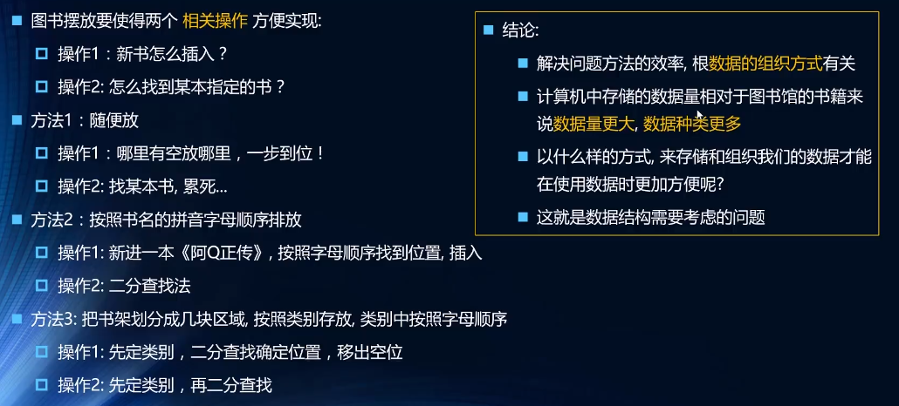
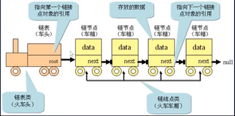
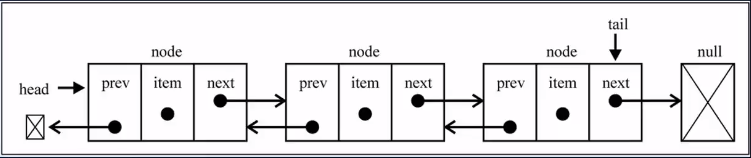
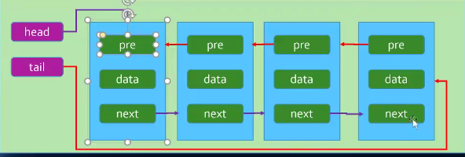

## 概念

### 数据结构是什么

-   数据结构是`数据对象`,以及存在于`该对象的实例`和`组成实例的数据元素`之间的各种联系
-   数据结构是计算机中`储存`、`组织数据`的方式，抽象数据类型的物理实现，好的数据结构的实现离不开算法
-   是一种`组织数据`的方式
    

### 什么是算法？

-   本意就是解决某个问题的`办法`、`步骤`、`逻辑`,以更`高效、简洁`的方式的到结果
    -   算法好，结构好，则处理数据更加高效简洁
    -   只有一个好，另外一个不会，次之
    -   不好的算法，处理不好的数据，。。。
-   数据结构的`实现`离不开`算法`
-   比如通过`A33这个“算法“`，找到`图书馆这个"结构"`的 A 书架第二排第三本书
-   算法 -> 处理事情的方法，数据结构 -> 处理事情的目标对象
-   如:往数组(数据结构)前面插入数据，用什么方法(算法)效率高呢

-   有无算法，就像大灾难时有没有人组织的差别，有无数据结构，就像大灾难时人们听不听安排，与到安全的的的路线多不多的差别

### 数据结构和算法的重要性

## 线性结构

### 数组

-   数组是一种`线性结构`，并且能在`任意位置`插入和删除数据
    -   有时候为了实现某种功能，必须对`任意位置`添加`限制`
    -   不足:删除或插入，特么是从前面，消耗性能，因为前面删除和插入时，后面的所有元素需要依次移动
    -   好处:可以通过下标直接获取，修改元素，前面插入虽耗性能，但也很方便

### 栈

-   `受限`的`线性结构`
    -   只有一个口`栈顶`，`进栈`、`入栈`、`压栈`(其实是同一个东西)只能从栈顶进入
    -   `出栈`、`退栈`也就是删除元素,也必须从`栈顶`出去
    -   因为只有一个口，所以元素只能`后进先出`(LIFO)
-   栈结构案例:
    -   函数调用栈
        -   如 A 调用 B、B 调用 C
        -   那么`执行函数A时`，会被`最先压到栈低，A 没执行完就不会弹出(结束)
        -   当 A 调用 B 时，B 入栈，B 调用 C 时，C 入栈
        -   此时 C 时最后入栈的，但只有 A 结束弹出 B 才可以弹出，最后才是 A
        -   所以`递归`，不断将`自己入栈`,如果没有结束条件所说的`栈溢出`就是这个原理
    -   练习:通过 Stack 分支十转二进制的方法

### 队列

-   `受限`的`线性结构`
    -   `先进先出`
-   `普通队列`

    -   插入一个元素，数据从后面添加，并且前面都处理完才会轮到新元素

-   `优先级队列`
    -   插入一个元素时可以和其他元素`优先级进行比较`, 比较完之后得出元素再队列中的`正确位置`
    -   每个元素不再只是一个数据，而是`包含优先级属性`，添加时根据优先级决定位置
-   练习:击鼓传花案例

### 链表

-   链表和`数组`一样,可以`用来储存一系列元素`,但是链表与数组实现机制是不一样的
-   单向链表对比数组(列表)
    -   数组优缺点
        - 优点
            - 通过下标`修改`和`获取`元素性能较高
        - 缺点
            - 创建需要申请`一系列内存空间`,并且`大多数语言`大小是`固定`的,不够用时需要`扩容`(申请大的再把内容复制去)
            - 数组从`开头`或`中间`插入删除元素成本高，需要打了元素位移
            - js封装的数组底层也有这些缺点
    -   链表优缺点
        - 优点
            - 作用与数组类似，但是链表不必`是连续的内存空间`，可以充分利用内存，实现动态管理
            - 创建是不必`确定大小`,并且大小可以`无限延伸`下去
            - 每个元素节点由`储存元素本身的数据`和`指向下一个元素的引用`组成  
            - `插入`和`删除`元素时,`时间复杂度`底，可达到O(1)，相对性能较高
        - 缺点
            - `修改`和`获取`元素必须从头开始 
        
- 单向链表与双向链表
    - 单向链表 
        - 从头遍历到结尾或者从结尾遍历到头
        - 只能通过next指向下一个节点
        - 单向链表的缺点
            - 很难回到上一个节点
    - 双向链表
        - 双向链表结构
            - 每个节点包含 `数据、next、prev指针` 三个部分
            - `head`指向第一个节点，还有`tail`指向最后一个节点
            - `第一个`节点的`prev`是`null`,`最后一个`节点的`next`是`null`
            
            
        - 从头遍历到结尾或者从结尾遍历到头   
        - 每一个节点都要向前链接的引用，与向后链接的引用
        - 双向链表的缺点
            - 插入或删除节点是需要处理四个引用，而不是两个
            - 占用空间较大

## 哈希表

### 哈希表理论

### 自定义哈希表

## 树结构

### 树的相关概念

### 二叉搜索树

### 树的遍历

### 二叉搜索树

### 其他补充

## 图结构

### 图相关概念

### 图的表示

### 自定义图

### 图的遍历

## 排序&算法

### 简单排序

### 高级排序
