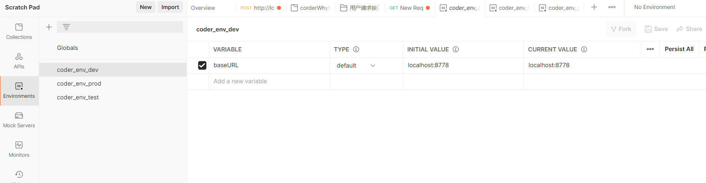

### 集合
1、new -> cellection -> 起一个集合名称
2、更多的 Add Folder(区分模块，比如用户请求接口)
3、模块中再更多 Add Request 添加用户接口请求

### 环境变量
1、new -> Environment -> 起一个名字 
2、添加环境变量

3、使用环境变量，接口请求上面可以选择环境，就可以直接通过 `{{baseUrl}}/users`  这样掉接口了


### Pre-request Script
> 调用接口前可以先做一些事情，比如通过js生成动态参数

```javascript
 // 获取时间戳
 var timestamp = new Date().getTime();

 // 将时间戳保存到全局变量中
 pm.globals.set("timestamp",timestamp);

 // 获取全局变量
  console.log(pm.globals,1000)

  // CTRL + ALT + C 控制台，查看具体调用的接口地址，与这边操作的输出
```


### Tests Tab
> 接口调用完成可以做一些事情

```javascript
// 调用登录接口后，直接把token写入全局变量，再把其他接口token，使用全局变量{{token}}代替
var data = JSON.parse(responseBody);
console.log(data);
pm.globals.set("token",data.token)
```

### 快捷键
 postman 控制台: `CTRL + ALT + C`