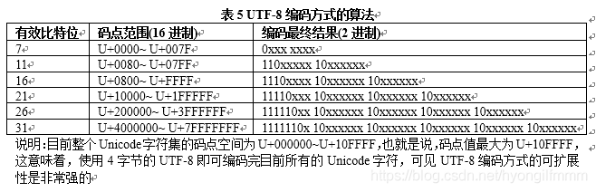

## regexp

### 作用

-   数据隐藏(`180****9356`)
-   数据采集(爬虫)
-   数据过滤(`你是****`)
-   数据验证(手机好，网址...)

### JS 正则方法

-   创建正则
    -   `var reg = /^xxx/ig`：字面量方式
    -   `var reg = new RegExp("^xxx","ig")` 或 `new RegExp(/xyz/i)`：构造行数创建
    -   第一中正则在编译时就创建，实例的正则在运行是才创建
-   匹配模式(修饰符)
    -   表示正则的附加规则，放在最后面
    -   `i:ignore` 忽略大小写
    -   `g:global` 全局匹配，匹配字符串中所有匹配的词
    -   `m:多行修饰符`
        -   `/^(abcd|2345)$/m.test("abcd\n2345")` 匹配到 abcd 和 2345

-   JS 正则对象提供的方法
    -   `reg.test("str");`:test 验证 str 中是否存在符合规则的子字符串
    -   `reg.test(["str1","str2","strn"])`:只要一个符合条件就返回true
    -   `reg.exec("str");`:exec 返回 str 中，匹配到的符合规则的第一个子字符串,与`小括号包裹`的子表达式，不匹配返回`null`
        -   reg.exec("str"); 第一次调用返回第一个匹配的字符串，第二次调用返回第二个匹配的字符串，没了返回null
        -   reg.index 查看匹配字符串的索引
-   一些属性
    -   `reg.lastIndex`
        -   正则的实例属性 lastIndex,初始情况下都是从零开始，当第二次调用这个实例匹配字符串时是从
        -   上一次匹配完成位置的下一个位置开始。（当然正则实例是开启全局的 g或y）
            -   1.如果上次匹配到了一个位置大于等于此次匹配的字符串的长度，那么此次匹配返回false或空数组
            -   2.如果上次没有匹配到，那么此次匹配还是从零开始
    -   `reg.source`
        -   `/abc/ig.source` 返回正文 abc
    
-   String 方法提供的方法
    -   `str.search(reg)`:从 str 中查找 reg 匹配到子字符串的`起始位置`,没有返回`-1`
    -   `str.match(reg)`:以数组模式返回 str 中所以符合 reg 要求的子字符串,和正则的`exec`类似,并通过 g 获取所以匹配项
    -   `str.replace(reg，callback|char)`:把匹配到的子字符串进行替换
        -   callback参数
            -   如果没有子表达式，参数二是匹配字符串起始位置
                -   callback((每次匹配,小括号1，index)=>{xxx})
            -   如果存在子表达式，参数是，匹配字符串、子1、子n、匹配字符串起始位置
                -   callback((每次匹配,小括号1，小括号n,index)=>{xxx})
        -   "12liao34zhong56xun".replace(/([a-zA-Z]+)/g,(item)=> item.substring(0,1).toUpperCase()+item.substring(1))
    -   `str.replaceAll(reg，callback|char)`
        -   正则reg必须加g全局匹配
    -   `str.split(reg)`:通过 str 中 reg 匹配到的子字符串进行分割(默认 g)

### 重要概念

-   字表达式\
    -   通过小括号括起来的内容称`字表达式`
-   捕获
    -   字表达式匹配到内容时，系统会捕获这个行为，然后将字表达式匹配到的内容放到缓存区中，成为`捕获`
    -   第一个捕获编号 1,等 n 个编号 n
-   反向引用
    -   通过\n(n>0 的，代表缓存区编号)来获取缓存区域的内容
    -   在表达式中使用已近查到的结果
-   经典案例(str = "abc22333444")
    -   找到至少连续的三位相同数字
        -   `/(\d)\1\1/g`:(\d)捕获，通过反向拿到缓存区 1 中的内容

### 小阔号的功能
查询处符合条件的字符串，只要一个符合条件则反 true,判断全部 => (?\<!xxx) 只要一个不符合条件返回true,所有不符合返回false

-   ():默认捕获效果，可通过\n 反向引用匹配的值
-   (?:xxx):非捕获匹配，不会影响\n
    -   (?:X)在正则中表示所匹配的子组X不作为结果输出
-   (?=xxx):非捕获匹配，`正向肯定预查|先行断言`,相当与添加条件限制`/^(?=.*8060$)xxxx`,表达式必须以 8060 结尾
    -   `/hello(?=\d{3})/.exec("hello123")`:hello 后面必须是三个数字
    -   我要提取的只是 hello,但是这个 hello 后面必须跟着 3 个数字
    -   `/(?=\d{3})/.exec("hello123")`：如果没有hello，匹配的就是后面有三个数字的位置
-   (?!xxx):非捕获匹配,`正向否定预查|先行否定断言`,相当于添加条件限制`/^(?!.*8060$)xxxx`,表达式不能以 8060 结尾
    -   `/\d{4}(?![a-zA-Z])/exec("3243##")`:数字后面不能出现字母
-   (?\<=xxx):非捕获匹配,`反向肯定预查`,相当于添加条件限制（先找到四个字母，再看看四个字母左边是否出现三个数字 ）
    -   `/(?<=\d{3})[a-zA-Z]{4}/.exec("123fdsf")`:连续 4 个字母左边必须出现 3 个数字
    -   先确定字符串中有 3 个连续数字，找到了，再看后面的字符是否匹配
-   (?\<!xxx):非捕获匹配,`反向否定预查`,相当于添加条件限制
    -   `/(?<!\d{3})[a-zA-Z]{4}/.exec("123fdsf")`:连续 4 个字母左边不能是 3 个数字
    -   字符串中只要1个连续 4 个字母左边不是3个数字,就返回true,全部都不是返回false
        -   是否全部str|max前面都是$
            -   `!/(?<!\$)(str|max)/.test("xx$strxx$maxxxx$strxxx$max")`

```javascript
// 前瞻：
exp1(?=exp2) 查找exp2前面的exp1
// 后顾：
(?<=exp2)exp1 查找exp2后面的exp1
// 负前瞻：
exp1(?!exp2) 查找后面不是exp2的exp1
// 负后顾：
(?<!exp2)exp1 查找前面不是exp2的exp1
```
### 编写规则

> 正则表达式是由所有字符以及特殊字符(元字符组成)的`文字模式`
> 正则表达式作为一个模板，将`文字模式`与搜索到的字符串进行匹配

#### 查什么(匹配符)

-   需要什么字符就填什么字符，元字符就前面加反斜杠\
-   js 可以直接匹配具体汉字，有些语言是不可以的
-   字符簇
    -   [a-zA-Z0-9]
        -   [ASCII]从上到下的顺序都可以如：[Z-a]可以匹配 Z、、\[、\],^,-,\`、a 等字符
    -   [abc]: 匹配A或B或C
    -   [^abc]: 取反，就不匹配 A、B、C
    -   [\u4e00-\u9fa5]: 匹配中文
-   `\d`:匹配纯数字，`\D`取反
-   `\w`:数字字母下划线，`\W`取反
-   `\s`:任意空白字符,`\S`取反，非空白字符
-   `.`:匹配处理回车`\n`外任意单个字符 => 任意单字符`[^]`

#### 差多少(限定符)

-   `*`:匹配前面次数 0 次或多次{0,},`.*`任意多次任意字符
-   `+`:匹配前面次数 1 次或多次{1,}
-   `?`:匹配前面次数 0 次或 1 次
-   `{n}`:n 次
-   `{n,}`:至少 n 次
-   `{n,m}`:n 次到 m 次

#### 从哪差(定位符)

-   `^`:`[]`外，匹配字符串开始位置
-   `$`:匹配字符串结束位置
-   `\b`:匹配单词边界(小数点也是单词边界)
    -   `/\b\zhong\b/.test("liao zhong 123")`:匹配字符串中是否有 zhong，并且是单词
-   `\B`:匹配非单词边界
    -   `/\B\zhong\B/.test("liaozhong123")`:匹配字符串中是否有 zhong，并且是不能是单词

#### 其他

-   `\`:反斜杠，转义使特殊字符变成普通字符，`\.`这里的.只能代表.
-   `|`:或，(a|b|c)

### linux 正则 与 通配符

> linux 指令中一百操作文件路径的用`通配符`,如:find，ls，cp 等,操作文件内容的用`正则`,如 grep

#### 通配符

-   `*`：匹配零或多个任意字符
-   `?`:匹配任意单个字符
-   `[]`：指定中括号内的多个字符，如：[rwc]或[r,w,c]都行
-   `[^]或[!]`：除了中括号内字符外匹配任一个字符
-   `{a,b,c}/{a..z}`:a 或 b 或 c / a 到 z

#### es6正则扩展
-    `new RegExp(/xyz/ig,"i")`：/xyz/i i覆盖ig
-    `u`:修饰符 
    -   使`.`，或其他符号可以识别\uFFFF外的字符 `/^.$/u.test("𠮷")` `/^\S$/.test('𠮷')`
    -   `/\u{61}/u.test('a')` // true
    -   无效转义报错 `/\,/u.test(',')` 本来就不需要转
    -   通过 `/xxx/.unicode` 查看是否设置了u字符
-   `y`:粘连（sticky）修饰符。 
    -   后一次匹配都从上一次匹配成功的下一个位置开始。(第一次必须首位开始,或者通过`reg.lastIndex`设置起始匹配位置)
    -   与g类似，试试y匹配的是一次或多次连续符合规则的字符
    -   类似于在每次匹配前面加了 ^
    -   `reg.sticky` 查看是否设置了y
-   `s`:`.`默认不包括`行终止符`,加s就可以包括 (ES2018 dotAll模式)
        -   U+000A 换行符（\n）
        -   U+000D 回车符（\r）
        -   U+2028 行分隔符（line separator）
        -   U+2029 段分隔符（paragraph separator）
        -   `res.dotAll` 查看是否处在dotAll模式 
-   `/abc/ig.flags`:es6 返回正则表达式的修饰符
-   `\p{...}`: 匹配某一类Unicode字符
-   具名组匹配
```shell
# -   `/(?<year>\d{4})-(?<month>\d{2})-(?<day>\d{2})/.exec('1999-12-31').groups.year;`
#-   let re = /(?<year>\d{4})-(?<month>\d{2})-(?<day>\d{2})/u;
#-   '2015-01-02'.replace(re, '$<day>/$<month>/$<year>')
```
-   解构赋值和替换 
    ```javascript
    '2015-01-02'.replace(re, (
        matched, // 整个匹配结果 2015-01-02
        capture1, // 第一个组匹配 2015
        capture2, // 第二个组匹配 01
        capture3, // 第三个组匹配 02
        position, // 匹配开始的位置 0
        S, // 原字符串 2015-01-02
        groups // 具名组构成的一个对象 {year, month, day}
    ) => {
        let {day, month, year} = groups;
        return `${day}/${month}/${year}`;
    });
    ```
-   引用 `\k<组名>` 功能以前的\1效果一样
    -   `/^(?<word>[a-z]+)!\k<word>$/.test('abc!abc')`
-   匹配索引 reg.exec(str).indices `暂时不支持使用`
    ```javascript
    const s1 = "xaaaz";
    const m1 = re1.exec(s1);
    m1.indices[0][0] === 1;
    m1.indices[0][1] === 5;

    // 第一次匹配起始结束 位置 第三阶段提案， https://github.com/tc39/proposal-regexp-match-Indices
    ```
-   一次性取出所有匹配
    ```javascript
    const string = 'test1test2test3';
    const regex = /t(e)(st(\d?))/g;

    console.log(string.matchAll(regex)) //返回一个 Iterator遍历器

    for (const match of string.matchAll(regex)) {
    console.log(match);
    }
    ```
#### linux 正则
[文章](https://www.linuxprobe.com/linux-regular-expression.html)
[pdf](https://www.linuxprobe.com/docs/LinuxProbe.pdf)

> 匹配内容用正则，匹配文件名用通配符

-   元字符(BRE 基本字符)

    -   `*`：匹配前面的字符零次或多次
    -   `.`：匹配任意一个字符
    -   `[]`：和通配符完全一样
    -   `[^]`：和通配符一样，但是没有[!]的写法
    -   `^h、$h、\<h、h\>`:行头 h、行尾 h、h 开头的单词、h 结束的单词

-   特殊含义扩展元字符(扩展正则正常使用，默认需要加`\`，加上功能参数-e既可以不需要`\`了)
    -   `?`：前面的字符零次或一次，基本正则是?  好像没有
    -   `+`：前面的字符至少一次，基本正则是+
    -   `|`: 或
    -   `()`
    -   `{}`
-   默认正则
    -   特殊含义字符`默认没有功能`,加上`\`才是功能元字符
    -   ?、+、{}、()、、、需要反斜杠\，
        -   `ro\?t`(r 开头 t 结尾，o 可有可无)
        -   `ro\+t`(r 开头 t 结尾，o 至少一次，root、rot)
-   扩展正则
    -   把有特殊含义的符号，`默认拥有功能`，如果要匹配字符要加上`\`转义
    -   各个命令开启方式
        -   grep: 一般 `-E参数` 或 egrep 开启扩展正则
    -   扩展正则新增操作
        -   grep -E "reg1|reg2"
-   其他
    -   `=~`:判断变量是否符合正则(`num=10;[[ $num =~ [0-9]{2} ]]`)

### 案例

-   判断回文字符串

```javascript
function huiwenVis(str) {
    //判断是否回文字符串，通过反向引用\n判断最后一个是否为第一个字符，中间类推
    const arr = Array.from({ length: Math.floor(str.length / 2) });
    const regExpStr = arr
        .fill("(.)")
        .concat(str.length % 2 ? ["."] : [])
        .concat(arr.map((_, index) => `\\${arr.length - index}`))
        .join("");

    return new RegExp(`^${regExpStr}$`).test(str);
}

console.log(huiwenVis("abccba"));

//其他方法: x.toString() === x.toString().split('').reverse().join('')
```

-   ip 端口地址验证
-   解析 rul

```javascript
let urls = "https://www.baidu.com?a=1&b=2";
let q = {};
urls.replace(/([^?&=]+)=([^&]+)/g, (_, k, v) => (q[k] = v));
console.log(q);
```
-   数字分割
```javascript
//(?!$) 后面不能是结束位置
'1234567890'.replace(/\d{3}(?!$)/g,(a)=>a+",")

// (?=(p)) 匹配找到 符合p子模式 前面的 那个位置
console.log('18060849356'.replace(/(?=(\d{3})+$)/g,'-')); // 3的倍数字符串 第一位也会替换

//从左往右以贪婪模式匹配以三个数字为一组(重复n>=1次)结尾的字符串
console.log('18060849356'.replace(/(?!^)(?=(\d{3})+$)/g,'-'));

/**
 * "123"
 * \b它匹配的是一个位置，如同^和$代表字符串开头和结束的位置
 * \B 非单词边界, \B 匹配的的是1~2，2~3直接的位置 
 *
 * (?=) => x(?=y) 就是说x后面是y我们才去匹配x
 *      所以这边 (?=(\d{3})+) 要的是后面存在 3的倍数 个数字的那个位置  
 *          所以 '18060849356'.replace(/\B(?=(\d{3})+)/g, '-') 结果是 1-8-0-6-0-8-4-9-356 
 *          9~3 之间后面是 356
 *          4~9 之间后面是 935
 *          0~8 之间后面是 849356  
 *          所以我们还要去掉那些，不是三个数字的间隔符
 * (?=(\d{3})+(?!\d)) 是说 
 *    要的是后面存在 3的倍数 个数字的那个位置,并且这个 3的倍数 字符串后面不能是数字
 *    这边不是数字的只有结尾
 *    所以只有 符合\B条件的位置，后面的所有/3 要没有余数才行，否则它后面 3倍数字符串 后面就是余数，是数字，就不符合 (?!\d)
 * 
 *  所有上面 用 $ 代替 (?!\d) 的方案，如果最后三个中有其他符号，是无法替换的，最后三个不符合\d{3}, 没有三个数字后面是结尾位置
 */
console.log('18060849356'.replace(/\B(?=(\d{3})+(?!\d))/g, '2')); 
```

-   去除字符串中多出指定规则的内容
```javascript
//同时去除字符串前两位与后四位
'12werty5678'.replace(/^\w{2}|\w{4}$/g,"")
```

-   车牌号规则
```javascript
const carNoReg = /^[京津沪渝冀豫云辽黑湘皖鲁新苏浙赣鄂桂甘晋蒙陕吉闽贵粤青藏川宁琼使领A-Z]{1}[A-Z]{1}[A-Z0-9]{4}[A-Z0-9挂学警港澳]{1}$/
```

-   判断单词是否由其他指定字符串组成
```javascript
/^(hello|word|add){1,}$/.test('helloword');
```

- 指定字符变色
```javascript
item.value = 'xxxxabcxxxx'
let word = 'abc'
let beflen = number;
let reg = new RegExp(`(?<=.{${beflen}})${word}`);
item.htmtmp = item.value.replace(reg,(item)=>`<span style="color:#f00;font-weight: bold;">${item}</span>`);
```

- split

```javascript
// 不保留符号
"split>=1xx<=2xx&&3xx".split(/>=|<=|&&/) // ['split', '1xx', '2xx', '3xx']
// 保留符号
"split>=1xx<=2xx&&3xx".split(/(>=|<=|&&){1}/) // ['split', '>=', '1xx', '<=', '2xx', '&&', '3xx']
// 优先级
"split>=111=222>=333".split(/(>=|=){1}/) //['split', '>=', '111', '=', '222', '>=', '333']
```

- 范围
    -   [Unicode官网](https://www.52unicode.com/)
    -   [Unicode 汉字](https://www.52unicode.com/cjk-unified-ideographs-zifu)
    -   [ASCII](https://www.habaijian.com/)

    -   Unicode-中文 [\u4e00-\u9fa5] 专注于简体 
        -   经测试 [\u4e00-\u9fe6] 都是汉字 => 9fa5龥 、9fa6龦
        -   经测试 [\u9fe7-\u9FFF] 都是空白 
        -   所以说 [\u4e00-\u9FFF] 验证中文都是可以的
    -   十进制为0到255的字符 [\x00-\xFF]
        -   字符串字节长度 str.replace(/[^\x00-\xFF]/g,'**').length; 
        -   十六进制表示范围最大是0-255 [\x00-\xFF] => 和 [\u0000-\u00FF] 是一样的
        -   超过255的如 `/[\x100]/.test('   ')` = false; `/[\u0100]/.test('Ā')` = true;
    -   unicode的字符编码和utf-8的存储编码表示是不同的
        
    -   utf-8是变长的,UTF规定：
        -   `如果一个符号只占一个字节，那么这个8位字节的第一位就为0` 
            -   **有效比特位 <=7 的unicode的字符编码二进制** [\u0000-\u007F]
            -   如 0041 的二进制位 	00000000 01000001    => "A"
                -   01000001  utf-8

        -   `如果为两个字节，那么规定第一个字节的前两位都为1，然后第一个字节的第三位为0，第二个字节的前两位为10`
            -  **有效比特位 >7 && <=11 的unicode的字符编码二进制** [\u0080-\u07FF]
            - 如 00FF 的二进制位 00000000 11111111  => "ÿ"
                -   拆分 0000 0000 1111 1111 (Unicode字符编码)
                -   拆分 1100 0011 1011 1111 = C3BF(转UTF-8)

        -   `然后如果是三个字节的话，那么第一个字节的前三位为111，第四位为0，剩余的两个字节的前两位都为10。`
            -  **有效比特位 >11 && <=16 的unicode的字符编码二进制** [\u0800-\uFFFF]
            -   如 4E25 的二进制位 0100,1110,0010,0101
                -   拆分      0100   11 1000   10 0101  (Unicode字符编码)
                -   拆分 1110 0100 1011 1000 1010 0101  = E4B8A5 (转UTF-8)
                        补四      补10      补10
        -   四个字节 有效比特位 <=21
        -   五个字节 有效比特位 <=26
        -   六个字节 有效比特位 <=31


