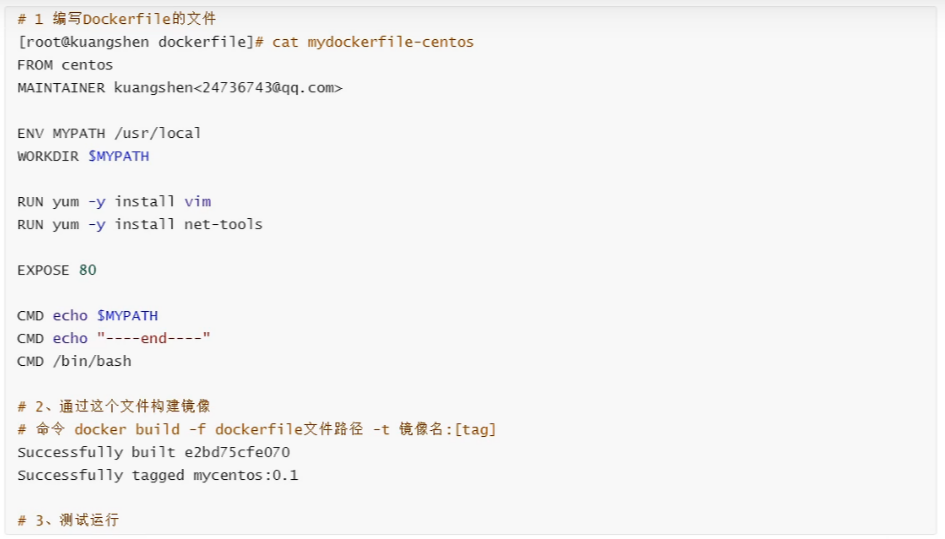

### 概述

- 解决问题:
    部署环境麻烦，相同环境更麻烦
    项目与环境一同打包（镜像），发布到`docker仓库`  => 用户(运维)下载直接运行

-   隔离思想
    Docker核心思想 打包装箱 每个箱子相互隔离互不影响

-   基本信息
    基于go开发的
    容器技术、虚拟化技术(系统最核心的环境 + mysql + 需要的技术2 + 需要的技术n ..) 打包成镜像 ，多个再相同系统运行
       `直接运行在宿主机上，容器没有自己内核，也没有不必要的软件`
       `每个容器相互隔离，有自己的文件系统，互不影响`
       `内核级别的虚拟化`
    虚拟机 => 虚拟机资源占用、冗余步骤多、启动速度慢、很多东西都不是程序环境所需要的
       `运行一个完整的系统，在系统上安装和运行软件`
       `如果需要连个容器，就需要安装连个centos这样的系统`
       `安全性强`
    基本组成架构

-   DevOpts(开发、运维)
    	打包镜像，发布运维，一键运行，运行环境高度一致

-   名词
    镜像(image):
    	类似模板，可以通过这个模板创建容器服务
    容器(container)
    	利用容器运行一个或一组应用,通过镜像创建
    	可以启动停止删除等基本命令
    仓库(repository)
    	远程存放镜像的地方

[仓库地址](https://hub.docker.com/) 
[官网](https://www.docker.com/)
[文档](https://docs.docker.com/)
[指令文档](https://docs.docker.com/reference/)

### 安装 
...
...
...
`/var/lib/docker`:工作目录

安装成功后
`systemctl start docker.service` 启动服务
`docker run hello-world` 测试是否可以用

-   docker 的工作原理
    -   docker 是一个Client-Server结构系统，Docker守护进程运行在服务器主机子上，通过Socket从客户端访问
        -   守护进程包含所有容器，相当于小的Linux系统，里面的端口与外界不冲突
    -   Docker服务器 执行 客户端发送的指令 
### 命令
帮助: `docker --help`
判断是否安装成功: `docker version`、`docker info`
启动程序: `docker run <镜像名称>`

-   镜像命令
    -   `docker images`：查看本地镜像
        -   `-aq`:查出所有镜像id
    -   `docker search <image name>`：搜索镜像
        -   `--filter=STARS=3000` :只搜索stars大于3000的镜像
    -   `docker pull <image name>`:下载镜像
        -   `docker pull <image name>:tag` 指定版本
    -   `docker rmi -f <image id|name>`:删除镜像
        -   `docker rmi -f $(docker images -aq)`:批量删除

> 下载测试镜像
```shell
docker pull centos
```
-   容器命令
    <!-- -   `docker linux大多数命令 容器id`:实现容器内部相应linux功能    -->
    -   `docker run [参数] centos`:新建容器并启动
        -   `--name Name`:容器名称
        -   `-d`:后台运行
            -   `后台运行必须有一个前台在使用的应用，否则启动后会自动停止`
        -   `-it centos /bin/bash`: 进入容器 交互运行,里面是单独的centos系统
            -   `exit`：停止并推出
            -   `Ctrl + p + q`:不停止推出
            -   `docker exec -it <id|name> /bin/bash` 进入当前正在运行的容器,并开启新终端，可以操作 
            -   `docker attach <id|name>` 进入当前正在运行的容器，正则运行的终端  
            -   ``:重新进入停止的容器
        -   `--rm`:用完就删除
        -   `-小p IP:8080:8080`:指定容器端口，可以多个
            -   IP:主机端口:容器端口
        -   `-大P`:随机容器端口 
        <!-- -   `docker update --restart=always <容器 id>` :更新参数 -->
    -   `docker ps`:查看运行中的容器
        -   `-a`:历史运行的容器
        -   `-n=1`:只看一个
        -   `-q`:只显示编号
    -   `docker rm <容器 id>`:删除容器  
        -   `docker rm $(docker ps -aq)`:删除所有
        -   `docker rm -a -q|xargs docker rm`:通过Linux的xargs批量删除
        -   `-f`：强制删除运行的容器
    -   `docker start|stop|restart|kill <容器 id>`:启动停止容器
    -   `docker pause|unpause <容器id>`:暂停容器
    -   `docker logs <容器 id>`:查看日志
        -   `-f -t --tail number`
    -   `docker inspect <容器 id>`:查看容器信息 
    -   `docker top <容器 id>`:查看进程信息 
    -   `docker stats`:查看资源占用

    -   `docker cp <容器 id>:/容器内路径 外部路径`:docker文件拷贝

    -   `docker history <容器 id>`：查看容器的构建过程
    
    -   docker save/load/import 保存镜像压缩包,加载镜像压缩包
    
- docker run 做了什么
    -   在本机寻找镜像，如果有运行镜像
    -   否则去远程仓库找，如果找到下载镜像到本地，在运行
    -   否则返回找不到

### 基本案例
- 安装nginx
```shell
# docker pull nginx // 下载
# docker run -d --name=nginx1 -p 3344:80 nginx // 开启  容器内nginx启动80端口，暴露出来映射到外部主机的3344
# curl localhost:3344  // 测试
```

-   安装 mysql
```shell
docker pull mysql
# 共享配置文件 数据文件 配置账号密码
docker run -d -p 3310:3306 -v /home/mysql/conf:/etc/mysql/conf.d -v /home/mysql/data:/var/lib/mysql -e MYSQL_ROOT_PASSWORD=初始密码 mysql --name some-mysql mysql   


```

- 安装 tomcat(默认暴露端口8080)
- es+kibana
### 镜像
> 镜像是一种轻量可执行的独立软件包，用来打包软件运行环境，和基于运行环境开发的软件，它包含运行某个软件所需的所有内容，包括`代码`、`库`、`运行时`、`环境变量`，`配置文件`等

#### 镜像加载原理
> UnionFS（联合文件系统）

系统主要包含bootfs(公用，不包含镜像中)、rootfs（Linux的/dev,/proc等文件目录）和独立的应用配置

是一种分层，轻量级高性能的文件系统(系统存在某个镜像，当拉去的二个镜像时，第一层如果与已有镜像相同，就不需要下载，直接拉取第二层);
下载过的不会再下载，拉取时版本号后面提示`Already exists`

Docker镜像都是只读的（镜像层），容器启动时，一个新的写入(用户操作 如:run)会被加载到镜像的顶部(自己的一层容器层)

> commit镜像
```shell
# docker commit 提交容器
# docker commit -m="描述信息" -a="作者" 容器id 目标镜像名:[TAG]

下载官方tomcat
run -it 进入容器修改内容
正在运行的容器层有一个新的ID、
通过这个id commit 做成镜像`存在本地`，(保存容器状态,相当于虚拟机快照)
发布

提交的时候上层的id都有存在信息中,pull的时候会先下载
```
### 容器数据卷
#### 概念
> 每次修改容器内配置需要进入很麻烦，我们可以在容器外不提供一个映射路径，达到容器外修改配置文件，容器内自动修改的技术
> 数据不能存在容器里面，`容器数据卷`可以 类似将容器内的目录挂在到主机上(但是它时同步过来的) 做到容器内外数据共享，容器间也可以

#### 使用
>  方式一: 通过命令挂载  -v （volume）

安全模块selinux把权限禁掉了，无法使用-v命令进行挂载
有时-v 容器无法启动 `chcon -Rt svirt_sandbox_file_t /dir/x/x` 开放权限 重新run
-R 递归处理所有的文件及子目录
-t 设置指定类型的目标安全环境
```shell
docker run -it -v 主机目录:容器内目录
docker inspect <容器 id>  => Mounts 查看是否挂载成功
```

#### 具名挂载与匿名挂载

```shell
-v juname:/inner/dir  具名挂载
-v /inner/der:rw    匿名挂载  rw可读可写 
-v /out/dir:/inner/dir:ro  指定路径挂载，到指定路径 ro只读
```

`docker volume ls`:查看卷名,匿名的就是自动生成的数据
`docker volume inspect juname`：查看详细位置，相关信息等

多个mysql或多个容器间数据共享

```shell
# 这里使用到了下面的 dockerfile的挂载 直接 -v也一样
dockre run -it --name parent lzoxun/镜像名称 
dockre run -it --name child1 --volumes-from parent 
...
# 父子容器挂载目录下的文件相互共享，parent就是数据卷容器
# 所有用到的容器都停止，数据才会没？？？？？
```
### DockerFile
DockerFile是用构建docker镜像的文件，是一个命令脚本，通过这个脚本生成镜像,
> 步骤
```shell
# 创建dockfile文件，文件名自定义
# 文件中的内容 格式: 大写指令 参数 
FROM centos
VOLUME ['volume01','name:volume02','/xx/xx:volume03']  #不用-v, volume01这连个是镜像内的目录，在生成镜像时直接挂载的数据卷目录

CMD echo "---end---"
CMD /bin/bash
# volume01 数据卷目录外部一定有一个同步的目录

# 一步一步构建镜像
# 运行
docker build -f /xx/xxx/dockerfile-name -t lzoxun/镜像名称:[tag?] .   
dockre run -it lzoxun/镜像名称 /bin/bash 
docker push # 发布镜像 dockerhub 阿里云等
```

#### DockerFIle构建流程

基础：

-   每个关键字(指令)都必须时大写字母
-   执行从上到下顺序执行
-   \# 表示注释
-   每一个指令都会创建一个镜像层提交

>   dockerfile是面向开发的，后期发布项目做镜像都要编写dockerfile文件。

步骤
    DockerFile：构建文件，定义了一切步骤
    DockerImages：镜像时通过DockerFile生成的，最终发布和运行的产品(正常使用冲这里开始 pull)
    Docker容器：镜像运行起来提供服务

>   DockerFile指令

 ```shell
 FROM        # 基础镜像，从这里开始构建
 MAINTAINER  # 指定维护者信息 姓名+邮箱
 RUN         # 构建镜像时需要运行的命令
 ADD 		# 添加镜像
 WORKDIR		# 镜像工作目录，进入生成的容器时默认所在目录
 VOLUME		# 挂载目录
 EXPOSE		# 暴露端口配置 外面的-p
 CMD			# 指定容器启动的时候运行的命令，只有追后也给生效
 ENTRYPOINT	# 指定容器启动的时候运行的命令，可以追加命令
 ONBUILD		# 但构建一个被基础的 DockerFile 就会运行 onbuild 的指令
 COPY		# 类似 ADD 将文件拷贝到镜像中
 ENV 		# 构建的时候设置环境变量
 ```

>   实战测试



>   tomcat 镜像案例

1.Dockerfile


2.构建镜像

```shell
docker build -t imagesname . # 使用官方的Dockerfile标准文件名不需要 -f
```

3.启动(run)

4.发布

>   发布到 dockerhub

```shell
docker login -u lzoxun -p xxxxxx
docker login -u lzoxun # 控制台输入密码
docker tag 镜像 镜像:1.0 # 加tag
docker push 镜像名:[tag] # 构造镜像的dockerfile的用户名需要与 dockerhub的用户相同
```

>   发布到阿里云

1.登录阿里云,找到镜像服务

2.创建命名空间

3.创建仓库,进入有推送步骤


### Docker网络原理

### IDEA真和Docker
### Docker Compose
### docker Swarm
### CI\CD jenkins 

### 可视化工具
> portainer
```shell
docker run -d -p 8088:9000 \
--restart=always -v /var/run/docker.sock:/var/run/docker.sock --privileged=true portainer/portainer

# 启动成功后 ip:8088 浏览器打开界面
# 设置密码
# 选择本地直接连接
```

> lazydocker