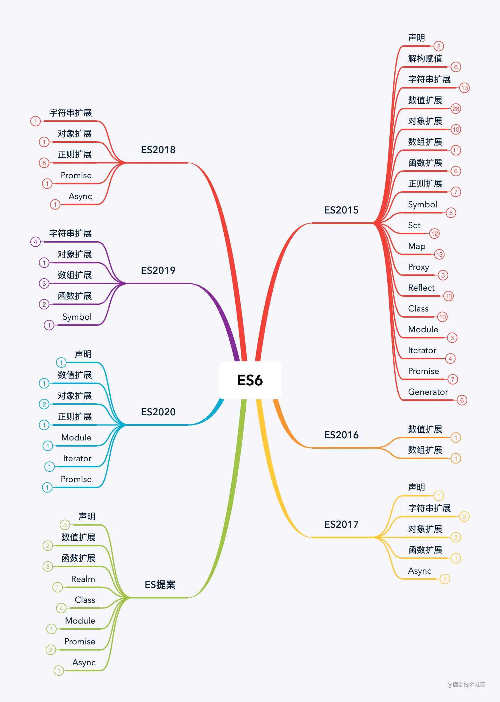

[](https://juejin.cn/post/6844903959283367950#heading-12)

## 变量、复制
### let/const
- 优先使用const，`必须有初始化值`，除非值一定需要改变
    - const 只是指向的对象不能修改，可以该`对象属性`
    - 相当于只能修改内容，不能修改内存地址
- let/const有if和for的块级作用域

- 作用域:变量在什么范围内是可用的
    - 块级作用域:{}、if(){}、for(){}...
    - es5以前var `if和for`都没有块级作用域，很多东西都需要`借助function`的作用域来解决问题
    - var for循环的异常
        - 就是因为var没有块级作用域， 变量i一直被改变，不会保存在作用域中,事件操作用的时候i就是最后一次的值了
        - `闭包`(function(i){})(i)可以解决问题是因为`函数是有作用域的`,传入的时候就形参赋值了

## 运算符
### ??

>   非空运算符，只判断变量是否为`null/undefined`, `||`可以判断变量是否为null/undefined/false/0/""等

```javascript
//?? 如果前面变量为null或undefined则返回??后面的值
null??1	 //1
0??1	 //0
// 非空判断
if((value??'') !== ''){
  //...
}


//??= 
a ??= b  ->   a = (a??b)

//?. 可选链操作符
// const host = config && config.db && config.db.host;
// 查找config下的db下的host属性，如果那一层没有，直接返回undefined
const host = config?.db?.host;
console.log(host)

obj?.prop // 对象属性是否存在
obj?.[expr] // 同上
func?.(...args) // 函数或对象方法是否存在

//?: 三元运算符
```

### 


## 函数
### 箭头函数
- `const fun = a => 123`
- 一个参数可胜利(),只有返回值可以省略{}
- `this`:箭头函数this是最近作用域的this，向外层作用域一层层查找


## 数组/json
- 数组
    - 数组遍历
        - for循环
        - for in:`for(let i in arr)` ，i为索引
        - for of:`for(let item of arr)`，item为每一项
        
    - `filter`
        - filter的回调必须返回一个`bool`值，`true`自动将这一项`返回`，否则`过滤`掉这一项
        - 用`新数组`接收
        
    - `map`
        - 每一项进行个性化操作后返回，生成`新数组`,改变`item`会音响原数组
        
    - `reduce`:对数组所以项进行汇总
        - preVal为`前一次return`的值，`第一次`默认为`参数二传入`的值，这里是0
        ```javascript
        let arr = [1,2,3,4];
        let total = arr.reduce((preVal,item)=>{
            return preVal + item
        },0)
        ```
        
    - `数组扁平化`并去重
    
        - **...new Set([1,2,3,4,[4,5,6,7],7,8,9].flat(Infinity))**


## 字符串

## 面向对象
### 对象
- 对象增强写法
   - name:name -> name
   - run:function(){} -> run(){}

## Promise

## generator

## 模块
## Map and Set
### Set
> 类似于数组的数据结构，成员值都是唯一且没有重复的值


