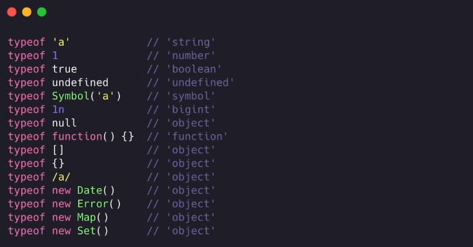
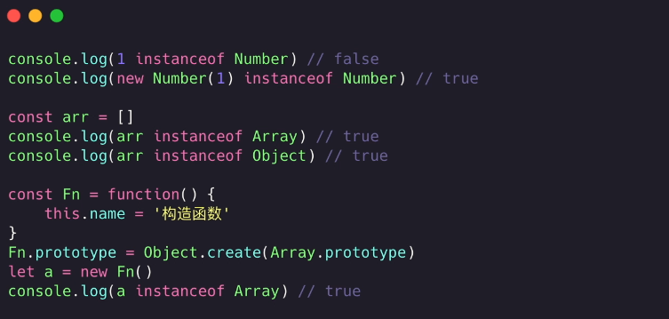
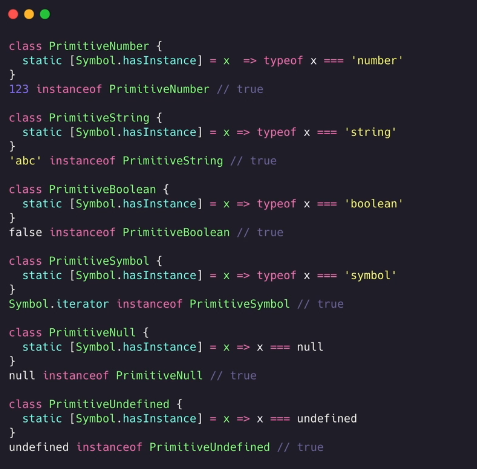
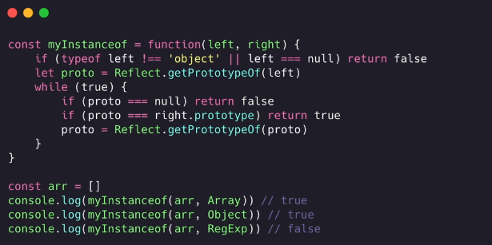
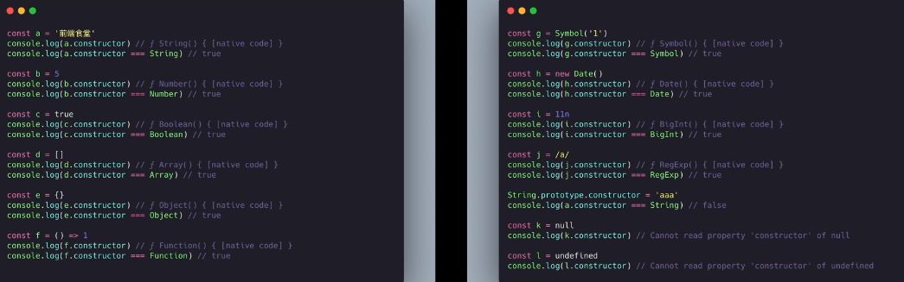
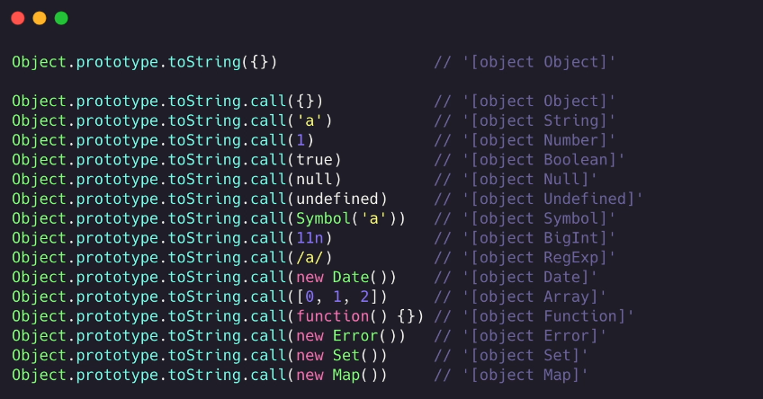
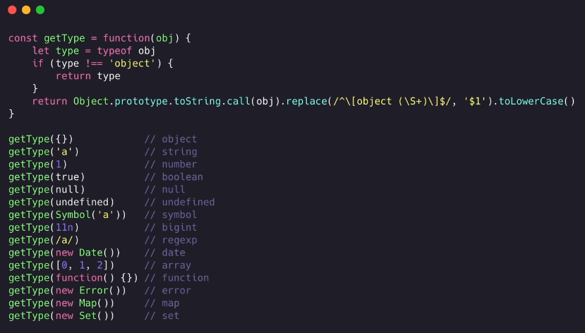
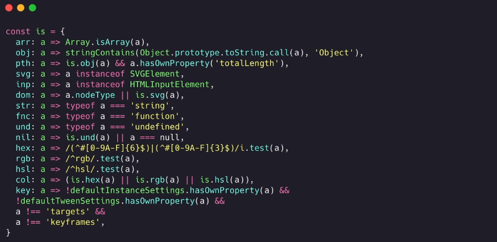

## JS 基础（ECMSscript）
### 概念
#### 认识 JavaScript

> -   JS 的作用是给浏览器*指令*，负责和浏览器进行*沟通*
> -   JS 是一门编程语言，与计算机交流的计算机语言
> -   JS 和 C、java、Python 等一样是高级语言
> -   JS 基于浏览器，一些内置方法源码需要找JS引擎
    -   [ECMA](https://262.ecma-international.org/)

#### 编程语言的历史

-   阶段一:`机器语言`，由二进制 0101010 组成
-   阶段二:`汇编语言`，用符号来代替，010101 难以记忆的代码
-   阶段三:`高级语言`，接近自然语言，符合我们的思维方式,*JavaScript*算是一个

#### JavaScript 的历史

-   1995 浏览器两大厂商`网景公司`与`微软`
-   网景
    -   网景招募`Brendan Eich`,为了`前端表达验证`，10 写出了最开始的`LiveScript`(js)
    -   java 出来后很火爆，就把`LiveScript`改名`JavaScript`
-   微软
    -   微软开始用的是`JScript`
    -   所以为了适配需要两份代码
-   时间轴
    -   1996.11，网景公司向`ECMA（欧洲计算机制造商协会）`提交申请语言标准
    -   1997.06，ECMA 以 JavaScript 为基础指定了 ECMAScript 标准规范`ECMA-262`
        -   JavaScript 成为了 ECMAScript 标准规范最著名的实现语言之一
        -   然后 ActionScript 和 JScript 也是 ECMAScript 标准的实现语言

#### JavaScript 与 ECMAScript 标准的关系

-   ECMAScript 是 JavaScript 的标准，描述了该语言的`语法`与`基本对象`
-   JavaScript 是 ECMAScript 的实现之一，除了基本实现之外，JavaScript 还多了自己的`DOM，BOM`的操作

#### JavaScript 的特点

-   按照运行方式不同，
    -   `编译性语言`:C 语言/C++ --预编译-编译-汇编--> 等步骤`一次性`将代码转为(linux 或 window..的)二进制 --> 执行
    -   `解释性语言`:JS/Python --> 一行行读取，一行行执行(JS 浏览器执行)
    -   `先编译再解释`:java 编译成 .class
-   动静类型语言
    -   `静态类型`：在代码执行之前，可以确定一个变量准确类型，并且之后不予许修改
    -   `动态类型`：不确定一个变量的准确类型，可以动态改变变量类型，灵活，但是不安全(JS 就是这种)
-   js 的主要应用场景
    -   网页交互
    -   服务端开放(NodeJs)
    -   命令行工具(NodeJs)
    -   桌面应用程序(VsCode 用 TypeScript 开法，GitHub 可以验证)
    -   APP(React Native,uni 等)
    -   游戏开发(cocos2d-js)
    -   小程序开发

#### JavaScript 编写位置

-   在 HTML 中直接执行

```html
<div onclick="alert('html执行js')"></div>
<a href="javascript:alsert('html执行js')"></a>
```

-   通过 script 标签执行
-   通过 script src 属性外部引入 JS 文件
    -   标签间不能写代码，并且要有双标签
    -   由于文档是从上到下执行的，所以建议把标签放在主体内容后面
    -   早期需要`type="text/javascriopt"`这种,由于限制所以主流浏览器以及 html5 的默认脚本语言就是 JS,所以写 JS 代码的话不用写了
    -   html 和 css 不区分大小写，js`严格区分`

#### 注释

```javascript
1.js
// xxxxxx
/* xxxxxx */

文档注释格式
/**
 *  xxxxx
 *  xxxxx
 */


2.html
// <!---->

3.css
/**/


```

#### 有浏览器交互

-   cosole.log()
-   alert()
-   document.write()
-   prompt("请输入数据")

#### 如何定义变量

-   var 变量标识符 = 值;
-   var a,b,c;
-   let、const、var

-   标识符
    -   数字、字母、\_ 、$ (数字不能开头)
    -   不能是关键字和保留字(保留字很多是其他语言拥有，js 暂未实现的标识符)
-   命名规范以及主要事项

    -   小驼峰(多个单词，除第一个，后面的首字母大写)
    -   驼峰(多个单词首字母大写)
    -   见名知意
    -   复制等号两边建议加空格(shell 强制不能加空格)

-   交换两个值为数字的变量，不用第三个变量,可以用`加减`的方式实现

#### 数据类型

-   引用数据类型:Object
-   特殊的引用构造类型:Function、Array、Regexp、Date、Math、Error、Math、Map、Set
-   基础类型:Number、String、Boolean、Null、Undefined、Symbol、Bigint

    -   数字:Number,值数字、NaN
        -   Number.MAX_VALUE 最大数值
        -   Number.MIN_VALUE 最小数值
        -   NaN:not a number，错误的数值运算返回
        -   isNaN:判断是否不是一个数值
    -   字符串:String
        -   `转义字符`：\n、\r、\t、\b 分别代表换行、回车、制表、退格
            -   开始的打字机换行需要消耗 0.2 秒时间，可以打印两个字符，要是在这 0.2 秒里面，又有新的字符传过来，那么这个字符将丢失。
            -   在每行后面加两个表示结束的字符。一个叫做“回车”，告诉打字机把打印头定位在左边界；另一个叫做“换行”，告诉打字机把纸向下移一行
            -   所以一行结尾是“<回车><换行>”，即“\r\n”
    -   Boolean:true/false

    -   Undefined(未定义):只有一个值 undefined；
        -   变量声明未赋值
        -   函数为放回
        -   对象属性未添加,等情况产生
    -   Null(空):只有一个值 null
        -   将变量指向这个`null`,那么如何原来那个对象没有句柄的话，回收机制就会进行回收,`起到销毁对象的作用`
    -   Bigint：兼容性不好
        -   Number.MAX_SAFE_INTEGER 安全值之外的数运算可能失去精度 `9007199254740992 === 9007199254740993`
        -   创建BigInt数据，后面加n
            -   `9007199254740992n === 9007199254740993n`
            -   `BigInt(9007199254740992) === BigInt(9007199254740993)` ???
        -   注意点
            -   BigInt不支持一元加号运算符
            -   不允许在bigint和 Number 之间进行混合操作
            -   不能在JS内置函数中使用 `Math.max(2n, 4n, 6n);` xxx
            -   if中不是 `0n` 就是 true

-   数据类型转换
-   方法

    -   typeof 返回类型字符串
        -   typeof age // number
        -   typeof str // string

-   js 数据储存形式
    -   代码存储在硬盘，浏览器运行的时候会加载到`内存`
    -   内存空间
        -   栈空间(stack)
            -   申请变量空间=基础数据类型值
            -   申请变量空间=引用数据类型地址
        -   堆空间
            -   用用数据类型数据
        -   销毁
            -   变量=null
-   js 的二、八、十进制前缀
    -   0b、0o、0x

#### 检测数据类型

-   typeof
    -   检测 Array 等特殊构造类型都为`object`
        
    -   可以判断处理 null 外的原始数据类型
        -   可能是 js 最初的 bug，为了兼容老代码一直保留
    -   只能判断对象类型中 Function
    -   除此之外 typeof NaN 为 number
-   instanceof
    -   检测某个构造行数的 prototype 属性是否出现在某个实例的原型链上(检测一个对象是否是某个构造函数的实例对象)
        
    -   由于可以随意更该原型指向，所以这个不安全
    -   可以准确判断引用对象类型，不好判断原始类型
        -   Symbol.hasInstance 用于判断某对象是否为某构造器的实例。拿来自定义 instanceof 操作符在某个类上的行为。
            
    -   实现 instanceof
        
-   constructor
    

    -   返回构造函数
    -   数值字面量如 1.constructor 直接使用会报错，需要通过(1).constructor 用()将数值转对象
    -   处理 null 和 undefined，其他都比较可以检测
    -   constructor 也可以手动修改，不安全

-   Object.prototype.toString.call()
    
    -   返回一个表示该对象的字符串
    -   封装
        
        

#### 数据类型转换

-   转数值类型
    -   Number(a);
        -   数字字符串(正常),不是正常数字(NaN)
        -   true/false => 1/0
        -   undefined/null => NaN/0
    -   parseInt(str,radix 进制)/parseFloat(str) ,合理运用编辑器代码提示
        -   将字符串转整型/浮点型，只能是字符串
        -   字符串有其他字符，取前面的数字(Number 直接 NaN)，第一个不是数字返回 NaN
-   转字符串
    -   num.toString()
        -   null、undefined、无 toString()
    -   String(num)
        -   null、undefined、布尔、数字等都可以
    -   num + "":与字符串拼接
-   转 bool(分支语句隐式调用 Boolean)
    -   Boolean(num)
        false:""、0、-0、undefined、null、NaN
        true:其他转字符串都为 true

#### 运算符

-   算术运算符
    -   (加 正 字符串拼接)+、-、\*、/、%、++、--
    -   自增自减++在前先加再用，++在后，先用再加
-   赋值运算符
    -   =、+=、-=、\*=、\=、%=
-   逻辑运算符
    -   &&、||、！
    -   断路运算-常用
-   比较运算符
    -   ==、!=、>=、<=、<、\> (== 的类型自动转换一般先转 number，再进行比较)
    -   ===、!== (严格相等比较，不会对比较的数据类型进行隐式转换,既比较类型也比较数据)
-   优先级
    -   `()` > `++|--` > `*|/|%` > `位运算符的左右移` > `非等判断` > `等全等不等` ....
    -   `,` < `赋值` < `?:三元运算` < 逻辑|| < 逻辑&& < 非左右移按位....

### 执行语句

> 顺序(默认从上往下)、分支、循环的常用执行顺序
> 用{}包裹的代码，叫做`代码块`

#### 分支

-   `if else`
-   `switch`:switch(exp){case "常量 1":语句 1;break;.....;default:语句 n;}

#### 循环

-   `for`
-   `while(exp){}`:条件为真一直循环执行
-   `do...while`
-   `break，continue`：break 跳出整个循环(这个 for 或整个 while)，continue 跳出本次循环

### 数组

### 字符串

### 重要概念
`事件循环 EventLoop`、


## JS API

> 通过 JS 操作 html(DOM) 和 浏览器(BOM)

### DOM
> dom 文档对象模型，操作网页内容，实现特效和交互

-   DOM 数对象(浏览器根据html标签生成的JS对象)
    -   DOM 树对象包含所有标签
    -   修改某个对象属性会映射到所有标签上
    ```javascript

    // querySelector(css选择器 button | .class | #id | ul li...); 返回第一个匹配的对象，没有返回null
    // querySelectorAll 返回所有匹配 NodeList 伪数组(有长度、有索引、但是没有js pop push 等方法)
    let div = document.querySelector("div")

    // 修改内容
    document.write("xxx"); // 直接追加到文档
    div.innerHTML = "xxx"; // 识别标签
    div.innerText = 'xxx'; // 不识别标签
    div.title='xxx'; // 修改属性
    div.style.background="#f0f"; //修改样式
    div.style.backgroundColor="#f0f"; // 驼峰换横杆 

    // left and offsetLeft ？？差别

    div.className='addClass'; //动态添加类 覆盖原有类名
    div.className+=" newclassName"; // 不会被覆盖

    div.classList // 获取样式列表 
    div.classList.add("xxx"); // 添加
    div.classList.remove("xxx"); // 删除
    div.classList.toggle("xxx"); // 切换

    // 表单操作
    let btn = document.querySelector("button");
    btn.disabled = false; //禁用按钮

    ```
-   节点(DOM树每个DOM下的属性内容等都是节点)
    -   元素节点、属性节点、文本节点、空格换行...

    ```javascript

    // 元素节点(DOM树的每一个标签)操作
    // 获取父节点
    eleNode.parentNode

    // 获取子节点
    eleNodeParent.children

    // 兄弟节点
    eleNode.nextElementSibling  //下一个节点
    eleNode.previousElementSibling // 上一个节点

    // 创建元素节点
    let div = document.createElement("div");
    div.className="xxx";

    eleNodeParent.appendChild(div) // 父元素最后最近新节点
    eleNodeParent.insertBefore(div,parentDom) //指定节点前插入  参数:新节点， 指定放在哪个节点前面

    // 克隆节点
    eleNode.cloneNodew(true)  // 可溶一个一样的节点，参数true代表连后代节点一起克隆

    // 删除节点
    eleNodeParent.removeChild(eleNodeParent.children[0]) //必先找到父节点，从父节点删除子节点


    ```

-   事件
    -   事件监听(绑定事件、注册事件)，监测程序是否有注册的事件发生，如果有就立即调用一个函数做出响应

    ```javascript

    // DOMLevel 0
    // 相同事件会被覆盖，都是事件冒泡
    // <input type="button" onclick="alert(0);" />
    ele.onclick = function(){}
    ele.onclick = null; // 清理

    // DOMLevel 2
    // 相同事件不会被覆盖，可设置捕获和冒泡
    // 事件源 ele 、事件名 args[0] 、事件触发做的事情 args[1]
    ele.addEventListener("event name",()=>{},bool); //bool 代表是否使用捕获机制，true 捕获 false 冒泡
    ele.removeEventListenet("event name","函数名称",bool) // 清除事件，匿名函数无法被清除
    // DOMLevel 3 一样的只是加了很多很多事件

    ```
    -   事件对象
    ```javascript
    /**
     * 监听函数回调的第一个参数 e event ...
     * 包含与事件相关信息的对象
     * 常用属性 e.
     *      type：当前事件类型
     *      clientX/clientY：获取光标相对于浏览器可见窗口左上角的位置（显示位置不包括状态栏等）      
     *      pageX/pageY：获取光标相对于document文档左上角的位置(包括页面滚动的距离)      
     *      offsetX/offsetY：获取光标相对于当前点击的DOM元素左上角的位置      
     *      screenX/screenY：      
     *      movementX/movementY：      
     *      layerX/layerY：
     *      key/code：获取检测操作的按键的值(以前的keyCode ascii码 废弃中)      
     *      
     *      
     */ 
    
    ```
    -   事件流
    ```javascript
    /**
     * 事件流指的是事件完整执行过程中的流动路径
     * 主要有两个阶段 事件捕获 和 事件冒泡 
     * 事件捕获 (参数三设置true)
     *    一个元 素事件被触发，先触发最父层，拥有该事件的元素
     *    document 开始 -> html -> body -> 单前点击的元素      
     * 事件冒泡
     *    当一个元素事件被触发时，同样的事件会在该元素的祖先元素(父级、父父级。。document)依次触发，如果它们有监听这个事件的话
     *    当前点击元素  -> body -> html -> document  
     *
     * 阻止事件流动 （事件冒泡，事件捕获）
     *    监听注册事件的时候，冒到这个元素的这个事件就会停止
     *    e.stopPropagation();
     *
     * 鼠标移入依次事件
     *      mouseover 和 mouseout  这个移入移出默认有冒泡行为
     *      mouseenter 和 mouseleave  这个移入移出不会有冒泡行为
     *
     * 阻止默认行为（阻止链接跳转，表单的默认就要的功能）
     *      e.preventDefault()
     *
     * 事件流特性 实现事件委托
     *      给父级注册事件，父级收到点击的时候，通过 e.target 获取具体点击的子元素
     *
     *
     */
    ```
-   环境对象 this
    -   非箭头函数 谁调用this指向谁

    ```javascript

    // this 指向
    function fn(){
        console.log(this);
    }

    fn() == window.fn() == window;

    let obj = {
        fn:function(){
            console.log(this)
        }
    }
    obj.fn() == obj

    // ele 被点击 this 是ele 
    ele.addEventListener("click",function(){
        console.log(this)
    })

    // 面向对象
    function Obje(){
        console.log(this,'default') // Obje {}
        this.showthis = function(){
            console.log(this,'showthis') // Obje {}
        }
    }
    Obje.prototype.showprotothis = function(){
        console.log(this,'showprotothis') // Obje {}
    }
    let sobj = new Obje();

    // call
    function testCall(){
        console.log(this)  // Obje {}
    }
    testCall.call(Obje)

    ```
