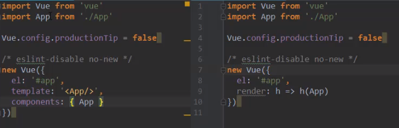

## 基础

### 相关信息

-   `编程范式`: 申明式编程(以前 jQuery 那种命令式编程)
- 样式App引入，公共组件单独抽离，页面内组件页面文件夹下

### 实例 option

-   `el`:挂载 vue 将要管理的 HTML 模板
-  `template`:运行的时候`template`与`el`同时存在，那么temp模板的HTML的代码会替换`#app`挂载的DOM节点
-   `data`:Object|Function
    -   组件 data`必须`是函数,用 return 对象里的数据
        -   组件需要被`多次调用`，使用函数返回可以`保证每个组件`的`数据是独立的`，不会相互音响
        -   如果就想要公用 把对象定义到外面，统一返回这个对象
    -   组件无法访问到 vue 实例 data 的数据
-   `methods`:方法列表(不与实例挂钩单独的叫函数)
-   `computed`:计算属性,只要 return 任意属性变化，都会更新 a
    -   `缓存`:页面上无论用几次，里面计算过程不会重复调用，属性发生变化才会调用
-   `filters`:过滤器对象
-   `components:{my-title:myTitle}`:`局部组件`注册，只能在当前实例上用

```javascript
computed:{
    // 因为计算属性一般不需要set属性的,只要获取就可以了
    a:{
        get:function(){
            return this.b + this.c
        }
    }
    // 简写
    a:function(){
        xxxxxx
        xxxxxx
        return this.b + this.c
    }
}
```

### 语法

-   `Mustache语法`: {{}}
    -   变量
    -   简单 js 表达式
-   指令

    -   `v-once`:标签里的数据开始渲染一次，数据变化则不会更新
    -   `v-html`:展示 html
    -   `v-text`
    -   `v-pre`:直接显示内容
    -   `v-cloak`:
        -   加到`挂载的dom`上，vue 解析之后会`自动删除v-cloak`
        -   样式：[v-cloak]{display:none} 这样可以处理双大括号闪烁的问题

-   `v-bind:| 语法糖 :`:绑定属性
    -   类:`:class="{类名:bool}"` ,多个调用方法，返回这个对象
    -   样式
        -   `:style="{属性名:变量属性值}"`， 支持`font-size`或`fontSize`
-   `v-on:|@:`:绑定方法
    -   `$event`:把对应的形参当做时间对象
    -   修饰符 @click.stop
        -   `.stop`:阻止事件冒泡
        -   `.prevent`:阻止默认事件
        -   `.enter|.13`:回车
        -   `.once`:第一次事件生效
-   `v-if v-else-if v-else`
    -   复用问题：切换之后某些相似元素复用，给他们指定不同`key`就不会复用了
-   `v-show`
    -   对比 v-if
        -   显示隐藏/加载卸载
-   `v-for`

    -   数组数据:`item,index`
    -   对象数据:`value,key,index`
    -   key 属性:
        -   编辑器 -> 虚拟 DOM -> 浏览器- 响应式
    -   无法响应式的操作
        -   arr[0]=1
            -   `C被标识为E`，`D被标识为C`,在`最后增加一个`标识为 D
        -   有不同且固有的 key 时在 B 与 C 之间插入 E()
            -   直接在`B与C`之间`插入节点`，C 和 D 无需变化,大大提高性能
            -   直接用 index 没有意义，因为 index 是会变化的，我们要的是能`一一对应`的 key
        -   插入时通过 diff 算法对比，查看虚拟 dom 与浏览器 dom 的 key

-   `v-model`:表单元素双向绑定

    -   1、v-bind:绑定 value 属性，数据改变 value 改变
    -   2、v-on:绑定@input 事件，value 改变重新赋值数据
    -   案例
        -   多选框如果 v-model 设置同一个数组，勾选会自动添加
        -   select 添加 multiple 多选
    -   修饰符
        -   `.lazy`:数据变化回车更新
        -   `.number`:值转 number 类型
        -   `.trim`:去除作用空格

-   `v-slot:slotName`:绑定具名插槽

-   响应式
    -   无法响应式的操作
        -   arr[0]=1

## 组件化

### 组件注册与父子组件

```javascript
//html
<my-title></my-title>


//创建组件构造器
let myTitle = Vue.extend({
    template:`<div>title</div>`
    components:{ //子组件
       myChild:myChild
    }
})
let myChild = Vue.extend({ //子组件
    template:`<div>child</div>`
})


//注册全局组件（可以在多个vue实例下使用）
Vue.component('my-title',myTitle)

//在Vue实例范围内使用组件


```

### 组件通讯

-   `props` 配合 `$eimt events`

    -   `:propName='xxx'`: 组件标签绑定传递的数据,不用绑定的话传递的数据只是`字符串`
        -   有些版本不支持驼峰需要`:prop-name='xxx`处理
    -   `props`:子组件中接收

        -   数组 : props:['name1','name2'，'xxx']
        -   对象 :

        ```javascript
        props:{
            name1:Array,
            name4:[Array,String],//多种类型
            name2:{
                type:String,
                default:'123',
                required:true   //必传
            }，
            //高版本vue中Object或Array的default必须是函数
            name3:{
                type:Array,
                default(){
                    return []
                }
            },
            //自定义验证函数参数必须是1或2或3
            name5:{
                validator:function(value){
                    return [1,2,3].include(value)
                }
            }

        }
        ```

        -   注意
            -   vue 官方`不建议`在子组件`更改`父组件`传入的prop`属性值
            -   可以在 data 手动设置一个对应属性值 `mynumber:this.number`这样重新定义一下
            -   想同步到父级，在`@input`数据变化时`触发$emit`或`witch监听`数据变化时触发，通过自定义函数更改

    -   子传父
        -   组件标签 `@selfevent='self'`
        -   子组件 `this.$emit(selfevent,data)`
        -   父组件 `self(data){c.log(data)}` 获取数据

### 父子访问(直接相互访问)

-   父访问子
    -   `this.$children`:获取子组件列表，直接调用其方法
    -   `this.$refs`:给组件添加 ref 属性
-   子访问父
    -   `this.$parent`:不建议用
    -   `this.$root`:直接拿到顶层 vue 实例

### 插槽

-   默认
    -   `组件中`设置`slot标签对`,父组件调用时`标签间`的内容就会替换到`子组件slot`的位置
    -   子组件`slot标签`中可以直接设置`默认dom`,调用标签间有东西，就会覆盖掉
    -   默认只会替换子组件`没有名字的slot`
-   具名插槽
    -   子组件:slot 标签设置`name:slotnamexx`
    -   父组件:要替换的标签中设置`slot="slotnamexx"`
-   作用域插槽
    -   编译作用域:组件中只能用自己的 data 数据
    -   作用:父组件替换插槽的标签,但是内容由子组件来提供
    -   步骤:
        -   子组件`slot标签`自定义属性，储存`子组件的数据`，如:`:data='dataList'`
        -   父组件调用的`标签对之间` 插入 `<template slot-scope="slot">{{slot.data}}</template>`
        -   从而实现将子组件的数据拿到父组件的插槽中使用
        -   v2.6 以上高版本可以不需要 template 标签了

## 进阶

### 生命周期

> 事物`从诞生到消亡`的过程，当走到`某一步`的时候`调用`一个你传入的`钩子(hook)函数`，做你在这个时候想做的事情

```javascript
function Vue(option){
    1.xxx
    2.xxx
    3.创建好的时候
        option.created?option.created()
        源码:callHook(vm,"created")
    4.xxx
}

new Vue({
    el:"#app"
    // 创建
    beforeCreate(){},
    created(){
        //当走到第三步的时候就好自动执行这里的程序
        console.log("创建好了")
    },
    //挂载
    beforeMount(),
    mounted(),
    //更新
    beforeUpdate(),
    updated(),
    //销毁
    beforeDestroy(),
    destroyed(),

})
```

### 模块化
>   模块化开发目的是将项目划分为一个个小结构、
>   这个结构中编写自己的`逻辑代码`,有`自己的作用域`，不会影响到其他结构
>   这个结构也可将自己希望暴露的`变量`,`函数`,`对象`等导出给其他结构使用
>   也可以通过某中方式导入其他结构的`变量`,`函数`,`对象`
>   将程序按照种子方式开发就叫`模块化开发`
>   核心就是`导入`和`导出`

>   自从出现`ajax`前后的分离、SPA页面需要`路由 状态管理`、Nodejs还有编写后端程序，模块化更加重要了

- 非模块化产生的问题
    - 多文件`全局变量命名冲突`
        - 利用函数作用域`;(function(){xxx})()` 匿名函数自执行(IIFE)
        - 里面的`代码无法复用`
        - 升级自己的模块化
        ```javascript
        //fileA
        var modelA = (function(){
            let num = 1;
            return { num }
        })()
        //fileB
        console.log(modelA.num) //1 
        ```
        -  缺点
            -   必须记得每个模块返回对象的命名如`modelA`
            -   每个文件都要包裹要给匿名函数
            -   没有适合的规范，每个人公司都有自己的写法
            -   所以js社区出现了很多好用的规范`AMD`、`CMD`、`Commonjs`、`ES6 的模块化`
- 常见模块化规范
    - `CommonJS`:
        - 运用于:`node`

        ```javascript
        /* 导入
         * node运行文件，每个js文件都是一个模块，一个commonjs的模块
         * require 作用是拿到指定模块中 的exports对象地址，并返回
         * node实现commonjs的本质就是对象的引用赋值
         * require("xxx")查找规则顺序
         *      1.如果xxx是./  ../   /开头，就会去当前文件夹、上层文件夹、根目录下查找模块
         *      2.查找优先级:xxx > xxx.js > xxx.json > xxx.node > xxx目录/index.js > xxx目录/index.json > xxx目录/index.node
         *      3.如果不是这些开头而是字符串, 优先级:核心模块 > 当前目录下的node_modules > 上级目录下的node_modules > 上上...
         * 相同模块只会被加载一次,之后会被加入到缓存,module的loaded属性变为true
         * 循环嵌套引入:按顺序依次加载,最后模块没引入了,再返回最后一层的上一层继续执行,最后再执行第一个文件的后续代码,遇到加载过的则跳过
         *      图结构的深度优先算法
         *
         * 加载过程:运行时同步加载
         */
        let {obj1,obj2} = require("./xxxx") //导入并解构
        let objs = require("./xxxx")
        
        //导出
        module.exports = {
            obj:obj,
        }
        //或
        exports.name = name;
        // 两者一样的，内部 module.exports = exports;
        // 如果最后手动 module.exports = {}; 前面的 exports 都没了
        // 再改吧exports数据时是不会变的，他们是两个对像

         exports.函数
         module.exports = 函数 //必须 let objs = require("./xxxx")；导入，函数不能结构
        ```
    - `ES6的Modules`
        - `script标签` 添加 `type="modules"`，设置为模块化文件,本地文件不支持
        ```javascript
        //按需导入,与到处的名称对应
        import {num,str,funName} from "./xxxx.js"
        //全部导入
        import * as All from "./xxxx.js" 
        //起别名
        import {num as newnum,str as newstr} from "./xxxx.js"
        //先导入直接导出（方便所有文件的暴露统一导出）
        export {xxx,xxx,xxx} from "./xxxx.js"
        
        //导出 （导出的都是变量的引用）
        export let str = 'str';
        export function funName(){}; //导出函数
        export class Person{}; //导出类
        export { //export的语法 不是对象
            num,xxx, str as newstrname
        }
        
        //-------default
        export default xxxx //default导出的只能有一个,可以让导入者自己命名
        import xxx from "./xxxx.js" //接收默认导出
        ```
        - import 不能再逻辑代码中导入
            -   js引擎解析代码(词法分析，并没有执行)时，就要确认依赖关系了，而解析成二进制后才会运行代码
            -   解析代码遇到类似if语句时，没有运行代码，不知道走哪条分支，也就不能确定是否要导入内部的依赖文件了
            -   逻辑代码中可以用 `const promise = import("./xxx.js")`;异步函数
            -   require()可以，是因为require是一个函数，是再运行阶段执行的   
            -   导出的是大括号中变量的引用，后期导出的内容变化，导入的也会跟着变
                -   解析时`export` 到`import`时创建一块内存空间(模块环境变量 Module environment recode)
                -   这块空间实时绑定（bindings）: `export {name}` -> 空间中 `const name = name` -> import 的时新定义的name
                -   非引用类型:es发现name变化会删除原来的`const name = name值`,重新创建一个，import的永远时最新的，外面时`无法更改`的
                -   引用类型:es发现name变化时`const name = name地址`,外面改变的是name地址指向的对象，是`可以更改`的
        -   Node 对ES Module的支持
            -   模块默认一样需要后缀
            -   老版本node，默认不能使用
                -   运行添加参数：`node index.js -experimental-modules`,实验阶段不稳定
            -   新版本node，默认不能使用的，node默认值commonjs的module
                -   方案1:在package.js 设置 "type":"module"
                -   方案2:将相关当作模块的文件的文件后缀改为`mjs`
        -  当前Node中ES Module 不能与 commonjs 交互的：ES Module，在解析是进行语法分析，commonjs是同步加载，实在运行时处理

             
    - `AMD`
        -   require
    - `CMD`
        -   seajs 实现

### 转脚手架步骤
- 默认
```javascript
//html
<div id="app">{{message}}</div>
//组件无
//创建实例
new Vue({
    el:"#app",//这个app是 html页面的app
    data:{
        message:'message'
    }
})

```
- 不改html页面
```javascript
//html
<div id="app"></div>
//组件无
//创建实例
new Vue({
    el:"#app", 
    template:`<div><span>{{message}}</span></div>`  //模板替换<div id="app"></div>插入到body中
    data:{
        message:'message'
    }
})

```
- 组件化抽离
```javascript
//html
<div id="app"></div>
//组件
const App = {
    template:`<div><span>{{message}}</span></div>`,
    data(){
        return {
            message:"message"
        }
    }
}
//创建实例
new Vue({
    el:"#app",
    template:`<App/>` //调用一下App标签,因为只有一个元素他自己就是跟 
    components:{
        App
    }
})

```
- 模块化
```javascript
//html
<div id="app"></div>
//导入
import App from './App'
//创建实例
new Vue({
    el:"#app",
    template:`<App/>` //调用一下App标签,因为只有一个元素他自己就是跟 
    components:{
        App
    }
})

```
导出app.js
```JavaScript
//App.js

export default { 
    template:`<div><span>{{message}}</span></div>`,
    data(){
        return {
            message:"message"
        }
    }
}
```

- .vue文件

>`.vue`文件需要配置loader

```shell
npm install vue-loader vue-template-compiler -D //loader和编译插件
#vue-loader14以上版本需要加一个插件

# webpack
{
    test:/\.vue/,
    use:['vue-loader']
}
```

```javascript
<template>
    <div><span>{{message}}</span></div>
</template>

<script>
    export default {
        data(){
            return {
                message:"message"
            }
        }
    }   
</script>

<style></style>
```

## 概念

-   `MVVM`:Model View ViewModel
    -   `View`:挂载的 dom 下的页面
        -   视图层、DOM 层，给用户展示各种信息
    -   `Model`:js 数据
        -   数据层，固定数据、借口数据等
    -   `ViewModel`：`new Vue()`
        -   试图模型层，`View`与`Model`沟通的桥梁
        -   数据绑定到页面上，数据改变`通过VM的处理`实时显示到`页面View`上
        -   `监听View的事件`，触发事件时去调用 Model 的方法
-   `虚拟DOM（vdom)`  
-  `runtime-only` 与 `runtime-compiler(编译类型)` 的差别
    
    - vue解析过程
        - template --解析-> ast(抽象语法树) --编译-> render函数 --形成-> 虚拟dom(vdom) --> 真实DOM
        - `runtime-only`:直接从render开始无需编译(性能高、代码量少)
        - `render函数`解析
            - 完整的render函数
            ```shell
            render:function(createElement){
                return createElement("h2",{class:"box"},['hello word',createElement(xxx)])
                # 渲染一个class=box 内容为hello word的h2标签，替换index.html的#app节点
                # h2标签直接换成组件 就是 runtime-only的写法
            }
            ```
        - main.js引入的APP组件以及是编译成`render函数`, 里面不存在`<template>`模板了，通过`vue-template-compiler`完成
- 前端渲染与后端渲染

    - 后端渲染
        - 服务器拿到浏览器发送的地址，服务器分析地址，通过jsp、php等技术，结合js+html+后端语言直接生成页面，在不这个页面返回到浏览器中
        - 后端语言是来操作数据库，动态将数据放到页面中
        - 一个url对应一个页面的映射关系，在后端处理就是后端路由
    - 前端渲染(前后端分离阶段)
        - ajax出现后，后端只负责提供数据
        - 一般公司会分静态资源服务其和API接口服务器
        - 访问网站 --> 静态资源服务器获取页面 --> 解析页面遇到ajax --> 向API服务器请求数据 --> 通过js将数据渲染到页面
        - 工作明确，一套接口多端运用
    - 前端路由(前端渲染基础添加路由)
        - SPA单页面应用
        - 访问页面直接下载引入的静态资源与当前路由页面访问到的接口,(默认所以.vue都会打包到同一个js中)
        - 点击按钮跳转时，生成URL，不会请求静态资源，而是去开始下载的资源里抽取当前页面需要显示的东西(类似某一个组件)
        - 从而形成一个URL对应一个组件的映射关系，由前端管理,就叫前端路由    
        - 改变url不刷新页面，而是获取开始下载资源中对应组件内容
        

### 配置文件
- package.json ^...,最会第三位版本号自动升级, ~...,第二位和第三位自动升级
- package-lock.js 记录项目中安装的真实版本
- `bate`版本都是测试不稳定的版本

## 生态系统
### vue-router
- 基础
    - 知识点
        - 所有组件都继承自Vue原型
    - 改变路径而不刷新vue提供的方式方式hash或history
        - history
            - history.pushState({},"","laster");栈结构，新进后出，每次push后，浏览器显示的的都是当前push的 
            - history.replace 
            - history.go(-1),退后一步骤，-2后退两步,.back == .go(-1),.forward = .go(1)向前一步
    - 安装 npm安装 vue-router
        - `导入`对象，调用`Vue.use(VueRouter)`安装插件(VueRouter.install)
        - `创建实例`传入`映射配置`
        - Vue实例中挂载路由实例
    - 使用步骤
        - 创建路由需要映射的组件
        - `<router-link to="/home">首页</router-link>`:标签跳转，或通过事件`push`等方式跳转
            - `to="/xxx"`:指定跳转位置
                - `:to="{path:'xxx',query:'xxx'}"`:query传参
            - `tag="div"`：渲染成指定标签，默认渲染成a标签
            - `replace`：使用replace替换
            - `active-class="xxx"`:指定激活元素拥有的类(new VueRouter({linkActiveClass:'xxx'}),全部统一更改)
            - 通过js跳转
                - `this.$router.push('/xxx')`:push、replace
                - `this.$router.push('/xxx')`:push、replace


        - `<router-view></router-view>`:设置存放的位置
            - 渲染组件容器，路由切换的是这变挂载的组件，其他内容不变
    - `keep-alive`:vue内置组件,可以使被包含的组件被缓存，保留状态，避免重新渲染
        - 属性
            - `exclude="组件name,name2"`:不缓存排除名称的组件
        - 搭配的两个钩子函数
            - activated(){},激活所在组件触发
            - deactivated(){}，切换，离开组件时触发
    - 组件内的导航守卫
        - 生命周期钩子同级:beforeRouteLeave(to,from,next){}

- vue webpack 打包
    - 文件 `app.xxxx.js`：存放应用程序开发的所以js业务代码
    - 文件 `vendor.xxxx.js`：存放第三方插件、库、包、框架
    - 文件 `manifest.xxx.js`:为打包代码做底层支撑运行时代码，`相互依赖`、`导入导出`等功能的处理
    - 路由懒加载
        - 程序运行时vendor、manifest必须要的，然而app却可以拆分
        - 把不同路由对应组件分割开来,路由被访问到时再加载对应资源，更加高效
- 路由懒加载

[地址](https://www.bilibili.com/video/BV15741177Eh?p=2&spm_id_from=pageDriver)
