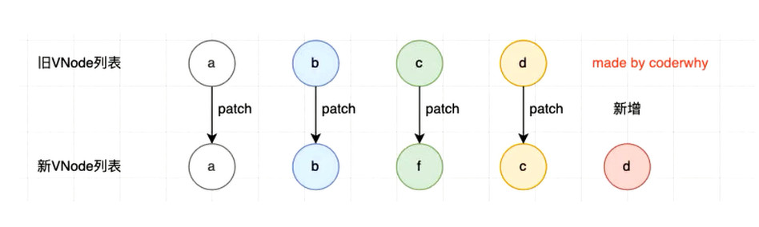
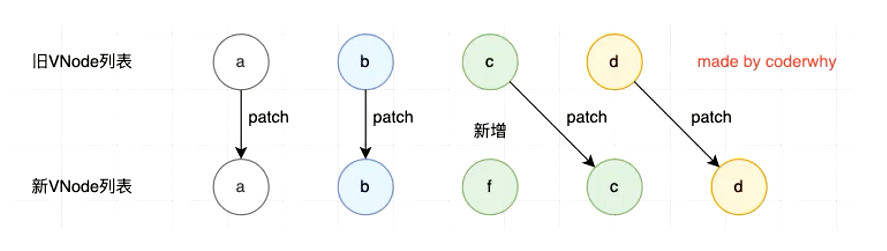

## 概念

<!-- ---------------------------day54 -->
#### 开启vue

```javascript
// 1、引入
<script src='https://unpkg.com/vue@next'></script>

// 2、创建模板内容 2.0的 options Api
const app = Vue.createApp({
    template: `<h2>hello {{msg}}!</h2`, // template的内容会覆盖app里的html，如果没写 temp vue将挂载节点里的html作为熏染模板，

    // 劫持返回的对象数据，通过 Object.defineProperty 或 new Proxy 添加到vue的响应式系统
    data: function(){ // 3.0 所有场景必须是函数 
        return {
            msg: "word",
            info: "this a info",
            coutn: 2,
            imgurl: "http://xxx/xxx/xxx.jpg",
            infos:{a:1,b:2}
        }
    }，

    // 不可以用箭头函数(箭头无作用域，里面的this无法指向vue对象)
    methods: {
        connect_met(){
            return this.info +“ ”+ this.msg
        }
        getData(){} 
    },
    
    /**
     * 计算属性, （包含响应式数据的计算），涉及到的属性变化，结果跟着变化
     * connect 会被混入到实例中, 可以通过 this.connetc 使用
     * 和 methods差别 存在缓存
     *     模板中 {{ connect_met() }} 使用三次,执行了三次
     *     模板中 {{ connect }} 使用三次，只会计算一次
     *     this.info 和 this.msg 发生变化，自动更新 connect
     */
    computed:{
        connect(){
            return this.info +" "+ this.msg
        },
        connect2:{
            get: function(){
                return this.info +" "+ this.msg
            },
            set: function(value){
                // 一些列操作
            }
        }
    },
        
    /**
     * 监听属性变化，某个属性变化，去做一件事情
     *
     */
    watch:{
        info(n,o){
            
        }
        infos(n,o){
            // 整个infos发生变化，得到的n是一个 Proxy对象
            console.log(Vue.toRaw(n)) // 获取原生对象
        },
        infos:{
            handler(n,o){
                // 侦听对象某个属性变化，默认无法深度监听
                console.log(Vue.toRaw(n)) // 获取原生对象
            },
            deep:true,
            immediate:true  // 第一次立即执行
        },
        "infos.a"(n,o){
            // 直接侦听对象属性
        }
    }
    
 
})

// 3、挂载到页面已存在的节点
app.mount("#app")

```

#### 模板语法 
> template 中的语法  (react 通过jsx 编写)

mustache 语法
```javascript
/**
 * {{}}
 * {{msg}}  普通数据绑定
 * {{count*2}} {{info.split(" ")}} {{a>2?"0":"1"}} 表达式,对 data 的数据进行加工再渲染
 * {{count*2}} {{info.split(" ")}} {{a>2?"0":"1"}} 表达式,对 data 的数据进行加工再渲染
 * {{ getData(msg) }} 调用methods 的方法，传入data的参数
 */
```

基本指令

>   标签中使用 

```javascript
/**
 * v-ones   只渲染一次，数据变化指令标签内部所有data不更新
 * v-text 与 v-html 是否将带html标签的数据效果呈现
 * v-pre  标签里所有东西当做字符串 包括 {{}}
 * v-cloak 防止js未加载出来时，页面出现{{msg}} 的问题 （配合 style [v-cloak]{display:none} 才行） 
 * v-memo=[name,msg] 3.2+  v-memo指令作用的标签内部(子树)数据不实时更新，只有name 或 msg数据变化了，再一起更新
 */
```

v-bang、绑定class和style
```javascript
/**
 * v-bind  缩写 : 动态绑定属性的值
 * v-bind:src="imgurl"  或  :src="imgurl"  
 * :class={active:bool} 或  :class="getClassList()"    函数中 retrun {active:true,msg:false}
 * :style={"font-size":size + "px"}  驼峰或引号都行
 * :[namexxx]="123" // 动态绑定属性名
 * v-bind="infos" // 绑定一个对象 infos:{a:1,b:2} 直接绑定a和b连个属性
 *
 */
```

绑定事件

```javascript
/**
 * v-on 缩写 @
 * @click="getData" // 事件发生时做一件事情，直接做，或通过函数做
 * v-on={click:getData,mousemove:getData2} 批量绑定
 * @click="getData" // 没参数 event 参数默认存在
 * @click="getData($event,msg)" // 有参数，需要手动传入事件对象
 * 事件修饰符
 *     @click.stop="xxx" 阻止事件冒泡 (原生通过 event.stopPropagation() 阻止)	
 *	         .prevent    阻止默认行为	(原生通过 event.preventDefault() 阻止)	
 *           .capture    使用捕获模式
 *           .self       事件绑定原生自己触发事件才生效
 *           .ones       只触发一次
 *           .left/right/middle 点击左/右/中按键时才触发
 *
 */
```

条件渲染

>   这些指令最好加到 `template` 元素中, 这样就不会渲染到页面，类似小程序的`block`

```javascript
/**
 * v-if/vi-else-if/v-else 节点的删除创建
 * v-show  // display 的显示隐藏
 * v-for="(item,index) in array"  
 * v-for="(item, key,index) in object"	
 * 	可迭代对象如字符串都是可以遍历的
 */
```

>   数组更新的检测，只有改变原数组，或调用可改变元素组的方法，才会更新

key

```javascript
/**
 * v-for key 属性的作用
 * 	  唯一的，一般用id 
 *	  主要用在Vue的虚拟DOM算法，在新旧nodes对比时辨识VNodes
 *    没使用key，有一种算法，使用key会用一种更好的算法（基于key的变化重新排列元素顺序，并移除不存在的元素）
 */
```

-   VNode: `Virtual Node` 虚拟节点

    -   位置： 存在于 vue template  到  真实DOM之间
    -   本质：是一个JavaScript对象

    ```javascript
    // template: <div class="title" style="font-size:30px">{{msg}}</div>
    
    const vnode = {
        type:"div",
        props: {
            class: "title",
            style: {
                "font-size":"30px"
            }
        }
        children: "内容"
    }
    
    // DOM: <div class="title" style="font-size:30px">内容</div>
    ```

-   虚拟DOM：很多`VNode`形成的 `VNode Tree`

    -   方便跨平台

        -   可以转 真实DOM对象
        -   可以转 移动端的 `button/view/image`
        -   可以转 IOS `UIButtono/UIView`
        -   `JavaScript` ，是**脚本语言**，可以将 转换为**各个平台想要显示的东西**

    -   方便diff算法 

        -   **没有Key** ：当遍历的**数组发生变化**时，**销毁所有**的**虚拟DOM**，在按照新的数据**全部重新创建**

        

        -   **存在唯一Key**：虚拟DOM会**通过key**认识，**变化后的某个节点，就是变化前的那个节点**，不销毁进行重新排序

        


#### MVC 与 MVVM

```javascript
/**
 * MVC: `Model - View - Controller` 的简称，（前端也符合，html view - js 控制器）
 *     准备好界面  控制器去服务器获取数据  得到数据转换为模型给页面使用
 *
 * MVVM: `Model（script，data等） - View（template） - ViewModel（Vue框架`） 的简称 ，Vue给Model和View建立桥梁 
 *     ViewModel 把 Model数据 绑定到界面
 *     ViewModel 把 View事件 监听到 Model
 */
```
