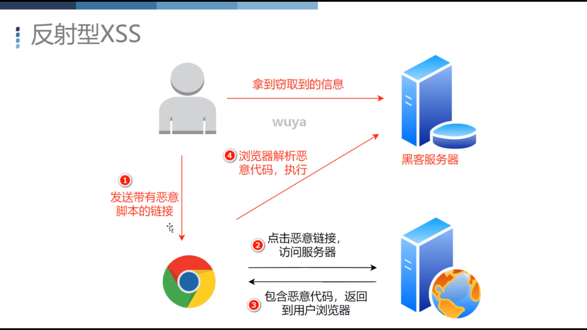
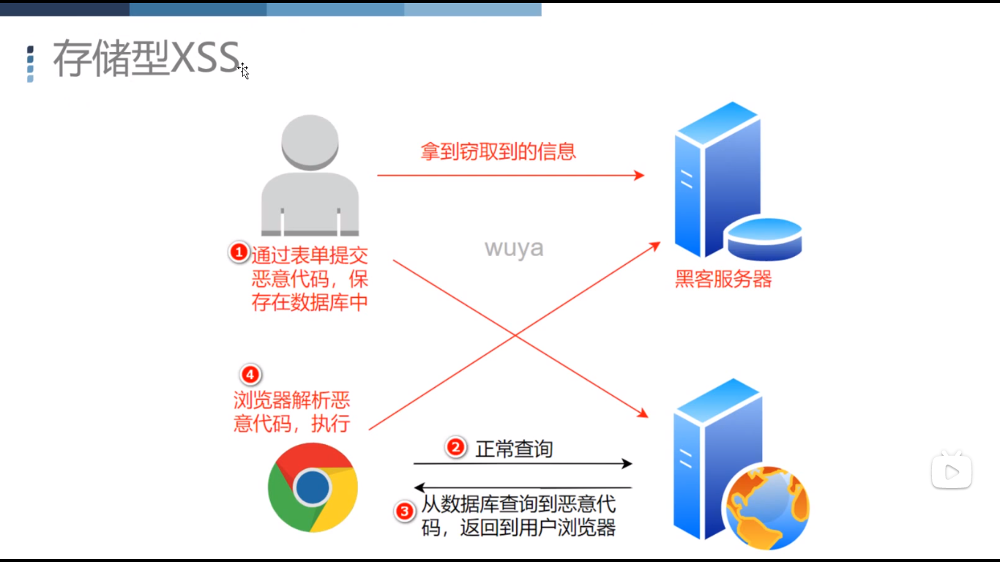
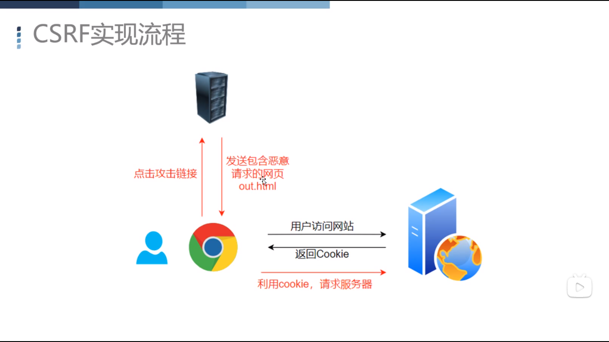

[漏洞排名](https://owasp.org/www-project-top-ten/)
### session、cookie 和 XSS跨站脚本攻击
- HTTP
    - `请求式应答` (有请求才有返回)
    - `灵活可扩展` (可传输各种类型数据,请求头 响应头可自定义，只要相互认识)
    - `可靠传输`
    - `无状态`
        - 弊端
            - 发送请求服务器默认是不知道谁在访问的
            - 每次访问都是独立的，无法保持会话
        - 解决方案`cookie`
            - http扩展功能
            - Set-Cookie:`第一次访问`服务器`主动响应`给客户端，`种cookie`
            - Cookie:之后请求，客户端`自动携带Cookie`去访问服务
            - 方式:访问域名 -> 携带cookie到客户端 -> 客户端存储cookie -> 在访问时通过请求头携带到服务器 
                - 再次访问服务器就知道谁在访问自己了
            - 格式:
                - 键值对(必须)
                - `expires`:设置过期时间
                - `max-age`:多久过期(秒，优先级高于expires)
                - `domain`:对哪个域名生效
                - `path`:匹配的路径(如果是`path=/`代表域名所有子域名及下所有路径都能使用)
                - `secure`: 是否只允许HTTPS,才发送Cookie到服务器
                - `httponly`:不允许通过`document.cookie`去修改此cookie
            - 保存位置:
                - `没有设置`过期时间则`保存在内存`，浏览器`关闭即失效`
                - `设置expires`就是持久的，保存在磁盘，`各个浏览器`保存的`位置`和`方式`都不一样
            - 特点:
                - `明文`
                - `用户可修改`
                - `大小受限`
                - `臃肿`:每次请求头都要携带，所有需要的cookie
            - 作用 
                - 记录登录状态，打开网址，发现cookie存在表示已登入
                - 跟踪用户行为
        - session
            - session信息是保存在服务端的，每次还是要`通过cookie`携带`sessionId`的
            - 工作流程
                - 进入页面判断是否能达到用户信息
                - 不能进入登录窗口
                - 登录成功 session保存用户信息
                - 后端只有判断是否能拿到用户信息，可以显示内容，否则显示登录窗口
                - 退出清除session，否则一直是登录状态
            - `sessionId`还是通过cookie与客户端交流的
            - 问题
                - 别人找到你某个网站的sessionId，没退出的，复制到自己的浏览器上，因为服务点保存了你的状态，那么理论上就能直接登录你的账户了

        - 远程操作cookie
            - 操作
                - 获取 document.cookie
                - 修改 document.cookie="name=xxx"
            - 攻击方式
                - XSS:Cross Site Script
                    - 利用web漏洞插入恶意代码，用户访问的时候，执行代码，获取用户身份从而达到攻击的目的
                    - 获取哪个网站的信息就要将脚本注入到哪个网站
                    - 漏洞
                       - 页面直接将query拿来直接执行
                       - 页面直接将input的值拿来执行
                    - 反射形XSS
                        - 一次性的，用户操作一次攻击一次那种，如果点击query传入的链接
                        - 需要诱导用户去操作
                        
                    - 存储型XSS
                        - 通过`评论、留言、注册恶意用户名`等方式将`恶意代码`提交到你的数据库，别人访问恶意用户或恶意用户的消息，就从数据库查出来恶意代码，就自动执行恶意代码
                        - 恶意代码可以是自动访问，第三方js,或恶意链接,直接拿到你在这个网站的信息 
                        
                    - 作用
                        - 冒充身份
                        - 刷点击
                        - 弹广告
                        - 传播蠕虫病毒(通过访问发送，一传十。。。)
                    - 防止
                        - 输入
                            - 识别恶意脚本，定义恶意脚本格式
                            - 脚本格式扩展变形 如:`<scri<script>pt>` 
                            - 通过正则找出来后干掉或静止此用户操作
                        - 输出
                            - 将一些特殊符号如`<>"'%`等符号进行转义
                        - 个人的处理不全,用插件WAF来安全防护服务器
                            - 第三方规则引擎，waf规则仓
                                - 硬件、云产品、开源库如:Apath 的 mod_security，modsecurity.cn
                            
### CSRF 跨站请求伪造
- 流程
    - 打开`登录`重要的网站,或者某个重要网站的cookie还在本地
    - 本地储存重要网站的信息
    - `访问乱七八糟`的网站 -> 返回`包含恶意请求`的页面如``
    - 如果`调用的重要网站地址`正好是你`刚刚登入的`，就调用成功了
    
- 恶意请求方式
    - 加载图片请求、点击a链接请求，隐藏的可自动提交的表达---后面js自动提交表单 
- 预防
    - 如何确定一个接口地址是否拥有CSRF漏洞?
        - 我自己没有输入账号密码，没有产生我的cookie，发起对一个接口的请求，只要正常响应了，那么这个接口是存在CSRF漏洞的
        - 需要登录的接口，公开的一些接口就没有意义了
    - 具体操作
        - 判断来源
            - 请求头的 referer 表示用户从哪个页面来访问的
            - 后端通过判断 referer 来防止CSRF，但是可以伪造，并不可信
        - 加密
            - 客户端对cookie进行加密，发送到服务端，服务端以同样方式进行加密，与客户端的进行对比
            - 因为CSRF拿不到cookie明文，所以这是可以防止的，如果用XSS偷到cookie，那么这也不安全
        - token
        - 验证码、支付输入密码、选择出所以自行车、将图片选择正等操作，时重要接口变成交互性的二次验证
    - 第三方工具发现漏洞
        - Blot, blot.py -u url,测试这个接口是否存在CSRF漏洞
        - T-Sec 漏洞扫描收费服务
- 与XSS的差别
    - 利用你保存的cookie，拿不到对方的cookie
    - 需要自己准备第三方网站，或将代码通过XSS方式注入到其他网站让你点，不要直接把代码注入到要攻击的网站

### sql注入、弱密码

https://www.coolshell.cn/

### referer 与  Referrer Policy 详解
> 请求的报头中，会包含一个 Referrer，用以指定该请求是`从哪个页面跳转`来的，常被用于`分析用户来源`等信息。但是也有成为用户的一个不安全因素，比如有些网站直接将 `sessionid` 或是 `token` 放在地址栏里传递的，会原样不动地当作 Referrer 报头的内容传递给第三方网站。

>所以就有了 `Referrer Policy`，用于`过滤 Referrer` 报头内容

```shell
enum ReferrerPolicy {
  "",
  "no-referrer",
  "no-referrer-when-downgrade",
  "same-origin",
  "origin",
  "strict-origin",
  "origin-when-cross-origin",
  "strict-origin-when-cross-origin",
  "unsafe-url"
};
# 很多种过滤类型
```
### 文件上传漏洞
- 原理
    - 上传一个可以执行的脚本文件如php，里面有类似eval的语句将某些代码包裹,从而获得了可执行服务端命令的能力
    - 当通过路径访问自己上传的文件时，eval就好解析出里面的代码
- 如何绕过？
- 安全人员如何避免？
    - 静止指定类型文件上传，必要的化可以传压缩包
    - 文件路径不要被用户获取
    - 限制上传的文件的权限