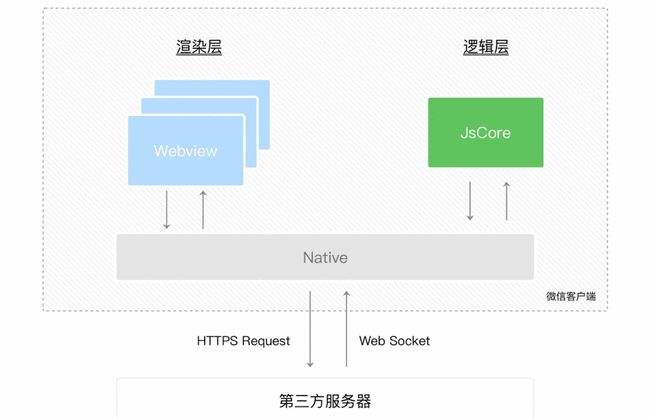

> 原生微信小程序(官方weui)

[官方文档](https://developers.weixin.qq.com/miniprogram/dev/reference/configuration/app.html)
## 环境
1、开发环境：一般网页运行浏览器中，小程序运行微信环境中
2、API差异：小程序无法调用浏览器的DOM BOM API，但是有微信环境提供的各种API
3、开发模式：账号 + 微信开发者工具 （开发设置获取AppID，创建项目需要用到）
-   vscode开发 
    -   wxml 插件
    -   小程序开发助手
    -   wechat-snippit
    -   vscode编辑代码，还是微信开发者工具展示(模拟器可以分离)

#### 关于
 传统程序需要打包到应用商店，通过审核才能上线，小程序可以动态添加功能，无需下载，安装（绕过苹果应用商店）
介于H5（前端）和原生App（移动开发工程师）的产品，基本前端来开发
主要技术
    小程序原生：WXML\WXSS\JavaScript\WexinScript（只有微信能用的一些脚本） 
    Vue开发：uni-app 跨平台选型方案（不同平台可能会有一些适配问题）
    React/Vue/Nerv：taro 京东团队的跨端跨框架技术
    其他开发app技术: ReactNative、Flutter(好用比较原生)。。。

#### 小程序 MVVM 架构思想
> view（.wxml）<=>  ViewModel（小程序内部框架） <=>  model（.js） 

小程序的架构模型(双线程模型)
    宿主环境（微信）为了执行小程序，将 WXML模块和WXSS样式，运行与`渲染层`，使用`WebView线程`（多个页面会有多个WebView线程）
    使用`JsCore`线程运行JS脚本
    两个线程都由`微信客户端（Native）`进行中转交互
    

为了接近原生体验，后期可能会用 `flutter` 的 `Skyline 渲染引擎`,`WebView`渲染的最终还是一个网页

### 关键字
-  openId:openid相当重要，它是用户的唯一标识id
## 目录结构
### page 文件夹
> 小程序页面, 快捷创建方式: `app.json` -> `pages` -> `直接添加路径保存`，就能直接生成`整个页面文件`了

相关文件
-  index.js  (某页面js逻辑)
    -   每个页面自己的 js
    -   
-  index.json  (某页面数据)
-  index.wxml  (某页面html)
    -   与 html 的差异
    -   标签名称不同、属性节点不同
    -   提供类似vue的模板语法   
    -   wxml 采用 Mustause 语法 {{}}
        -   绑定内容 : `{{xxx}}`、`{{num > 10 ? "大于十":"小于等于十"}}`、`{{num * 10}}`   绑定内容
        -   绑定属性 : `src="{{xxx}}"` 
            -   `hidden="{{bool}}"` 是否隐藏元素（hidden 与 wx:if  == 反 v-show 与 v-if）
    -   判断语句 : `wx:if    wx:elif   wx:else`
    -   列表渲染 : `wx:for="{{List}}"`
        -  索引 {{index}}  每一项 {{item}}  
        -  `wx:for-index="idx"` 重命名索引
        -  `wx:for-item="itm"` 重命名每一项
        -  `wx:key="id"` 自动去取item的id
        -  `wx:key="*this"` item自身作为key
    -   绑定事件 : 
        -   点击触发 `bindtap 或 bind:tap`
        -   输入触发 `bindinput 或 bind:input`
        -   状态改变 `bindchange 或 bind:change`
        -   事件对象属性
            -   target：指向触发事件的源头组件(类似 ul 事件委托的 li)
            -   currentTarget：绑定事件的组件(类似 ul 事件委托的 ul)
    -   事件传参
        -   传递参数xxx，值为123 ：`data-xxx="123"`
        -   获取 `event.currentTarget.dataset.xxx`
        -   input bindinput 的最新值 `e.detail.value`

        -   传递参数xxx，值为123 ：`mark:xxx="123"`
        -   获取 `event.mark.xxx`

    -   捕获与冒泡
        -   点击后，向内捕获 到达底点击对象 向外冒泡
        ```html
        <!--默认就是冒泡 v3tap v2tap v1tap 这样执行的-->
        <!--这里设置成捕获执行v1tap v2tap v3tap-->
        <view class="v1" bindtap='v1tap' capture-bind:tap="v1tap">
            <view class="v2" bindtap='v2tap' capture-bind:tap="v2tap">
                <view class="v3" bindtap='v3tap' capture-bind:tap="v3tap">
                </view>
            </view>
        </view>

        <!--到达捕获的 v2tap 时直接终止，不继续捕获和后面的向上冒泡了-->
        <view class="v1" bindtap='v1tap' capture-bind:tap="v1tap">
            <view class="v2" bindtap='v2tap' capture-catch:tap="v2tap">
                <view class="v3" bindtap='v3tap' capture-bind:tap="v3tap">
                </view>
            </view>
        </view>
        ```
    -   独特标签
        -   block 包裹多个标签，渲染后不会该标签不存在
    -   动态绑定class
        -   class='item {{xxxindex === index?"active":"“}}'
    
-  index.wxss  (某页面css)
    -   仅支持大部分css属性，常用的基本都支持，也有`自己的东西`
        -   rpx 适配
            -   将宽度分为 `750` 份，屏幕总宽度为 `750rpx`
            -   换算px 
            -   px转rpx(750/屏幕【设计稿】宽度)  => 750屏幕 1px==1rpx  => 375屏幕 1px==2rpx  => 375和750屏幕，满屏都是750rpx
            -                                      250屏幕 1px==3rpx => 50屏幕 1px==15rpx  => 都是750rpx满屏
            -                                      当拿到设计稿250的设计稿，设置设计稿上50px的盒子，就需要设置（50*3）rpx
            -                                      所以屏幕越小，1px对应的rpx就越大，所以不同大小设备显示在屏幕上的比例都是一样的
            -   rpx转px(屏幕或设计稿宽度/750)
            -   
        -   @import 样式导入
            -   `@import "xxxx.wxss"`
    -   app.wxss 全局样式表 页面中 自己的私有样式表
        -   局部权重(鼠标移入wxss类时显示权重 )大于等于全局时，就近原则，局部样式覆盖全局

-  微信的WexinScript
    -    里面的方法可以直接在{{}}中使用
    -   页面中直接写
    ```javascript
    // wxml 页面中使用
    <wxs module='count'>
        function add(a,b){  //只能用原生js
            return a+b;
        }
    
        //必须使用 CommonJs导出才能使用
        module.exports = {
            addvalue:add
        }
    </wxs>
    
    <view>{{count.addvalue(1,2)}}</view>
    ```
    -   封装到文件

    ```javascript
    // count.wxs
    <wxs module='count' src='/xx/xx/xx/count.wxs'></wxs>
    ```


### 执行

#### 小程序的生命周期
[文档]('https://developers.weixin.qq.com/miniprogram/dev/reference/api/App.html')

```javascript
// 必须再app.js中调用，且只能调用一次
App({
    onLaunch(options){ // 只执行1次
        console.log("小程序生命周期，初始化");
        // 1. 执行登录等业务逻辑
        wx.login({
            success: res => {
                // 发送 res.code 到后台换取 openId, sessionKey, unionId
            }
        })
        //1.1 如果登录成功就将获取的数据储存到 store
        //1.2 只有一个，且是全局共享的，所以 共享数据可以放这里 this.globalData 
    },
    onShow(options){ // 执行多次
        // 判断用户进入小程序的场景（群聊，扫一扫）
        console.log(options.scene) // 场景编码 主入口1001
        console.log("小程序生命周期，切换到前台");
    },
    onHide(){
        console.log("小程序生命周期，切换到后台");
    },
    globalData: { // 自定义随机对象，储存全局属性
        token:'123456',
        userInfo:'12'
    }
})


```

#### 页面的生命周期

```javascript
Page({
    // 页面加载时候执行
    onLoad(){
        // 获取 App 实例的共享数据
        const app = getApp();
        const token = app.globalData.token; // 123456
        const userInfo = app.globalData.userInfo;

        // 发送请求
        wx.require({
            url:'',
            success: (res)=>{},
            error: (err)=>{}
        })
        // 渲染数据
    } 
})

```
#### 组件和组件的生命周期
组件的创建 components
    组件的 `.json` 文件  `component:true`
    组件必须被引用，否则会报错
    页面的 `.json` 文件需要引入
```javascript
"usingComponents": {
    "my-banner":"/components/banner/banner"
}
```

​	组件间可以`相互引用app.json` 里注册就是`全局注册` 

组件的wxss样式
    组件中不能使用`id选择器`,`属性选择器`,`标签选择器` （这些选择器会影响外面页面的样式）
    `class` 不会影响到外面，所有尽量用class
    外面的处理 `标签`选择器，默认都不会影响到组件
```javascript
Components({
    options:{
        styleIsolation: "isolated"， // 默认
        styleIsolation: "apply-shared"， // 组件中让页面样式影响到我
        styleIsolation: "shared"， // 组件中让页面样式影响到我，让自己样式影响到页面
    }
})
```


组件通信
```javascript
// 通过组件的 properties 接收  
properties: { 
    title:{
        type:String, //null 不限制类型 
        value:"默认标题"
    }
},
// 组件发出自定义事件
methods:{
    cpmClick(){
        console.log("传出数据到外部")
        this.triggerEvent("titleclick",'datastrval')
    },
    // 外面 bind:titleclick="xxxxx" 接收
}

// 接收外面传进来的累
externalClasses:['info'], 
```


组件的生命周期
```javascript

```


### util 文件夹
> 存放一些工具方法

### 配置文件
+ app.js  (全局js逻辑)
    -   app.js 项目入口文件
+ app.json  (全局配置文件)
    -   `pages`:小程序所有页面路径存放
    -   `windnow`:小程序全局窗口外观（默认标题栏，手机wifi栏，窗口背景等）
    -   `tabBar`: 设置底部tabBar 菜单 
    -   `"style":"v2"` 用v2版本样式
+ app.wxss  (全局css)
+ project.config.json (一些配置项目配置信息)
    -   一般不做修改
    -   appid (网上的项目需要把这个appid换成自己的)
+ project.private.config.json，（私有配置 可以放到.gitxxx里 ）覆盖 project.config.json 相同属性的值
    -   setting (详情->本地设置的操作 会更新到这里)
+ sitemap.json (设置爬虫文件权限)
  

https://www.bilibili.com/video/BV19r4y1N7Br?p=3&spm_id_from=pageDriver

### 小程序宿主环境 微信
-   通信模型支持
    -   逻辑层 通过 微信客户端与选如此通信
    -   逻辑层 通过 微信客户端与第三方服务通信 获取数据
-   运行机制支持
    - 程序 下载代码包 -> 解析 app.json 全局配置文件 -> 执行app.json 小程序入口文件 -> 渲染首页 启动完成
    - 页面 加载解析页面的 .json 配置文件 -> 加载 wxml wxss 渲染层文件 -> 执行 .js 文件
-   组件支持
    -   视图容器
    ```html
    view  <!--类似div-->
    scroll-view + scroll-y属性 <!--可滚动的视图区域-->
    ```
-   API支持
    -   事件监听API
        -   以 on 开头 监听事件触发。wx. == window.
    -   同步API
        -   以 Sync 结尾的
        -   结果可以直接获取，异常也会直接排除 
    -   异步API
        -   通过回调接收结果

### 发布流程
`开发版本`用于程序自测，添加的测试人员都可以访问，修改完美在发布到`正式版本`
开发者工具上传代码
开发版本(可以设置成体验版本)  -> 审核中版本 -> 线上版本

物料下载  - 设置 基本设置 可下载小程序二维码
运营数据  - 统计 或 数据助手查看(扫描右上角手机数据)

### 调试工具
-   AppData  查看页面的所有数据
### 第三方包
安装完成之后还需要 选择构建，构建npm 生成 miniprogram_npm 才能正常使用

### 快捷操作
+ 将页面新增到编译模式，不用将页面路径移到最前面，就能直接调试指定页面了 

## 小程序-云开发
+ 必须要appId
+ 开发者工具新建项目(建议都选择不使用云服务)
+ 进入左上角头像旁边的云开发按钮，随便输入一个合格的环境名称，提交(每个用户能申请两个，用掉后想继续用需要收费的)
+ 设置权限所有用户可读

### 云数据库
> 采用NoSQL类型数据库
### 云存储
> 微信小程序最大限制两M，如果有大的资源可以使用云存储解决      
> 点击资源查看详情，可看到资源的id与路径

### 云函数
> 云函数可以调用云数据库的数据，能做一些前端做不到的事情
> 客户端通过db查询有20条限制，最好通过云函数(基于nodejs)操作  
> 云函数可以图片用户权限获取数据 

操作:
+ 在根目录(pages同级)新建任意名称文件夹，如:cloudFunc
+ 配置文件 project.config.json 第一级添加 "cloudfunctionRoot":"cloudFunc", 
+ 如果成功 cloudFunc会变成白云图标
+ 右键新建nodejs云函数 
+ 然后客户端的数据库操作都能进云函数使用
+ 函数写好后，在文件夹中右键部署并上传(如果没有node_module，就选不上传node_module的)


#### 内容管理
> 小程序数据库管理系统
位置:云服务 -> 更多 -> 内容管理 -> 开通 -> 得到管理系统网址 
使用:打开网址 -> 创建项目 -> 进入找到内容模型(模型与数据库表对应) -> 添加模板与记录 -> 开发者工具数据库直接刷新


### 生物认证
> 生物认证是指通过**指纹**、**手型**、**脸型**、**声音**、**虹膜和视网腊扫描**等物理特征识别人的一种认证方式
> 微信目前仅支持指纹和人脸识别